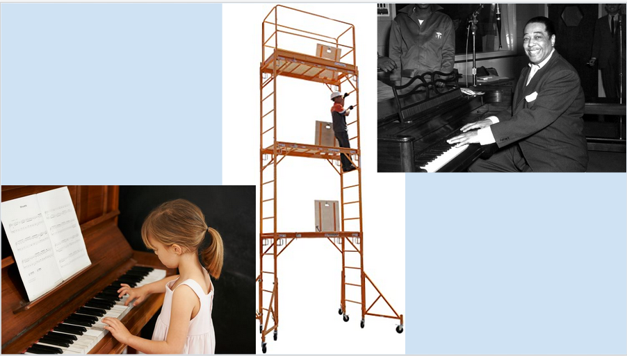
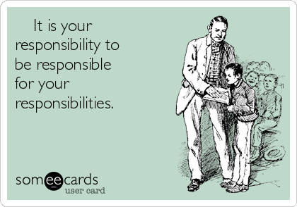
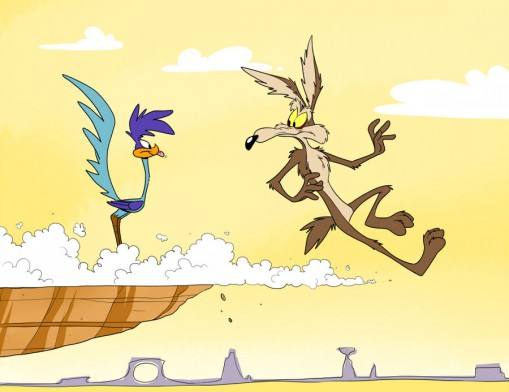
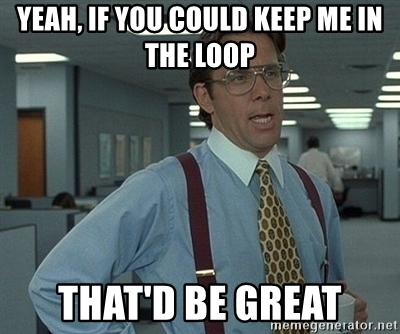
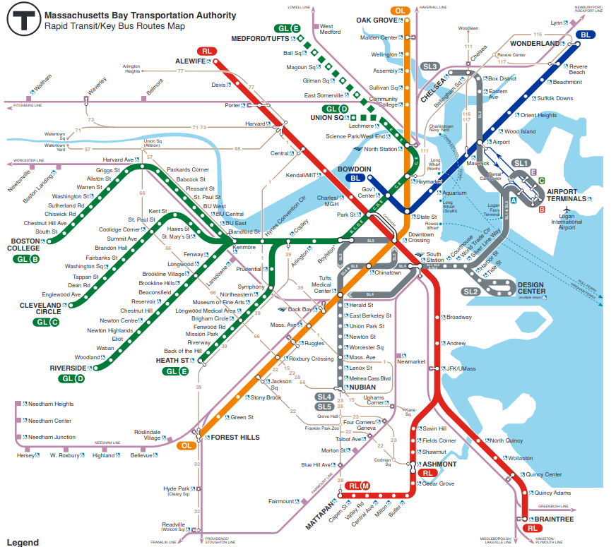
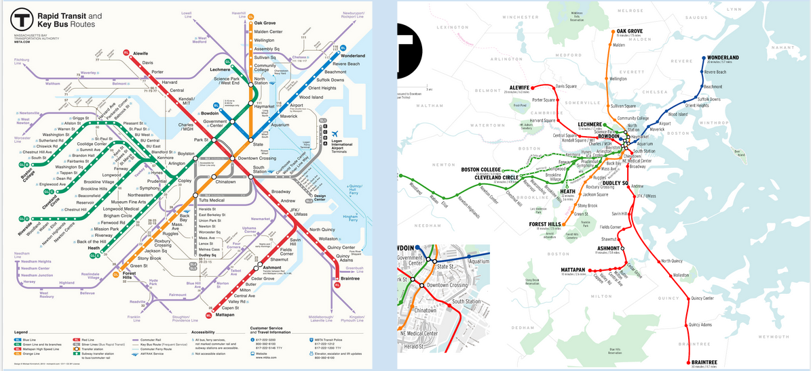
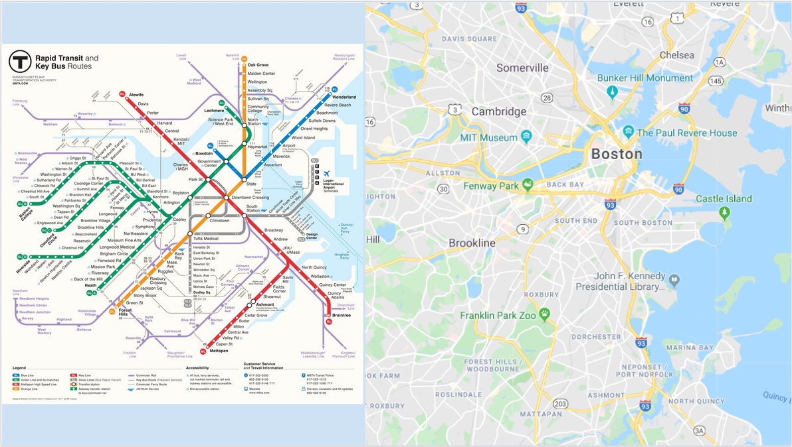

---
output:
  beamer_presentation:
    theme: "CambridgeUS"
    colortheme: "dolphin"
    fonttheme: "structurebold"
fontsize: 14pt
classoption: "aspectratio=169"
header-includes:
- \usepackage{caption}
- \captionsetup[figure]{labelformat=empty}
- \captionsetup[table]{labelformat=empty}
---

```{r, echo = FALSE, warning = FALSE, message = FALSE}
## Render the pdf
##rmarkdown::render(input = "./01_1-Intro_to_AM.Rmd", output_file = "./01_1-Intro_to_AM.pdf")

##fontsizes for tables: ‘"tiny"’, ‘"scriptsize"’, ‘"footnotesize"’, ‘"small"’, ‘"normalsize"’, ‘"large"’, ‘"Large"’, ‘"LARGE"’, ‘"huge"’, ‘"Huge"’

library(tidyverse)
library(readxl)
library(stargazer)
##library(kableExtra)
library(modelr)

knitr::opts_chunk$set(echo = FALSE,
                      eval = TRUE,
                      error = FALSE,
                      message = FALSE,
                      warning = FALSE,
                      comment = NA)

#############################################################
## Stargazer code

## Regular Table
##stargazer(summary = FALSE, type = "latex", header = FALSE, rownames = FALSE, float = FALSE)

## Regression Results
##stargazer(res1, type = "latex", digits = 2, omit.stat = "rsq", header = FALSE, font.size = "footnotesize", star.cutoffs = .05, notes = "*p < 0.05", notes.append = FALSE, dep.var.caption = "", float = FALSE)

##covariate.labels = c("Mother's Education")
##dep.var.labels = "Earnings (2021)"

#############################################################
## Figures

## ```{r, fig.align = 'center', fig.asp=0.618, out.height = '90%', fig.width = 5}

##knitr::include_graphics()

#############################################################
## Side-by-side columns

## ::: columns
## :::: column
## Content in left column
## ::::
## :::: column
## Content in right column
## ::::
## :::

## Build bullets one-by-one
##\begin{enumerate}[<+->]

```


# MGMT 228: Analytical Methods

\begin{center}
\begin{Large}
Use the web to find us an example of "statistics" being used in the world to make an argument.

\vspace{.2in}

\textbf{ANY} and \textbf{ALL} examples welcome.

\end{Large}

\vspace{.5in}

Justin Leinaweaver (Spring 2022)
\end{center}


#
::: columns
:::: column
\vspace{1in}

\begin{center}
\begin{huge}
Introductions
\end{huge}
\end{center}
::::
:::: column
\begin{huge}
\begin{itemize}
\item Name
\vspace{.2in}
\item Year in school
\vspace{.2in}
\item Major
\vspace{.2in}
\item Dream job
\end{itemize}
\end{huge}
::::
:::


#
\begin{center}
\begin{huge}
What is something you learned in intro statistics (MATH 227) that has proved useful in your life?
\end{huge}
\end{center}


#
\begin{center}
\begin{huge}
What is something you learned in intro statistics (MATH 227)? 

\vspace{.5in}

Optional: ...that has proved useful in your life?
\end{huge}
\end{center}


#
```{r, fig.align = 'center', fig.asp=0.618, out.height = '95%', fig.width = 5}

```


# Learning Outcomes

By the end of the semester you will be able to:

\begin{enumerate}
\item Collect and critically evaluate data from a variety of sources (e.g. government sources, surveys, etc.)

\item Use basic data analytics tools to support decision-making (e.g. univariate, bivariate and multivariate approaches including regression), and

\item Apply a set of more advanced tools that expand the utility of these models (e.g. forecasting, seasonality, nonlinearity, constrained dependent variables, etc.).
\end{enumerate}


# Backup your files to the cloud!
```{r, fig.align = 'center', fig.asp=0.618, out.height = '80%', fig.width = 5}

```


# 
\begin{center}
```{r, results = "asis"}
tibble(
    Grade = c("Participation", "Visualizations Report", "Simple OLS Report", "Multiple OLS Report", "Final Report"),
    Proportion = c(25, 15, 20, 20, 20)
) %>%
    mutate(
        Proportion = str_c(Proportion, '%')
    ) %>%
    rename(" " = Proportion) %>%
    stargazer(summary = FALSE, rownames = FALSE, header = FALSE, float = FALSE, font.size = "LARGE")
```
\end{center}


# Participation

\begin{Large}
\begin{itemize}
\item Get to class on time,
\vspace{.2in}
\item Have the materials you need to be productive,
\vspace{.2in}
\item Do the work in class, and
\vspace{.2in}
\item Save your work.
\end{itemize}
\end{Large}


# Excused absence coming up?

```{r, fig.align = 'center', fig.asp=0.618, out.height = '60%', fig.width = 5}

```

\begin{center}
\begin{Large}
It is your responsibility to notify me and to complete a make-up assignment.
\end{Large}
\end{center}


# 
```{r, fig.align = 'center', fig.asp=0.618, out.height = '95%', fig.width = 5}

```


# 
```{r, fig.align = 'center', fig.asp=0.618, out.height = '95%', fig.width = 5}

```


#
\begin{center}
\begin{huge}
\textbf{What is a model?}
\end{huge}
\end{center}


#
::: columns
:::: column
\vspace{1in}
\begin{center}
\begin{LARGE}
\textbf{The Boston "T"}
\end{LARGE}
\end{center}
::::
:::: column
```{r, fig.align = 'center', fig.asp=0.618, out.height = '90%', fig.width = 5}

```
::::
:::


# 
```{r, fig.align = 'center', fig.asp=0.618, out.height = '90%', fig.width = 5}

```


# 
```{r, fig.align = 'center', fig.asp=0.618, out.height = '95%', fig.width = 5}

```


#
::: columns
:::: column
```{r, fig.align = 'center', fig.asp=0.618, out.height = '90%', fig.width = 5}
knitr::include_graphics("./Images/01_1-Drury.jpg")
```
::::
:::: column
\vspace{.5in}

\begin{large}
Maps are:
\begin{itemize}
\item Neither true nor false
\item Limited in their accuracy
\item Partial representations
\item Useful for only some uses
\item A reflection of the interests of the designer
\end{itemize}
\end{large}
::::
:::


#
::: columns
:::: column
```{r, fig.align = 'center', fig.asp=0.618, out.height = '90%', fig.width = 5}
knitr::include_graphics("./Images/01_1-Drury.jpg")
```
::::
:::: column
\vspace{.5in}

\begin{large}
\textbf{Scientific models} are:
\begin{itemize}
\item Neither true nor false
\item Limited in their accuracy
\item Partial representations
\item Useful for only some uses
\item A reflection of the interests of the designer
\end{itemize}
\end{large}
::::
:::


# Our Plan This Semester

\begin{Large}
\textbf{Build models to answer questions with data}

\begin{itemize}
\item What drives economic investment in US states? 

\item Why do some countries attract greater levels of international investment than others?

\item What explains why some individuals make more money than others?
\end{itemize}
\end{Large}
