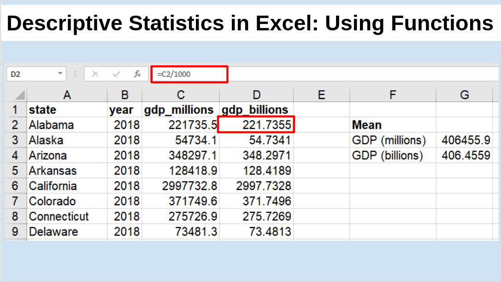

---
output:
  beamer_presentation:
    theme: "CambridgeUS"
    colortheme: "dolphin"
    fonttheme: "structurebold"
fontsize: 14pt
classoption: "aspectratio=169"
header-includes:
- \usepackage{caption}
- \captionsetup[figure]{labelformat=empty}
- \captionsetup[table]{labelformat=empty}
- \setbeamertemplate{page number in head/foot}[]{}
---

```{r, echo = FALSE, warning = FALSE, message = FALSE}
## rmarkdown::render(input = "./02_1-Descriptive_Stats.Rmd", output_file = "./02_1-Descriptive_Stats.pdf")

##fontsizes for tables: ‘"tiny"’, ‘"scriptsize"’, ‘"footnotesize"’, ‘"small"’, ‘"normalsize"’, ‘"large"’, ‘"Large"’, ‘"LARGE"’, ‘"huge"’, ‘"Huge"’

library(tidyverse)
library(readxl)
library(stargazer)
##library(kableExtra)
library(modelr)

knitr::opts_chunk$set(echo = FALSE,
                      eval = TRUE,
                      error = FALSE,
                      message = FALSE,
                      warning = FALSE,
                      comment = NA)

```


# Today's Agenda

\begin{Large}
What drives economic investment in US states?
\begin{itemize}
\item Introduce Dataset 1
\item Begin univariate analyses
\end{itemize}

\end{Large}

\vspace{.4in}

\begin{center}
Justin Leinaweaver (Spring 2022)
\end{center}


#
\begin{columns}
\begin{column}{0.4\textwidth}
```{r, fig.align = 'center', fig.asp=0.618, out.width = '80%', fig.width = 5}
knitr::include_graphics("./Images/01_1-Drury.jpg")
```
\end{column}
\begin{column}{0.6\textwidth}

\vspace{.5in}

\begin{large}
\textbf{Scientific models} are:
\begin{itemize}
\item Neither true nor false
\item Limited in their accuracy
\item Partial representations
\item Useful for only some uses
\item A reflection of the interests of the designer
\end{itemize}
\end{large}
\end{column}
\end{columns}


# Dataset 1\: The Motivating Problem
\center

\Large
What drives economic investment in US states? 

\vspace{.5in}

Why do some states attract greater investment by companies and individuals than others?


# Dataset 1\: The Motivating Problem
\center

\LARGE
What drives economic investment in US states? 

\vspace{.25in}

\begin{LARGE}
\begin{enumerate}
\item Literature Review

\vspace{.1in}

\item Exploratory Data Analysis
\end{enumerate}
\end{LARGE}


# Dataset 1\: Literature Review

\textbf{What are the important causal mechanisms that explain business investment in states?}

\begin{enumerate}
\item A focus group of educated, engaged and dynamic undergraduates interested in business

\item Girsch-Bock, Mary. (2021, Jan 19). Top 10 Best States to Start Your Small Business in 2021. \textit{The Blueprint by The Motley Fool}.
\end{enumerate}


# Dataset 1: The Economies of the US States

```{r, fig.align = 'center', out.width = '95%'}

```


#
\begin{Large}
\textbf{"Three Rules of Tidy Data"}
\end{Large}

```{r, fig.align = 'center', out.width = '95%'}

```

\vspace{.5in}

Source: Wickham (2018) R for Data Science. O'Reilly.


# Dataset 1: The Economies of the US States

```{r, fig.align = 'center', out.width = '95%'}

```


# Dataset 1\: The Motivating Problem
\center

\Large
What drives economic investment in US states? 

\vspace{.5in}

Why do some states attract greater investment by companies and individuals than others?


# Dataset 1: The Economies of the US States

```{r, fig.align = 'center', out.width = '95%'}

```


# Dataset 1: The Economies of the US States

```{r, fig.align = 'center', out.width = '95%'}

```


#
\scriptsize
```{r}
options(width = 100)
set.seed(543)
d <- round(runif(529, 100, 250), 0)
d
```


#
::: columns
:::: column

\scriptsize
```{r}
options(width = 50)
d
```

::::
:::: column

\LARGE

\vspace{.5in}

+ The middle?

\vspace{.5in}

+ The range?

\vspace{.5in}

+ The variation?

::::
:::


# Defining Statistics: Level 1

\Large
\center

Statistics is a set of tools we use to summarize data

\vspace{.25in}
 
Summarize: "give a brief statement of the main points of (something)" (Oxford Dictionary).


# Defining Statistics: Level 2

\Large
\center

"The practice or science of collecting and analyzing numerical data in large quantities, **especially for the purpose of inferring proportions in a whole from those in a representative sample**" (Oxford Dictionary).


# 
\textbf{Descriptive Statistics (Johnson 2012)}

\begin{columns}
\begin{column}{0.1\textwidth}

\end{column}
\begin{column}{0.9\textwidth}

Measures of Central Tendency
\begin{itemize}
\item Mean
\item Median
\end{itemize}

\vspace{.15in}

Deviations from Central Tendency
\begin{itemize}
\item Standard deviation
\end{itemize}

\vspace{.15in}

Measures of Variability
\begin{itemize}
\item Range
\item IQR
\end{itemize}

\end{column}
\end{columns}


# 
\textbf{Descriptive Statistics (Johnson 2012)}

\begin{columns}
\begin{column}{0.1\textwidth}

\end{column}
\begin{column}{0.9\textwidth}

Measures of Central Tendency
\begin{itemize}
\item Mean
\item Median
\end{itemize}

\vspace{.15in}

Deviations from Central Tendency
\begin{itemize}
\item Standard deviation
\end{itemize}

\vspace{.15in}

Measures of Variability
\begin{itemize}
\item Range = Maximum - Minimum
\item IQR = 75th - 25th percentile
\end{itemize}

\end{column}
\end{columns}


# {.plain}
```{r, fig.align = 'center', out.width = '100%'}

```


# {.plain}
```{r, fig.align = 'center', out.width = '100%'}

```


# For Thursday
\begin{columns}
\begin{column}{0.5\textwidth}

\begin{Large}
\textbf{Variables}
\begin{itemize}
\item Minimum wage
\item Unemployment
\item Population
\item Homeowner Rate
\item Manufacturing
\end{itemize}
\end{Large}

\end{column}
\begin{column}{0.5\textwidth}

\begin{large}
\textbf{Descriptive Statistics}
\begin{itemize}
\item Mean
\item Median
\item Standard deviation
\item Minimum
\item Maximum
\item 25th Percentile
\item 75th Percentile
\end{itemize}
\end{large}

\end{column}
\end{columns}


# For Thursday

Predictors to Analyze (5): Min wage, unemployment, population, homeowner rate and manufacturing

|      |         |
|:-----|:-------:|
|Mean|= AVERAGE|
|Median|= MEDIAN|
|Standard deviation|= STDEV.S|
|Minimum|= MIN|
|Maximum|= MAX|
|25th Percentile|= QUARTILE.EXC (*data*, 1)|
|75th Percentile|= QUARTILE.EXC (*data*, 3)|


