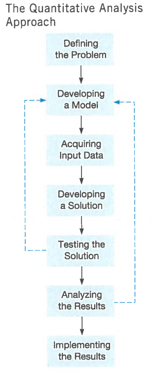
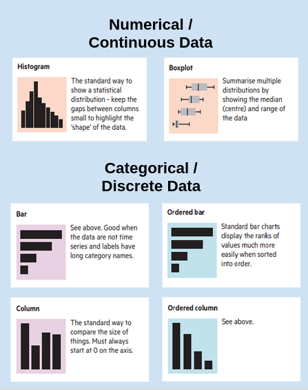
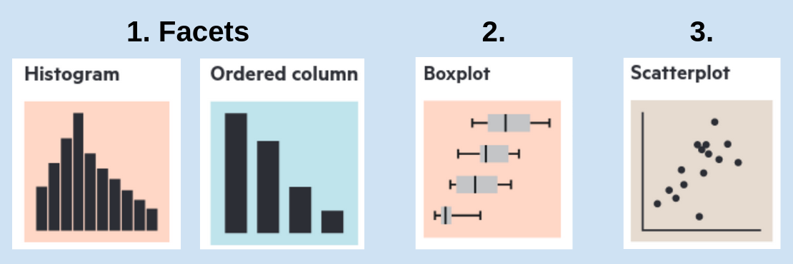
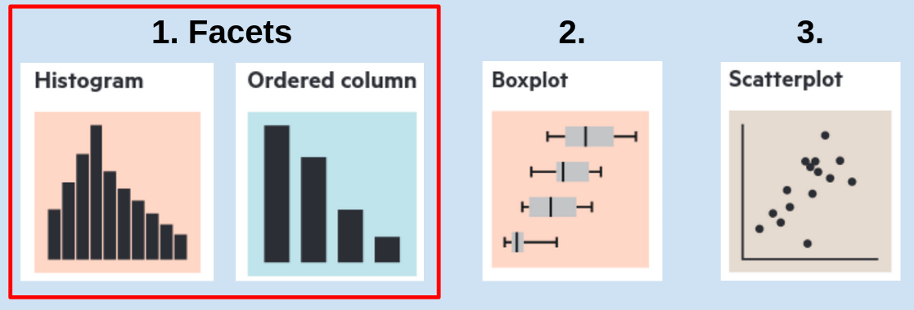
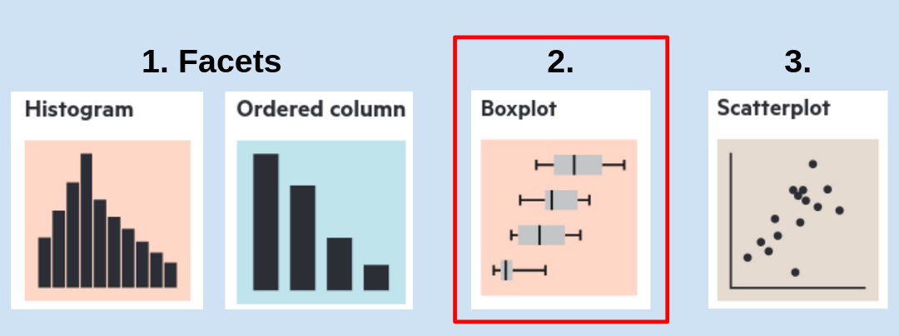
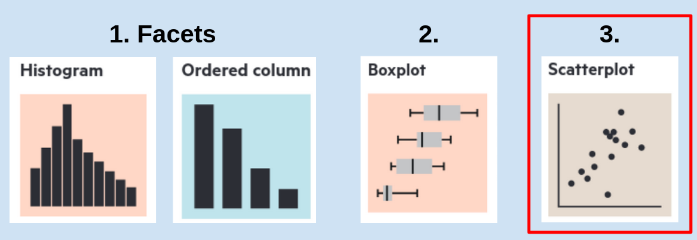

---
output:
  beamer_presentation:
    theme: "CambridgeUS"
    colortheme: "dolphin"
    fonttheme: "structurebold"
fontsize: 14pt
classoption: "aspectratio=169"
header-includes:
- \usepackage{caption}
- \captionsetup[figure]{labelformat=empty}
- \captionsetup[table]{labelformat=empty}
---

```{r, echo = FALSE, warning = FALSE, message = FALSE}
## Render the pdf
##rmarkdown::render(input = "./03_1-Bivariate_Visualizations.Rmd", output_file = "./03_1-Bivariate_Visualizations.pdf")

##fontsizes for tables: ‘"tiny"’, ‘"scriptsize"’, ‘"footnotesize"’, ‘"small"’, ‘"normalsize"’, ‘"large"’, ‘"Large"’, ‘"LARGE"’, ‘"huge"’, ‘"Huge"’

library(tidyverse)
library(readxl)
library(stargazer)
##library(kableExtra)
library(modelr)

knitr::opts_chunk$set(echo = FALSE,
                      eval = TRUE,
                      error = FALSE,
                      message = FALSE,
                      warning = FALSE,
                      comment = NA)


```


# Today's Agenda

\begin{LARGE}

Exploring bivariate and multivariate visualizations

\end{LARGE}

\vspace{.5in}

\begin{center}
Justin Leinaweaver (Spring 2022)
\end{center}


# Dataset 1\: The Motivating Problem

\begin{columns}
\begin{column}{0.25\textwidth}
```{r, fig.align = 'center', out.height = '82%'}

```
\end{column}
\begin{column}{0.7\textwidth}

\begin{large}
\vspace{.25in}

What drives economic investment in US states? 

\vspace{.5in}

Why do some states attract greater investment by companies and individuals than others?
\end{large}

\end{column}
\end{columns}


# Last Week: Univariate Analyses
\begin{columns}
\begin{column}{0.6\textwidth}

Measures of Central Tendency
\begin{itemize}
\item Mean
\item Median
\end{itemize}

\vspace{.15in}

Deviations from Central Tendency
\begin{itemize}
\item Standard deviation
\end{itemize}

\vspace{.15in}

Measures of Variability
\begin{itemize}
\item Range
\item IQR
\end{itemize}

\end{column}
\begin{column}{0.4\textwidth}
```{r, fig.align = 'center', fig.asp=0.618, out.height = '90%', fig.width = 5}

```
\end{column}
\end{columns}


# 
\begin{Large}
\textbf{Bivariate and Multivariate Visualizations}
\end{Large}

\vspace{.25in}

```{r, fig.align = 'center', fig.asp=0.618, out.width = '90%', fig.width = 5}

```


# 
\begin{Large}
\textbf{Bivariate and Multivariate Visualizations}
\end{Large}

\vspace{.25in}

```{r, fig.align = 'center', fig.asp=0.618, out.width = '90%', fig.width = 5}

```


# Bivariate Viz: Categorical x Categorical
\begin{large}
\begin{center}
\textbf{1. Using Facets to Extend Univariate Visualizations}
\end{center}

\vspace{.25in}

Make two bar plots of manufacturing category
\begin{enumerate}
\item One for states with an income tax, and

\item One for states without an income tax.
\end{enumerate}
\end{large}


# Bivariate Viz: Categorical x Categorical
```{r, fig.align = 'center', fig.asp=0.4, out.height = '70%', fig.width = 6}
d <- read_excel("../../Data/Dataset-1/Dataset1-2020_Only.xlsx", na = "NA") %>%
  mutate(
    gdp_category = factor(gdp_category, levels = c("Under $100 billion", "Under $1 trillion", "Above $1 trillion")),
    pop_category = factor(pop_category, levels = c("Under 5 million", "Under 10 million", "Above 10 million")),
    manufacturing_category = factor(manufacturing_category, levels = c("Under 100k", "Under 300k", "Above 300k")),
    income_tax2 = if_else(income_tax == 1, "Income Tax", "No Income Tax")
  )

d %>%
  ggplot(aes(x = manufacturing_category)) +
  geom_bar(fill = "darkblue", width = .5) +
  geom_hline(yintercept = seq(5,15,5), color = "white") +
  theme_bw() +
  labs(x = "Manufacturing Employment", y = "") +
  facet_wrap(~ income_tax2)
```


# Bivariate Viz: Categorical x Categorical
\begin{large}
\begin{center}
\textbf{1. Using Facets to Extend Univariate Visualizations}
\end{center}

\vspace{.25in}

Make three bar plots of GDP category
\begin{enumerate}
\item pop\_category = "Under 5 million"
\item pop\_category = "Under 10 million"
\item pop\_category = "Above 10 million"
\end{enumerate}
\end{large}


# Bivariate Viz: Categorical x Categorical
```{r, fig.align = 'center', fig.asp=0.4, out.height = '72%', fig.width = 8.5}
d %>%
  mutate(
    pop_category = case_when(
      pop_category == "Under 5 million" ~ "1. Population < 5 million",
      pop_category == "Under 10 million" ~ "2. Population < 10 million",
      pop_category == "Above 10 million" ~ "3. Population > 10 million"
    )
  ) %>%
  ggplot(aes(x = gdp_category)) +
  geom_bar(fill = "darkblue", width = .5) +
  geom_hline(yintercept = seq(5,15,5), color = "white") +
  theme_bw() +
  labs(x = "Size of GDP", y = "") +
  scale_x_discrete(limits = c("Under $100 billion", "Under $1 trillion", "Above $1 trillion"), labels = c("< $100 billion", "< $1 trillion", "> $1 trillion")) +  
  facet_wrap(~ pop_category)
```


# Bivariate Viz: Numerical x Categorical
\begin{large}
\begin{center}
\textbf{1. Using Facets to Extend Univariate Visualizations}
\end{center}

\vspace{.25in}

Make three histograms of manufacturing employment (5 bins)
\begin{enumerate}
\item pop\_category = "Under 5 million"
\item pop\_category = "Under 10 million"
\item pop\_category = "Above 10 million"
\end{enumerate}
\end{large}


#
```{r, fig.align = 'center', fig.asp=0.618, out.height = '48%', fig.width = 5}
## Histograms in facets
## To match excel, use breaks to manually set the bins
d10 <- d %>% filter(pop_category == "Under 5 million")

diff1 <- (max(d10$manufacturing_thousands) - min(d10$manufacturing_thousands))/5

## manually set the breaks in the histogram
breaks1 <- c(min(d10$manufacturing_thousands),
             min(d10$manufacturing_thousands) + diff1,
             min(d10$manufacturing_thousands) + diff1*2,
             min(d10$manufacturing_thousands) + diff1*3,
             min(d10$manufacturing_thousands) + diff1*4,
             min(d10$manufacturing_thousands) + diff1*5)

d %>%
    filter(pop_category == "Under 5 million") %>%
    ggplot(aes(x = manufacturing_thousands)) +
    geom_histogram(breaks = breaks1, fill = "darkblue", color = "white") +
    theme_bw() +
    labs(x = "Manufacturing Employment", title = "Small States")
```

\begin{columns}
\begin{column}{.5\textwidth}

```{r, fig.align = 'center', fig.asp=0.618, out.height = '48%', fig.width = 5}
## To match excel, use breaks to manually set the bins
d10 <- d %>% filter(pop_category == "Under 10 million")

diff1 <- (max(d10$manufacturing_thousands) - min(d10$manufacturing_thousands))/5

## manually set the breaks in the histogram
breaks1 <- c(min(d10$manufacturing_thousands),
             min(d10$manufacturing_thousands) + diff1,
             min(d10$manufacturing_thousands) + diff1*2,
             min(d10$manufacturing_thousands) + diff1*3,
             min(d10$manufacturing_thousands) + diff1*4,
             min(d10$manufacturing_thousands) + diff1*5)

d %>%
    filter(pop_category == "Under 10 million") %>%
    ggplot(aes(x = manufacturing_thousands)) +
    geom_histogram(breaks = breaks1, fill = "darkblue", color = "white") +
    theme_bw() +
    labs(x = "Manufacturing Employment", title = "Medium States")
```
\end{column}

\begin{column}{.5\textwidth}
```{r, fig.align = 'center', fig.asp=0.618, out.height = '48%', fig.width = 5}
## To match excel, use breaks to manually set the bins
d10 <- d %>% filter(pop_category == "Above 10 million")

diff1 <- (max(d10$manufacturing_thousands) - min(d10$manufacturing_thousands))/5

## manually set the breaks in the histogram
breaks1 <- c(min(d10$manufacturing_thousands),
             min(d10$manufacturing_thousands) + diff1,
             min(d10$manufacturing_thousands) + diff1*2,
             min(d10$manufacturing_thousands) + diff1*3,
             min(d10$manufacturing_thousands) + diff1*4,
             min(d10$manufacturing_thousands) + diff1*5)
d %>%
    filter(pop_category == "Above 10 million") %>%
    ggplot(aes(x = manufacturing_thousands)) +
    geom_histogram(breaks = breaks1, fill = "darkblue", color = "white") +
    theme_bw() +
    labs(x = "Manufacturing Employment", title = "Large States")
```
\end{column}
\end{columns}


#
```{r, fig.align = 'center', fig.asp=0.618, out.width = '95%', fig.width = 5}

```


# Using Box Plots: Numerical x Categorical
\begin{LARGE}
\begin{center}
Remake the last visualization using a box plot instead of histograms with facets.

\vspace{.25in}

e.g. separate boxes for each population category
\end{center}
\end{LARGE}


# Bivariate Viz: Numerical x Categorical
```{r, fig.align = 'center', fig.asp=0.618, out.height = '85%', fig.width = 6}
## box plots
d %>%
  ggplot(aes(y = manufacturing_thousands, x = pop_category)) +
  geom_boxplot(fill = c("pink", "lightblue", "blue")) +
  theme_minimal() +
  labs(x = "", y = "Manufacturing Employment (thousands)") #, title = "Employment in manufacturing correlates with the size of the population"

```


#
```{r, fig.align = 'center', fig.asp=0.618, out.width = '95%', fig.width = 5}

```


# Using Scatter Plots: Numerical x Numerical

\begin{center}
\begin{Large}

\textbf{Do states with bigger populations have higher levels of employment in manufacturing?}

\vspace{.25in}

Make a scatter plot of manufacturing employment and population.

\end{Large}
\end{center}


# Bivariate Viz: Numerical x Numerical
```{r, fig.align = 'center', fig.asp=0.618, out.height = '75%', fig.width = 5}
d %>%
  ggplot(aes(x = population_thousands, y = manufacturing_thousands)) +
  geom_point(color = "darkblue", size = 2) +
  theme_minimal() +
    labs(x = "Population (Thousands)", y = "Manufacturing Employment (Thousands)")
```


# Time to Practice!

1. Make two histograms of unemployment, one for states with an income tax and one for states without.

2. Remake the above as a box plot

3. Make and analyze the following four scatter plots:
\begin{itemize}
\item GDP (actual) x Unemployment
\item GDP (actual) x Bachelors' Degrees
\item GDP (rate) x Unemployment
\item GDP (rate) x Bachelors' Degrees
\end{itemize}


# Unemployment x Income Taxes
\begin{columns}
\begin{column}{0.5\textwidth}
```{r, fig.align = 'center', fig.asp=.9, out.height = '80%', fig.width = 5}
## 1. Histogram
d %>%
  ggplot(aes(x = unemployment)) +
  geom_histogram(bins = 8, color = "white") +
  facet_wrap(~ income_tax2, scales = "free_y", ncol = 1) +
  theme_bw() +
  labs(x = "Unemployment Rate (%)", y = "")
```
\end{column}
\begin{column}{0.5\textwidth}
```{r, fig.align = 'center', fig.asp=0.85, out.height = '75%', fig.width = 5}
## 2. Box plot
d %>%
  ggplot(aes(x = income_tax2, y = unemployment)) +
  geom_boxplot(fill = "lightblue") +
  theme_bw() +
  labs(x = "", y = "Unemployment Rate (%)")
```
\end{column}
\end{columns}


# Scatter plots of GDP (actual)
\begin{columns}
\begin{column}{0.5\textwidth}
```{r, fig.align = 'center', fig.asp=0.8, out.height = '70%', fig.width = 5}
d %>%
  ggplot(aes(x = unemployment, y = gdp_millions)) +
  geom_point() +
  theme_bw() +
  labs(x = "Unemployment Rate (%)", y = "GDP (Millions USD)")
```
\end{column}
\begin{column}{0.5\textwidth}
```{r, fig.align = 'center', fig.asp=0.8, out.height = '70%', fig.width = 5}
d %>%
  ggplot(aes(x = bachelors, y = gdp_millions)) +
  geom_point() +
  theme_bw() +
  labs(x = "Bachelors' Degrees Earned (%)", y = "GDP (Millions USD)")
```
\end{column}
\end{columns}


# Scatter plots of GDP (rate)
\begin{columns}
\begin{column}{0.5\textwidth}
```{r, fig.align = 'center', fig.asp=0.8, out.height = '70%', fig.width = 5}
d %>%
  ggplot(aes(x = unemployment, y = gdp_rate)) +
  geom_point() +
  theme_bw() +
  labs(x = "Unemployment Rate (%)", y = "GDP Growth Rate (%)")
```
\end{column}
\begin{column}{0.5\textwidth}
```{r, fig.align = 'center', fig.asp=0.8, out.height = '70%', fig.width = 5}
d %>%
  ggplot(aes(x = bachelors, y = gdp_rate)) +
  geom_point() +
  theme_bw() +
  labs(x = "Bachelors' Degrees Earned (%)", y = "GDP Growth Rate (%)")
```
\end{column}
\end{columns}
