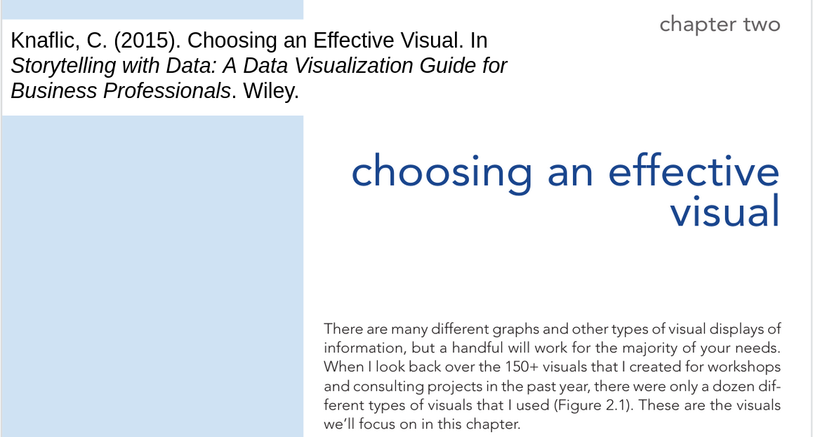
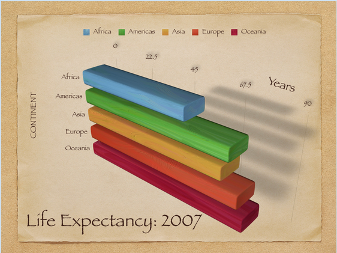
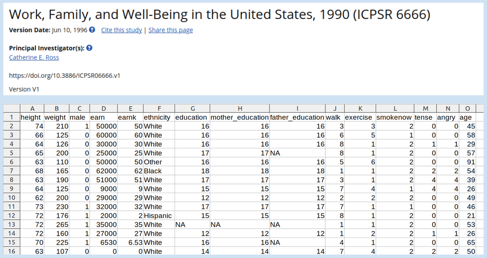
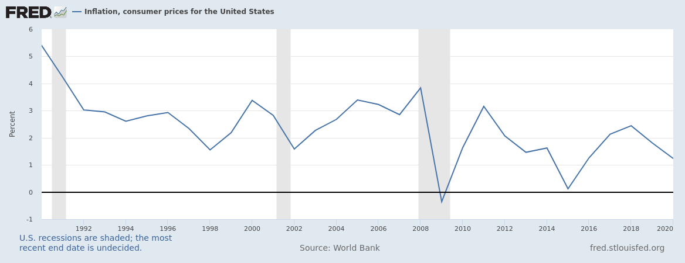

---
output:
  beamer_presentation:
    theme: "CambridgeUS"
    colortheme: "dolphin"
    fonttheme: "structurebold"
fontsize: 14pt
classoption: "aspectratio=169"
header-includes:
- \usepackage{caption}
- \captionsetup[figure]{labelformat=empty}
- \captionsetup[table]{labelformat=empty}
---

```{r, echo = FALSE, warning = FALSE, message = FALSE}
## Render the pdf
##rmarkdown::render(input = "./03_2-Practice_Visualizations.Rmd", output_file = "./03_2-Practice_Visualizations.pdf")

##fontsizes for tables: ‘"tiny"’, ‘"scriptsize"’, ‘"footnotesize"’, ‘"small"’, ‘"normalsize"’, ‘"large"’, ‘"Large"’, ‘"LARGE"’, ‘"huge"’, ‘"Huge"’

library(tidyverse)
library(readxl)
library(stargazer)
##library(kableExtra)
library(modelr)

knitr::opts_chunk$set(echo = FALSE,
                      eval = TRUE,
                      error = FALSE,
                      message = FALSE,
                      warning = FALSE,
                      comment = NA)

#############################################################
## Stargazer code

## Regular Table
##stargazer(summary = FALSE, type = "latex", header = FALSE, rownames = FALSE, float = FALSE)

## Regression Results
##stargazer(res1, type = "latex", digits = 2, omit.stat = "rsq", header = FALSE, font.size = "footnotesize", star.cutoffs = .05, notes = "*p < 0.05", notes.append = FALSE, dep.var.caption = "", float = FALSE)

##covariate.labels = c("Mother's Education")
##dep.var.labels = "Earnings (2021)"

#############################################################
## Figures

## ```{r, fig.align = 'center', fig.asp=0.618, out.height = '90%', fig.width = 5}

##```{r, out.height = '90%'}
##knitr::include_graphics()
##```

#############################################################
## Side-by-side columns

## ::: columns
## :::: column
## Content in left column
## ::::
## :::: column
## Content in right column
## ::::
## :::

##\begin{columns}
##\begin{column}{0.3\textwidth}
##
##
##\end{column}
##\begin{column}{0.7\textwidth}
##
##
##\end{column}
##\end{columns}

## Build bullets one-by-one
##\begin{enumerate}[<+->]

```


# Today's Agenda

\begin{LARGE}

Practice building and polishing univariate, bivariate and multivariate visualizations

\end{LARGE}

\vspace{.5in}

\begin{center}
Justin Leinaweaver (Spring 2022)
\end{center}

```{r, include = FALSE}
d <- read_excel("../../Data/Dataset-1/Dataset1-2020_Only.xlsx", na = "NA") %>%
  mutate(
    gdp_category = factor(gdp_category, levels = c("Under $100 billion", "Under $1 trillion", "Above $1 trillion")),
    pop_category = factor(pop_category, levels = c("Under 5 million", "Under 10 million", "Above 10 million")),
    manufacturing_category = factor(manufacturing_category, levels = c("Under 100k", "Under 300k", "Above 300k")),
    income_tax2 = if_else(income_tax == 1, "Income Tax", "No Income Tax")
  )
```


# Practice from Tuesday

1. Make two histograms of unemployment, one for states with an income tax and one for states without.

2. Remake the above as a box plot

3. Make and analyze the following four scatter plots:
\begin{itemize}
\item GDP (actual) x Unemployment
\item GDP (actual) x Bachelors' Degrees
\item GDP (rate) x Unemployment
\item GDP (rate) x Bachelors' Degrees
\end{itemize}


# Unemployment x Income Taxes
\begin{columns}
\begin{column}{0.5\textwidth}
```{r, fig.align = 'center', fig.asp=.9, out.height = '80%', fig.width = 5}
## 1. Histogram
d %>%
  ggplot(aes(x = unemployment)) +
  geom_histogram(bins = 8, color = "white") +
  facet_wrap(~ income_tax2, scales = "free_y", ncol = 1) +
  theme_bw() +
  labs(x = "Unemployment Rate (%)", y = "")
```
\end{column}
\begin{column}{0.5\textwidth}
```{r, fig.align = 'center', fig.asp=0.85, out.height = '75%', fig.width = 5}
## 2. Box plot
d %>%
  ggplot(aes(x = income_tax2, y = unemployment)) +
  geom_boxplot(fill = "lightblue") +
  theme_bw() +
  labs(x = "", y = "Unemployment Rate (%)")
```
\end{column}
\end{columns}


# Scatter plots of GDP (actual)
\begin{columns}
\begin{column}{0.5\textwidth}
```{r, fig.align = 'center', fig.asp=0.8, out.height = '70%', fig.width = 5}
d %>%
  ggplot(aes(x = unemployment, y = gdp_millions)) +
  geom_point() +
  theme_bw() +
  labs(x = "Unemployment Rate (%)", y = "GDP (Millions USD)")
```
\end{column}
\begin{column}{0.5\textwidth}
```{r, fig.align = 'center', fig.asp=0.8, out.height = '70%', fig.width = 5}
d %>%
  ggplot(aes(x = bachelors, y = gdp_millions)) +
  geom_point() +
  theme_bw() +
  labs(x = "Bachelors' Degrees Earned (%)", y = "GDP (Millions USD)")
```
\end{column}
\end{columns}


# Scatter plots of GDP (rate)
\begin{columns}
\begin{column}{0.5\textwidth}
```{r, fig.align = 'center', fig.asp=0.8, out.height = '70%', fig.width = 5}
d %>%
  ggplot(aes(x = unemployment, y = gdp_rate)) +
  geom_point() +
  theme_bw() +
  labs(x = "Unemployment Rate (%)", y = "GDP Growth Rate (%)")
```
\end{column}
\begin{column}{0.5\textwidth}
```{r, fig.align = 'center', fig.asp=0.8, out.height = '70%', fig.width = 5}
d %>%
  ggplot(aes(x = bachelors, y = gdp_rate)) +
  geom_point() +
  theme_bw() +
  labs(x = "Bachelors' Degrees Earned (%)", y = "GDP Growth Rate (%)")
```
\end{column}
\end{columns}


# 
```{r, fig.align = 'center', out.height = '90%'}

```


# Professional Visualizations
\begin{columns}
\begin{column}{0.4\textwidth}

\begin{large}
\begin{enumerate}
\item Informative titles
\vspace{.15in}
\item Figure labels
\vspace{.15in}
\item Clean axis labels
\vspace{.15in}
\item Source info
\vspace{.15in}
\item No chart junk
\end{enumerate}
\end{large}

\end{column}
\begin{column}{0.6\textwidth}
\vspace{.2in}
```{r, fig.align = 'center', out.height = '75%'}

```
\end{column}
\end{columns}


# 
```{r, fig.align = 'center', fig.asp=0.7, out.height = '75%', fig.width = 6}
d <- read_excel("../../Data/Dataset-2/Wk3-WDI-Life_Expectancy_Data.xlsx") %>%
    select(year = "Time", country = "Country Name", life_exp = "Life expectancy at birth, total (years) [SP.DYN.LE00.IN]")

d_world <- d %>% filter(country == "World")
d_other <- d %>% filter(country != "World")

## d_other %>%
##     ggplot(aes(x = reorder(country, life_exp), y = life_exp)) +
##     geom_col() +
##     geom_hline(yintercept = seq(20, 60, 20), color = "white") +
##     geom_hline(yintercept = d_world$life_exp, color = "red", size = 1.5) +
##     annotate("text", x = 2, y = 83, label = "Global\nAvg", size = 6, color = "red") +
##     theme_bw() +
##     coord_flip(ylim = c(0, 95)) +
##     labs(x = "", y = "Life Expectancy")

d_other %>%
    ggplot(aes(x = reorder(country, life_exp), y = life_exp)) +
    geom_point(size = 2) +
    geom_hline(yintercept = d_world$life_exp, color = "red", size = 1.5) +
    annotate("text", x = .25, y = 78, label = "Global Avg", size = 4, color = "red") +
    theme_bw() +
    coord_flip(ylim = c(55, 85), xlim = c(0,11)) +
    labs(x = "", y = "Years at birth", title = "Life Expectancy by UN Region (2019)")
```

\begin{footnotesize}
\textbf{Figure 1}: Global life expectancies for 2019 are taken from the World Bank's World Development Indicators (WDI) database and organized by UN region.
\end{footnotesize}


#
```{r, out.height = '95%', fig.align = 'center'}

```


# Inflation, consumer prices
```{r, out.height = '60%', fig.align = 'center'}
## Inflation, consumer prices for the United States (FPCPITOTLZGUSA)
## https://fred.stlouisfed.org/series/FPCPITOTLZGUSA



## 102.66% est
## earnk2021 = earnk * 2.0266
```
\begin{itemize}
\item Since 1990 $\approx +102.66\%$ 
\item \textbf{New Variable}: earnk2021 = earnk x 2.0266
\end{itemize}


# Univariate Analysis

\begin{LARGE}

Visualize the following variables:

\begin{enumerate}
\item Ethnicity

\item Education

\item Yearly Income (earnk2021) 
\end{enumerate}
\end{LARGE}


# Univariate Analysis

\begin{Large}

Visualize the following variables:

\begin{enumerate}
\item Ethnicity - \textbf{Bar plot}

\item Education - \textbf{Bar plot}

\item Yearly Income (earnk2021) - \textbf{Histogram}
\end{enumerate}
\end{Large}


#
```{r, fig.align = 'center', fig.asp=0.618, out.height = '49%', fig.width = 5}
## Input Ross data and adjust for inflation
d <- read_excel("../../Data/Dataset-3-Ross_1990/ICPSR_Ross_Survey_1990.xlsx", na = c("NA"), guess_max = 10000)%>%
    mutate(
        earnk2021 = earnk * 2.0266
    )

d %>%
  count(ethnicity) %>%
  ggplot(aes(x = reorder(ethnicity, desc(n)), y = n)) +
  geom_col(width = .75) +
  theme_bw() +
  labs(x = "", y = "", title = "Survey Respondents by Ethnicity") +
  geom_hline(yintercept = c(500, 1000, 1500), color = "white")
```

\begin{columns}
\begin{column}{0.5\textwidth}

```{r, fig.align = 'center', fig.asp=0.618, out.height = '49%', fig.width = 5}
d %>%
  ggplot(aes(x = education)) +
  geom_bar() +
  theme_bw() +
  labs(x = "", y = "", title = "Survey Respondents by Education") +
  scale_x_continuous(breaks = seq(1, 18, 1), labels = seq(1, 18, 1)) +
  geom_hline(yintercept = seq(200, 600, 200), color = "white")
```

\end{column}
\begin{column}{0.5\textwidth}

```{r, fig.align = 'center', fig.asp=0.618, out.height = '49%', fig.width = 5}
d %>%
  ggplot(aes(x = earnk2021)) +
  geom_histogram(bins = 20, color = "white") +
  theme_bw() +
  labs(x = "Yearly Income (Thousands USD)", y = "", title = "Survey Respondents by Income") 
```

\end{column}
\end{columns}


# Univariate Analysis
\begin{large}
Recode education and remake the visualization:

\begin{itemize}
\item $<$ HS (1-11)
\item HS (12)
\item Some college (13-15)
\item College (16)
\item Post-Grad (17-18)
\end{itemize}
\end{large}


#
::: columns
:::: column
```{r, fig.align = 'center', fig.asp=0.8, out.width = '95%', fig.width = 5}
d %>%
  ggplot(aes(x = education)) +
  geom_bar() +
  theme_bw() +
  labs(x = "", y = "", title = "Survey Respondents by Education") +
  scale_x_continuous(breaks = seq(1, 18, 1), labels = seq(1, 18, 1)) +
  geom_hline(yintercept = seq(200, 600, 200), color = "white")
```
::::
:::: column
```{r, fig.align = 'center', fig.asp=0.8, out.width = '95%', fig.width = 5}
## Redo education
d %>%
  mutate(
    education = case_when(
      education < 12 ~ "< HS",
      education == 12 ~ "HS",
      education < 16 ~ "Some College",
      education == 16 ~ "College",
      education < 19 ~ "Post-Grad"
    )
  ) %>%
  ggplot(aes(x = education)) +
  geom_bar() +
  theme_bw() +
  labs(x = "", y = "", title = "Survey Respondents by Education") +
  scale_x_discrete(limits = c("< HS", "HS", "Some College", "College", "Post-Grad")) +
  geom_hline(yintercept = seq(200, 600, 200), color = "white")
```
::::
:::


# Bivariate Analyses
\begin{LARGE}
Visualize the following relationship:
\begin{itemize}
\item Gender x Smoker
\end{itemize}
\end{LARGE}


#
```{r, fig.align = 'center', fig.asp=0.55, out.height = '95%', fig.width = 7}
## gender x smoker
d %>%
  mutate(
    gender = if_else(male == 1, "Male", "Female")
  ) %>%
  ggplot(aes(x = factor(smokenow))) +
  geom_bar(width = .75) +
  theme_bw() +
  scale_x_discrete(limits = c(1, 2), labels = c("Smoker", "Non-Smoker")) +
  facet_wrap(~ gender) +
  geom_hline(yintercept = seq(250, 750, 250), color = "white") +
  labs(x = "", y = "", title = "Reported Smoking Rates by Gender")
```


# Bivariate Analyses
\begin{LARGE}
Visualize the following relationship:
\begin{itemize}
\item Income x Gender
\end{itemize}
\end{LARGE}


# 
\begin{columns}
\begin{column}{0.5\textwidth}
```{r, fig.align = 'center', fig.asp=1, out.height = '85%', fig.width = 4.5}
## income x gender
d %>%
  mutate(
    gender = if_else(male == 1, "Male", "Female")
  ) %>%
  ggplot(aes(x = earnk2021)) +
  geom_histogram(color = "white") +
  facet_wrap(~ gender, ncol = 1, scales = "free_y") +
  theme_bw() +
  labs(x = "Yearly Income (Thousands USD)", y = "", title = "Reported Yearly Earned Income by Gender")
```
\end{column}
\begin{column}{0.5\textwidth}
```{r, fig.align = 'center', fig.asp=.618, out.height = '55%', fig.width = 4.5}
d %>%
  mutate(
    gender = if_else(male == 1, "Male", "Female")
  ) %>%
  ggplot(aes(x = gender, y = earnk2021)) +
  geom_boxplot(fill = "lightblue") +
  theme_bw() +
  labs(y = "Yearly Income (Thousands USD)", x = "", title = "Reported Yearly Earned Income by Gender") +
  coord_cartesian(ylim = c(0, 100))
```
\end{column}
\end{columns}


# Bivariate Analyses
\begin{LARGE}
Visualize the following relationship:
\begin{itemize}
\item Income x Education (recoded)
\end{itemize}
\end{LARGE}


#
```{r, fig.align = 'center', fig.asp=.618, out.height = '95%', fig.width = 6}
## income x education
d %>%
  drop_na(education) %>%
  mutate(
    education = case_when(
      education < 12 ~ "< HS",
      education == 12 ~ "HS",
      education < 16 ~ "Some College",
      education == 16 ~ "College",
      education < 19 ~ "Post-Grad"
    )
  ) %>%
  ggplot(aes(x = education, y = earnk2021)) +
  geom_boxplot(fill = "lightblue") +
  theme_minimal() +
  labs(y = "Yearly Income (Thousands USD)", x = "", title = "Reported Yearly Earned Income by Education Level") +
  scale_x_discrete(limits = c("< HS", "HS", "Some College", "College", "Post-Grad")) +
  coord_cartesian(ylim = c(0, 100))
```


# Multivariate Analyses
\begin{LARGE}
Visualize the following relationship:
\begin{itemize}
\item Income x Education (original) x Gender
\end{itemize}
\end{LARGE}


# Multivariate Analyses
\begin{Large}
Visualize the following relationship:
\begin{itemize}
\item Income x Education (original) x Gender
\end{itemize}

\vspace{.2in}

Make two scatter plots
\begin{enumerate}
\item Income x Education for males
\item Income x Education for females
\end{enumerate}
\end{Large}


#
```{r, fig.align = 'center', fig.asp=.618, out.height = '95%', fig.width = 6}
#Income x Education (all) x Gender
d %>%
  mutate(
    gender = if_else(male == 1, "Male", "Female")
  ) %>%
  ggplot(aes(x = education, y = earnk2021, color = gender, shape = gender)) +
  geom_point(size = 2.5) +
  theme_bw() +
  scale_color_manual(values = c("red", "blue")) +
  labs(x = "Education", y = "Yearly Income (Thousands USD)", color = "", shape = "", title = "Does education correlate with income?") +
  facet_wrap(~ gender) +
  guides(color = FALSE, shape = FALSE)
```


# Multivariate Analyses
\begin{LARGE}
Visualize the following relationship:
\begin{itemize}
\item Height x Weight x Gender
\end{itemize}
\end{LARGE}


# 
\begin{columns}
\begin{column}{0.5\textwidth}
```{r, fig.align = 'center', fig.asp=1, out.height = '95%', fig.width = 5}
d %>%
  mutate(
    gender = if_else(male == 1, "Male", "Female")
  ) %>%
  ggplot(aes(x = height, y = weight, color = gender, shape = gender)) +
  geom_point(size = 2.5) +
  theme_bw() +
  scale_color_manual(values = c("red", "blue")) +
  labs(x = "Height (in)", y = "Weight (lb)", color = "", shape = "", title = "Basic Demographics of the Survey Respondents") +
  facet_wrap(~ gender, ncol = 1) +
  guides(color = FALSE, shape = FALSE)
```
\end{column}
\begin{column}{0.5\textwidth}
```{r, fig.align = 'center', fig.asp=.85, out.height = '75%', fig.width = 5}
d %>%
  mutate(
    gender = if_else(male == 1, "Male", "Female")
  ) %>%
  ggplot(aes(x = height, y = weight, color = gender, shape = gender)) +
  geom_point(size = 2.5) +
  theme_bw() +
  scale_color_manual(values = c("red", "blue")) +
  labs(x = "Height (in)", y = "Weight (lb)", color = "", shape = "") +
  theme(legend.position = "top")
```
\end{column}
\end{columns}
