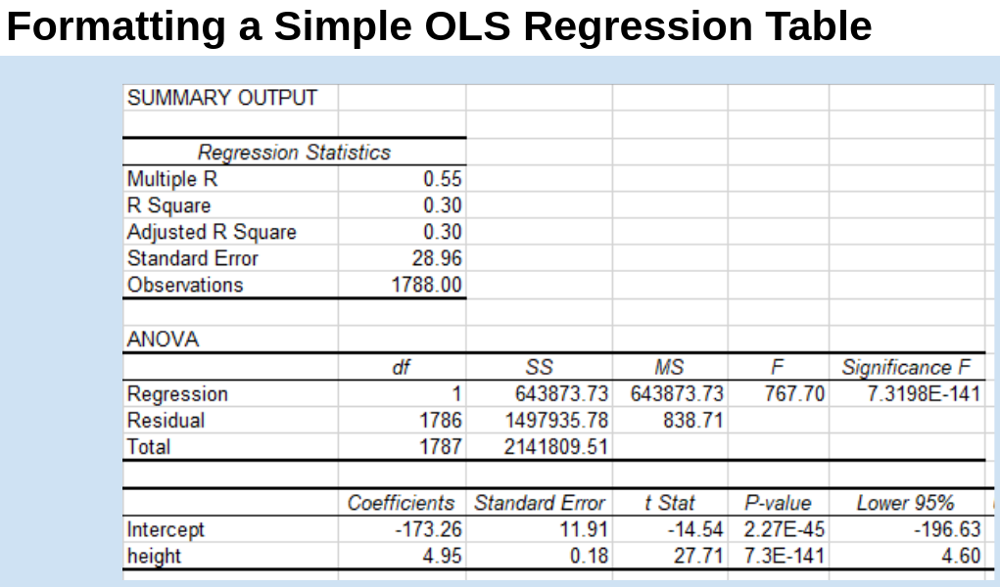
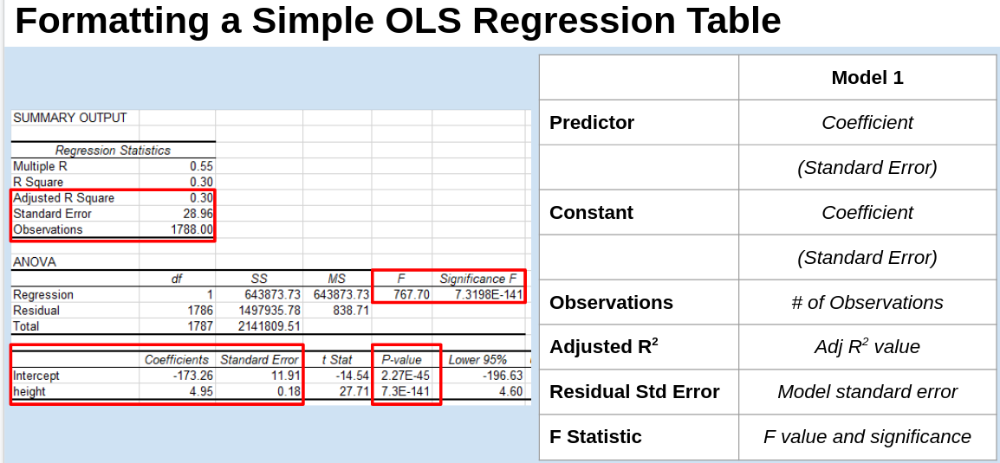

---
output:
  beamer_presentation:
    theme: "CambridgeUS"
    colortheme: "dolphin"
    fonttheme: "structurebold"
fontsize: 14pt
classoption: "aspectratio=169"
header-includes:
- \usepackage{caption}
- \captionsetup[figure]{labelformat=empty}
- \captionsetup[table]{labelformat=empty}
---

```{r, echo = FALSE, warning = FALSE, message = FALSE}
## Render the pdf
##rmarkdown::render(input = "./05_1-Simple_OLS_Regression.Rmd", output_file = "./05_1-Simple_OLS_Regression.pdf")

##fontsizes for tables: ‘"tiny"’, ‘"scriptsize"’, ‘"footnotesize"’, ‘"small"’, ‘"normalsize"’, ‘"large"’, ‘"Large"’, ‘"LARGE"’, ‘"huge"’, ‘"Huge"’

library(tidyverse)
library(readxl)
library(stargazer)
##library(kableExtra)
library(modelr)

knitr::opts_chunk$set(echo = FALSE,
                      eval = TRUE,
                      error = FALSE,
                      message = FALSE,
                      warning = FALSE,
                      comment = NA)

#############################################################
## Stargazer code

## Regular Table
##stargazer(summary = FALSE, type = "latex", header = FALSE, rownames = FALSE, float = FALSE)

## Regression Results
##stargazer(res1, type = "latex", digits = 2, omit.stat = "rsq", header = FALSE, font.size = "footnotesize", star.cutoffs = .05, notes = "*p < 0.05", notes.append = FALSE, dep.var.caption = "", float = FALSE)

##covariate.labels = c("Mother's Education")
##dep.var.labels = "Earnings (2021)"

#############################################################
## Figures

## ```{r, fig.align = 'center', fig.asp=0.618, out.height = '90%', fig.width = 5}

##```{r, fig.align = 'center', out.height = '90%'}
##knitr::include_graphics()
##```

#############################################################
## Side-by-side columns

## ::: columns
## :::: column
## Content in left column
## ::::
## :::: column
## Content in right column
## ::::
## :::

##\begin{columns}
##\begin{column}{0.3\textwidth}
##
##
##\end{column}
##\begin{column}{0.7\textwidth}
##
##
##\end{column}
##\end{columns}

## Build bullets one-by-one
##\begin{enumerate}[<+->]

```


# Today's Agenda

\begin{large}
1. Explore the intuitions of OLS regression

\vspace{.25in}

2. Practice fitting and interpreting simple OLS regressions
\end{large}

\vspace{.5in}

\begin{center}
Justin Leinaweaver (Spring 2022)
\end{center}

```{r, include = FALSE}
d <- read_excel("../../Data/Dataset-3-Ross_1990/ICPSR_Ross_Survey_1990.xlsx", na = c("NA"), guess_max = 10000) %>%
    mutate(
        earnk2021 = earnk * 2.0266
    )
```


# 
```{r, fig.align = 'center', out.height = '90%'}

```


# 
```{r, fig.align = 'center', out.height = '90%'}
knitr::include_graphics("./Images/05_1-fig2_4-2.png")
```

# 
```{r, fig.align = 'center', out.height = '90%'}

```

# 
```{r, fig.align = 'center', out.height = '90%'}

```


# The Formula for a Line

\begin{center}
\begin{huge}
y = mx + b

\vspace{.2in}

is equivalent to

\vspace{.2in}

y = $\alpha$ + $\beta$ x
\end{huge}
\end{center}


# The Formula for a Line

\begin{center}
\begin{huge}
y = $\alpha$ + $\beta$ x
\end{huge}
\end{center}

\vspace{.2in}

\begin{Large}
\begin{itemize}
\item y is the outcome
\item $\alpha$ is the constant
\item $\beta$ is the coefficient estimate
\item x is the predictor
\end{itemize}
\end{Large}


# The Formula for a Line

\begin{center}
\begin{huge}
y = $\alpha$ + $\beta$ x
\end{huge}
\end{center}

\vspace{.2in}

\begin{Large}
\begin{itemize}
\item y is the outcome
\item $\alpha$ is the constant (\textbf{the intercept})
\item $\beta$ is the coefficient estimate (\textbf{the slope})
\item x is the predictor
\end{itemize}
\end{Large}


# 
```{r, fig.align = 'center', out.height = '90%'}

```


# 
```{r, fig.align = 'center', out.height = '90%'}

```


# 
```{r, fig.align = 'center', out.height = '90%'}

```


# 
```{r, fig.align = 'center', out.height = '90%'}

```


# 
```{r, fig.align = 'center', out.height = '95%'}

```


# Univariate Analysis
```{r, fig.align = 'center', fig.asp=0.4, out.width = '95%', fig.width = 6.5}
d %>%
  pivot_longer(cols = c(weight, height), names_to = "Vars", values_to = "Values") %>%
  mutate(
    Vars = if_else(Vars == "weight", "Weight (lb)", "Height (in)")
  ) %>%
  ggplot(aes(x = Values)) +
  geom_histogram(color = "white", fill = "darkgrey") +
  facet_wrap(~ Vars, scales = "free", ncol = 2) +
  theme_bw() +
  labs(x = "", y = "")
```


#
```{r, fig.align = 'center', fig.asp=0.618, out.height = '95%', fig.width = 6.5}
## Bivariate Viz
d %>%
  ggplot(aes(x = height, y = weight)) +
  geom_point(alpha = .2) +
  #geom_smooth(method = "lm", se = FALSE) +
  theme_bw() +
  labs(x = "Height (in)", y = "Weight (lb)")
```


# 
```{r, fig.align = 'center', out.height = '95%'}

```

# 
```{r, fig.align = 'center', out.height = '95%'}

```

# 
```{r, fig.align = 'center', out.height = '85%'}

```

# 
```{r, fig.align = 'center', out.height = '85%'}

```


#
\begin{columns}
\begin{column}{0.5\textwidth}
```{r, fig.align = 'center', fig.asp=0.8, out.height = '75%', fig.width = 5}
## Bivariate Viz
d %>%
  ggplot(aes(x = height, y = weight)) +
  geom_point(alpha = .2) +
  geom_smooth(method = "lm", se = FALSE) +
  theme_bw() +
  labs(x = "Height (in)", y = "Weight (lb)")
```
\end{column}
\begin{column}{0.5\textwidth}

\begin{center}
```{r, results = "asis"}
## Regression
res1 <- d %>% lm(data = ., weight ~ height)

## Save coefficients
x1 <- round(coef(res1), 2)

stargazer(res1, omit.stat = "rsq", star.cutoffs = .05, notes = "*p < 0.05", notes.append = FALSE, digits = 2, covariate.labels = c("Height", "Constant"), dep.var.labels = "Weight", dep.var.caption = "", header = FALSE, float = FALSE, font.size = "scriptsize")
```
\end{center}

\end{column}
\end{columns}


#
\begin{columns}
\begin{column}{0.5\textwidth}
```{r, fig.align = 'center', fig.asp=0.8, out.height = '70%', fig.width = 5}
## Bivariate Viz
d %>%
  ggplot(aes(x = height, y = weight)) +
  geom_point(alpha = .2) +
  geom_smooth(method = "lm", se = FALSE) +
  theme_bw() +
  labs(x = "Height (in)", y = "Weight (lb)")
```
\end{column}
\begin{column}{0.5\textwidth}

\begin{center}
```{r, results = "asis"}
stargazer(res1, omit.stat = "rsq", star.cutoffs = .05, notes = "*p < 0.05", notes.append = FALSE, digits = 2, covariate.labels = c("Height", "Constant"), dep.var.labels = "Weight", dep.var.caption = "", header = FALSE, float = FALSE, font.size = "scriptsize")
```
\end{center}

\end{column}
\end{columns}

\vspace{.2in}

\begin{large}
\begin{center}
Outcome = Constant + Beta Coefficient * Predictor
\end{center}
\end{large}


#
\begin{columns}
\begin{column}{0.5\textwidth}
```{r, fig.align = 'center', fig.asp=0.8, out.height = '70%', fig.width = 5}
## Bivariate Viz
d %>%
  ggplot(aes(x = height, y = weight)) +
  geom_point(alpha = .2) +
  geom_smooth(method = "lm", se = FALSE) +
  theme_bw() +
  labs(x = "Height (in)", y = "Weight (lb)")
```
\end{column}
\begin{column}{0.5\textwidth}

\begin{center}
```{r, results = "asis"}
stargazer(res1, omit.stat = "rsq", star.cutoffs = .05, notes = "*p < 0.05", notes.append = FALSE, digits = 2, covariate.labels = c("Height", "Constant"), dep.var.labels = "Weight", dep.var.caption = "", header = FALSE, float = FALSE, font.size = "scriptsize")
```
\end{center}

\end{column}
\end{columns}

\vspace{.2in}

\begin{large}
\begin{center}
Weight = `r x1[1]` + `r x1[2]` x Height
\end{center}
\end{large}


#
\begin{columns}
\begin{column}{0.5\textwidth}
```{r, fig.align = 'center', fig.asp=0.8, out.height = '70%', fig.width = 5}
## Bivariate Viz
d %>%
  ggplot(aes(x = height, y = weight)) +
  geom_point(alpha = .2) +
  geom_smooth(method = "lm", se = FALSE) +
  theme_bw() +
  labs(x = "Height (in)", y = "Weight (lb)")
```
\end{column}
\begin{column}{0.5\textwidth}

\begin{center}
```{r, results = "asis"}
stargazer(res1, omit.stat = "rsq", star.cutoffs = .05, notes = "*p < 0.05", notes.append = FALSE, digits = 2, covariate.labels = c("Height", "Constant"), dep.var.labels = "Weight", dep.var.caption = "", header = FALSE, float = FALSE, font.size = "scriptsize")
```
\end{center}

\end{column}
\end{columns}

\vspace{.2in}

\begin{large}
\begin{center}
Weight = `r x1[1]` + `r x1[2]` x 64 $\approx$ `r x1[1] + x1[2]*64` lb
\end{center}
\end{large}


#
\begin{columns}
\begin{column}{0.5\textwidth}
```{r, fig.align = 'center', fig.asp=0.8, out.height = '70%', fig.width = 5}
## Bivariate Viz
d %>%
  ggplot(aes(x = height, y = weight)) +
  geom_point(alpha = .2) +
  geom_smooth(method = "lm", se = FALSE) +
  theme_bw() +
  labs(x = "Height (in)", y = "Weight (lb)")
```
\end{column}
\begin{column}{0.5\textwidth}

\begin{center}
```{r, results = "asis"}
stargazer(res1, omit.stat = "rsq", star.cutoffs = .05, notes = "*p < 0.05", notes.append = FALSE, digits = 2, covariate.labels = c("Height", "Constant"), dep.var.labels = "Weight", dep.var.caption = "", header = FALSE, float = FALSE, font.size = "scriptsize")
```
\end{center}

\end{column}
\end{columns}

\vspace{.2in}

\begin{large}
\begin{center}
Weight = `r x1[1]` + `r x1[2]` x 69 $\approx$ `r x1[1] + x1[2]*69` lb
\end{center}
\end{large}


# 
```{r, fig.align = 'center', out.height = '95%'}

```


# Analyze Three OLS Models
\begin{large}
For each model: Make a regression table, scatter plot and a prediction using the average value of the predictor.

\begin{itemize}
\item Model 1: Regress earnings (earnk2021) on height
\item Model 2: Regress earnings (earnk2021) on age
\item Model 3: Regress earnings (earnk2021) on education
\end{itemize}
\end{large}


# For Thursday
\begin{Large}
\begin{enumerate}
\item Finish the model building work from class today

\vspace{.25in}

\item Use the four steps outlined in Wilson, Keating, and Beal-Hodges (2012) chapters 4 and 5 to evaluate the fit of our models of earnings. 
\end{enumerate}
\end{Large}
