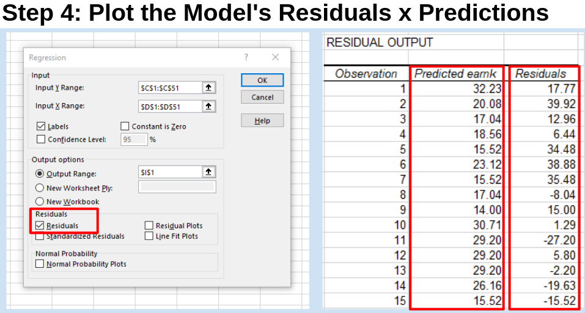
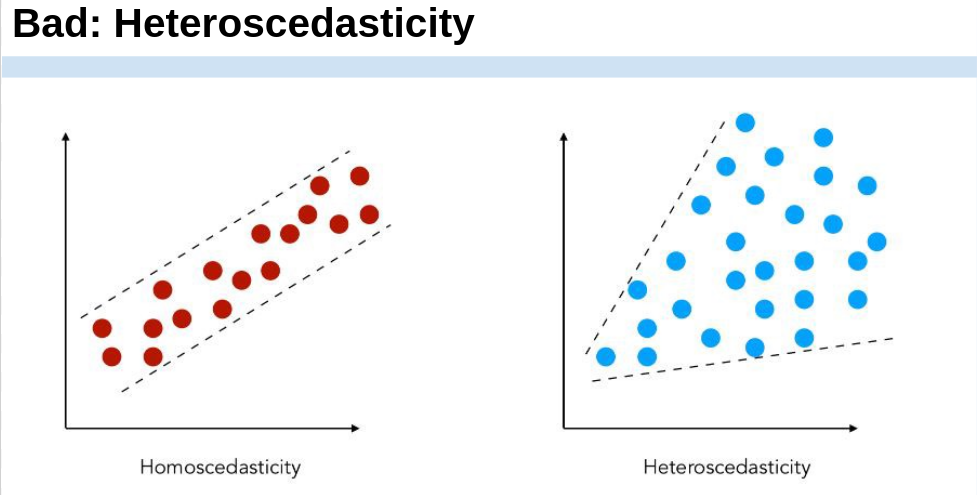
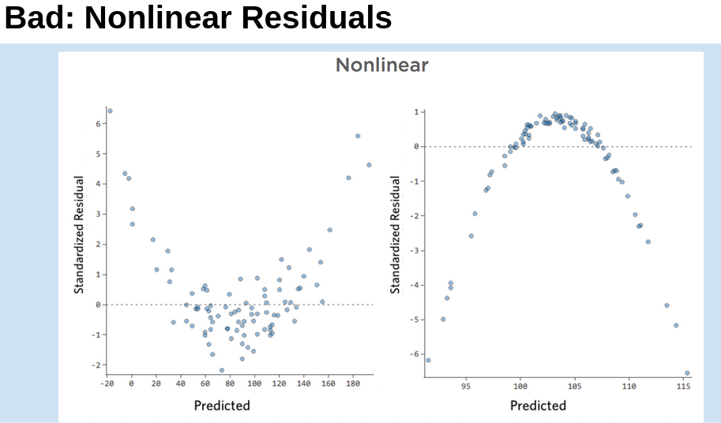

---
output:
  beamer_presentation:
    theme: "CambridgeUS"
    colortheme: "dolphin"
    fonttheme: "structurebold"
fontsize: 14pt
classoption: "aspectratio=169"
header-includes:
- \usepackage{caption}
- \captionsetup[figure]{labelformat=empty}
- \captionsetup[table]{labelformat=empty}
- \setbeamertemplate{page number in head/foot}[]{}
---

```{r, echo = FALSE, warning = FALSE, message = FALSE}
## Render the pdf
##rmarkdown::render(input = "./05_2-Evaluating_OLS.Rmd", output_file = "./05_2-Evaluating_OLS.pdf")

##fontsizes for tables: ‘"tiny"’, ‘"scriptsize"’, ‘"footnotesize"’, ‘"small"’, ‘"normalsize"’, ‘"large"’, ‘"Large"’, ‘"LARGE"’, ‘"huge"’, ‘"Huge"’

library(tidyverse)
library(readxl)
library(stargazer)
##library(kableExtra)
library(modelr)

knitr::opts_chunk$set(echo = FALSE,
                      eval = TRUE,
                      error = FALSE,
                      message = FALSE,
                      warning = FALSE,
                      comment = NA)

#############################################################
## Stargazer code

## Regular Table
##stargazer(summary = FALSE, type = "latex", header = FALSE, rownames = FALSE, float = FALSE)

## Regression Results
##stargazer(res1, type = "latex", digits = 2, omit.stat = "rsq", header = FALSE, font.size = "footnotesize", star.cutoffs = .05, notes = "*p < 0.05", notes.append = FALSE, dep.var.caption = "", float = FALSE)

##covariate.labels = c("Mother's Education")
##dep.var.labels = "Earnings (2021)"

#############################################################
## Figures

## ```{r, fig.align = 'center', fig.asp=0.618, out.height = '90%', fig.width = 5}

##```{r, fig.align = 'center', out.height = '90%'}
##knitr::include_graphics()
##```

#############################################################
## Side-by-side columns

## ::: columns
## :::: column
## Content in left column
## ::::
## :::: column
## Content in right column
## ::::
## :::

##\begin{columns}
##\begin{column}{0.3\textwidth}
##
##
##\end{column}
##\begin{column}{0.7\textwidth}
##
##
##\end{column}
##\end{columns}

## Build bullets one-by-one
##\begin{enumerate}[<+->]

```


# Today's Agenda

\begin{Large}

Evaluating simple OLS regressions

\end{Large}

\vspace{.5in}

\begin{center}
Justin Leinaweaver (Spring 2022)
\end{center}


# For Today
\begin{Large}
\begin{enumerate}
\item Finish the model building work from class today

\vspace{.25in}

\item Use the four steps outlined in Wilson, Keating, and Beal-Hodges (2012) chapters 4 and 5 to evaluate the fit of our models of earnings. 
\end{enumerate}
\end{Large}


# 
\begin{large}
\begin{center}
\textbf{Can we build a useful model of yearly earnings in the Ross (1990) dataset?}
\end{center}
\end{large}

```{r, fig.align = 'center', fig.asp=0.618, out.height = '75%', fig.width = 5}
d <- read_excel("../../Data/Dataset-3-Ross_1990/ICPSR_Ross_Survey_1990.xlsx", na = c("NA"), guess_max = 10000) %>%
    mutate(
        earnk2021 = earnk * 2.0266
    )

d %>%
  ggplot(aes(x = earnk2021)) +
  geom_histogram(color = "white", fill = "darkgrey") +
  theme_bw() +
  labs(x = "Yearly Earnings (Thousands 2021 USD)", y = "")
```


# 
\begin{large}
\begin{center}
\textbf{Can we build a useful model of yearly earnings in the Ross (1990) dataset?}
\end{center}
\end{large}

\vspace{.25in}

```{r, fig.align = 'center', fig.asp=0.3, out.width = '100%', fig.width = 8}
d %>%
  select(earnk2021, height, age, education) %>%
  pivot_longer(cols = height:education, names_to = "Predictor", values_to = "Values") %>%
  mutate(
    Predictor = case_when(
      Predictor == "age" ~ "Age (years)",
      Predictor == "height" ~ "Height (in)",
      Predictor == "education" ~ "Education (years)"
    )
  ) %>%
  ggplot(aes(x = Values, y = earnk2021)) +
  geom_point() +
  geom_smooth(method = "lm", se = FALSE) +
  facet_wrap(~ Predictor, scales = "free") +
  theme_bw() +
  labs(x = "", y = "Earnings (2021 Thousands)")
```


#
\begin{center}
```{r, results = "asis"}
## Simple Regression Options
res1 <- d %>% lm(data = ., earnk2021 ~ height)
res2 <- d %>% lm(data = ., earnk2021 ~ age)
res3 <- d %>% lm(data = ., earnk2021 ~ education)

## Save coefs
x1 <- round(coef(res1), 2)
x2 <- round(coef(res2), 2)
x3 <- round(coef(res3), 2)

stargazer(res1, res2, res3, omit.stat = "rsq", star.cutoffs = .05, notes = "*p < 0.05", notes.append = FALSE, digits = 2, covariate.labels = c("Height", "Age", "Education", "Constant"), dep.var.labels = "Earnings (2021)", dep.var.caption = "", float = FALSE, header = FALSE, font.size = "scriptsize")
```
\end{center}


#
\begin{columns}
\begin{column}{.5\textwidth}
\begin{center}
```{r, results = "asis"}
stargazer(res1, res2, res3, star.cutoffs = .05, notes = "*p < 0.05", notes.append = FALSE, digits = 2, covariate.labels = c("Height", "Age", "Education", "Constant"), dep.var.labels = "Earnings (2021)", dep.var.caption = "", float = FALSE, header = FALSE, omit.stat=c("all"), font.size = "scriptsize")
```
\end{center}
\end{column}

\begin{column}{.5\textwidth}
```{r, fig.align = 'center', out.height = '100%', fig.width = 4.5}
d %>%
  select(earnk2021, height, age, education) %>%
  pivot_longer(cols = height:education, names_to = "Predictor", values_to = "Values") %>%
  mutate(
    Predictor = case_when(
      Predictor == "age" ~ "Age (years)",
      Predictor == "height" ~ "Height (in)",
      Predictor == "education" ~ "Education (years)"
    )
  ) %>%
  ggplot(aes(x = Values, y = earnk2021)) +
  geom_point() +
  geom_smooth(method = "lm", se = FALSE) +
  facet_wrap(~ Predictor, scales = "free", ncol = 1) +
  theme_bw() +
  labs(x = "", y = "Earnings (2021 Thousands)")
```
\end{column}
\end{columns}


# What are the predicted earnings...

\begin{large}
For someone of average height in the sample?
\begin{itemize}
\item Avg height of `r round(mean(d$height, na.rm = TRUE), 1)` = `r str_c('\\$', round(x1[1]+x1[2]*round(mean(d$height, na.rm = TRUE), 1), 1), 'k')`
\end{itemize}

For someone of average age in the sample?
\begin{itemize}
\item Avg age of `r round(mean(d$age, na.rm = TRUE), 1)` = `r str_c('\\$', round(x2[1]+x2[2]*round(mean(d$age, na.rm = TRUE), 1), 1), 'k')`
\end{itemize}

For someone of average education in the sample?
\begin{itemize}
\item Avg education of `r round(mean(d$education, na.rm = TRUE), 1)` = `r str_c('\\$', round(x3[1]+x3[2]*round(mean(d$education, na.rm = TRUE), 1), 1), 'k')`
\end{itemize}
\end{large}


# What are the predicted earnings...
\begin{large}
Model 1: Height
\begin{itemize}
\item Avg = `r str_c('\\$', round(x1[1]+x1[2]*round(mean(d$height, na.rm = TRUE), 1), 1), 'k')` vs Maximum = ?
\end{itemize}

Model 2: Age
\begin{itemize}
\item Avg = `r str_c('\\$', round(x2[1]+x2[2]*round(mean(d$age, na.rm = TRUE), 1), 1), 'k')` vs Maximum = ?
\end{itemize}

Model 3: Education
\begin{itemize}
\item Avg = `r str_c('\\$', round(x3[1]+x3[2]*round(mean(d$education, na.rm = TRUE), 1), 1), 'k')` vs Maximum = ?
\end{itemize}
\end{large}


# What are the predicted earnings...
\begin{large}
Model 1: Height
\begin{itemize}
\item Avg = `r str_c('\\$', round(x1[1]+x1[2]*round(mean(d$height, na.rm = TRUE), 1), 1), 'k')` vs Maximum (`r round(max(d$height, na.rm = TRUE), 1)`) = ?
\end{itemize}

Model 2: Age
\begin{itemize}
\item Avg = `r str_c('\\$', round(x2[1]+x2[2]*round(mean(d$age, na.rm = TRUE), 1), 1), 'k')` vs Maximum (`r round(max(d$age, na.rm = TRUE), 1)`) = ?
\end{itemize}

Model 3: Education
\begin{itemize}
\item Avg = `r str_c('\\$', round(x3[1]+x3[2]*round(mean(d$education, na.rm = TRUE), 1), 1), 'k')` vs Maximum (`r round(max(d$education, na.rm = TRUE), 1)`) = ?
\end{itemize}
\end{large}


# What are the predicted earnings...
\begin{large}
Model 1: Height
\begin{itemize}
\item Avg = `r str_c('\\$', round(x1[1]+x1[2]*round(mean(d$height, na.rm = TRUE), 1), 1), 'k')` vs Maximum (`r round(max(d$height, na.rm = TRUE), 1)`) = `r str_c('\\$', round(x1[1]+x1[2]*round(max(d$height, na.rm = TRUE), 1), 1), 'k')`
\end{itemize}

Model 2: Age
\begin{itemize}
\item Avg = `r str_c('\\$', round(x2[1]+x2[2]*round(mean(d$age, na.rm = TRUE), 1), 1), 'k')` vs Maximum (`r round(max(d$age, na.rm = TRUE), 1)`) = `r str_c('\\$', round(x2[1]+x2[2]*round(max(d$age, na.rm = TRUE), 1), 1), 'k')`
\end{itemize}

Model 3: Education
\begin{itemize}
\item Avg = `r str_c('\\$', round(x3[1]+x3[2]*round(mean(d$education, na.rm = TRUE), 1), 1), 'k')` vs Maximum (`r round(max(d$education, na.rm = TRUE), 1)`) = `r str_c('\\$', round(x3[1]+x3[2]*round(max(d$education, na.rm = TRUE), 1), 1), 'k')`
\end{itemize}
\end{large}


#
\begin{center}
```{r, results = "asis"}
stargazer(res1, res2, res3, omit.stat = "rsq", star.cutoffs = .05, notes = "*p < 0.05", notes.append = FALSE, digits = 2, covariate.labels = c("Height", "Age", "Education", "Constant"), dep.var.labels = "Earnings (2021)", dep.var.caption = "", float = FALSE, header = FALSE, font.size = "scriptsize")
```
\end{center}


# What is statistical significance?
\begin{center}
```{r, results = "asis"}
stargazer(res3, omit.stat = "rsq", star.cutoffs = .05, notes = "*p < 0.05", notes.append = FALSE, digits = 2, covariate.labels = c("Education", "Constant"), dep.var.labels = "Earnings (2021)", dep.var.caption = "", float = FALSE, header = FALSE, font.size = "footnotesize")
```
\end{center}


# What is statistical significance?
\begin{columns}
\begin{column}{0.4\textwidth}
\begin{center}
```{r, results = "asis"}
stargazer(res3, omit.stat = "rsq", star.cutoffs = .05, notes = "*p < 0.05", notes.append = FALSE, digits = 2, covariate.labels = c("Education", "Constant"), dep.var.labels = "Earnings (2021)", dep.var.caption = "", float = FALSE, header = FALSE, font.size = "scriptsize")
```
\end{center}
\end{column}

\begin{column}{0.6\textwidth}

\hspace{.25in}Alternative Hypothesis (H$_{A}$)
\begin{itemize}
\item Higher levels of education are associated with larger incomes.
\end{itemize}

\vspace{.25in}

\hspace{.25in}Null Hypothesis (H$_{0}$)
\begin{itemize}
\item Level of education is not associated with income.
\end{itemize}

\end{column}
\end{columns}


# What is statistical significance?
\begin{columns}
\begin{column}{0.5\textwidth}

```{r, fig.align = 'center', fig.asp=0.85, out.height = '75%', fig.width = 4}
d %>%
  ggplot(aes(x = education, y = earnk2021)) +
  geom_jitter(width = 0, height = 0, alpha = .35) +
  geom_smooth(method = "lm", se = FALSE) +
  theme_bw() +
  coord_cartesian(ylim = c(-10, 200)) +
  labs(x = "Education (years)", y = "Earnings (2021 USD)", title = "Alternative Hypothesis")

```

\end{column}
\begin{column}{0.5\textwidth}

```{r, fig.align = 'center', fig.asp=0.85, out.height = '75%', fig.width = 4}
d %>%
  ggplot(aes(x = education, y = earnk2021)) +
  geom_jitter(width = 0, height = 0, alpha = .35) +
  geom_hline(yintercept = mean(d$earnk2021), color = "red") +
  theme_bw() +
  coord_cartesian(ylim = c(-10, 200)) +
  labs(x = "Education (years)", y = "Earnings (2021 USD)", title = "Null Hypothesis")
```

\end{column}
\end{columns}


# P-Values: A shortcut to determining statistical significance

\begin{Large}
"The p-value is the probability of observing another computed test statistic ... that is more extreme (either positive or negative) than the one computed for your sample. ... Therefore, the smaller the p-value, the more support for the alternative hypothesis" (p82).
\end{Large}


# 
\begin{columns}
\begin{column}{0.4\textwidth}

\begin{center}
```{r, results = "asis"}
stargazer(res3, omit.stat = "rsq", star.cutoffs = .05, notes = "*p < 0.05", notes.append = FALSE, digits = 2, covariate.labels = c("Education", "Constant"), dep.var.labels = "Earnings (2021)", dep.var.caption = "", float = FALSE, header = FALSE, font.size = "scriptsize")
```
\end{center}

\end{column}
\begin{column}{0.6\textwidth}

\vspace{.25in}

```{r, fig.align = 'center', fig.asp=0.7, out.height = '75%', fig.width = 4}
d %>%
  ggplot(aes(x = education, y = earnk2021)) +
  geom_jitter(width = 0, height = 0, alpha = .35) +
  geom_smooth(method = "lm", se = FALSE) +
  geom_hline(yintercept = mean(d$earnk2021), color = "red", size = 1.1) +
  theme_bw() +
  coord_cartesian(ylim = c(-10, 200)) +
  labs(x = "Education (years)", y = "Earnings (2021 USD)")
```

\end{column}
\end{columns}


# What is statistical significance?
\begin{center}
```{r, results = "asis"}
## Insignificant example
res4 <- d %>% lm(data = ., earnk2021 ~ smokenow)

stargazer(res4, omit.stat = "rsq", star.cutoffs = .05, notes = "*p < 0.05", notes.append = FALSE, digits = 2, covariate.labels = c("Non-Smoker"), dep.var.labels = "Earnings (2021)", dep.var.caption = "", float = FALSE, header = FALSE, font.size = "footnotesize")
```
\end{center}


# 
\begin{columns}
\begin{column}{0.4\textwidth}

\begin{center}
```{r, results = "asis"}
stargazer(res4, omit.stat = "rsq", star.cutoffs = .05, notes = "*p < 0.05", notes.append = FALSE, digits = 2, covariate.labels = c("Non-Smoker"), dep.var.labels = "Earnings (2021)", dep.var.caption = "", float = FALSE, header = FALSE, font.size = "footnotesize")
```
\end{center}

\end{column}
\begin{column}{0.6\textwidth}

\vspace{.25in}

```{r, fig.align = 'center', fig.asp=0.7, out.height = '70%', fig.width = 4}
d %>%
  ggplot(aes(x = smokenow, y = earnk2021)) +
  geom_jitter(width = .1, height = 0, alpha = .35) +
  geom_smooth(method = "lm", se = FALSE, size = 1.1) +
  geom_segment(x = 1, xend = 2, y = mean(d$earnk2021), yend = mean(d$earnk2021), color = "red") +
  theme_minimal() +
  labs(x = "", y = "Earnings (2021 USD)", title = "Alternative vs the Null Hypothesis") +
  scale_x_continuous(breaks = c(1,2), labels = c("Smoker", "Non-Smoker"), limits = c(0.75,2.25))
```

\end{column}
\end{columns}


#
\begin{center}
```{r, results = "asis"}
stargazer(res1, res2, res3, omit.stat = "rsq", star.cutoffs = .05, notes = "*p < 0.05", notes.append = FALSE, digits = 2, covariate.labels = c("Height", "Age", "Education", "Constant"), dep.var.labels = "Earnings (2021)", dep.var.caption = "", float = FALSE, header = FALSE, font.size = "scriptsize")
```
\end{center}


# Step 4: Include a plot of the model's residuals
```{r, fig.align = 'center', fig.asp=0.618, out.height = '85%', fig.width = 5}
## Show a fake data result with heterogeneous data
new1 <- tibble(
    x = rnorm(350),
    y = (x * 3) + rnorm(350)
  )

res100 <- lm(y ~ x, data = new1)

new1 %>%
  add_residuals(res100) %>%
  add_predictions(res100) %>%
  ggplot(aes(x = pred, y = resid)) +
  geom_point() +
  theme_bw() +
  labs(x = "Model Predictions", y = "Residuals") 
```


#
```{r, fig.align = 'center', out.height = '95%'}

```


# Step 4 Goal: Homoscedastic Errors
```{r, fig.align = 'center', fig.asp=0.618, out.height = '85%', fig.width = 5}
new1 %>%
  add_residuals(res100) %>%
  add_predictions(res100) %>%
  ggplot(aes(x = pred, y = resid)) +
  geom_point() +
  theme_bw() +
  labs(x = "Model Predictions", y = "Residuals") +
  geom_smooth(method = "lm", se = FALSE)
```


#
```{r, fig.align = 'center', out.height = '90%'}

```


#
```{r, fig.align = 'center', out.height = '95%'}

```


# 
```{r, fig.align = 'center', fig.asp=0.618, out.height = '95%', fig.width = 5}
d %>%
  add_residuals(res1) %>%
  add_predictions(res1) %>%
  ggplot(aes(x = pred, y = resid)) +
  geom_point(alpha = .25) +
  theme_bw() +
  labs(x = "Model Predictions", y = "Residuals", title = "Residuals: Regressing Earnings on Height") +
  geom_smooth(se = FALSE)
```


# 
```{r, fig.align = 'center', fig.asp=0.618, out.height = '95%', fig.width = 5}
d %>%
  add_residuals(res2) %>%
  add_predictions(res2) %>%
  ggplot(aes(x = pred, y = resid)) +
  geom_point(alpha = .25) +
  theme_bw() +
  labs(x = "Model Predictions", y = "Residuals", title = "Residuals: Regressing Earnings on Age") +
  geom_smooth(se = FALSE)
```


# 
```{r, fig.align = 'center', fig.asp=0.618, out.height = '95%', fig.width = 5}
d %>%
  add_residuals(res3) %>%
  add_predictions(res3) %>%
  ggplot(aes(x = pred, y = resid)) +
  geom_point(alpha = .25) +
  theme_bw() +
  labs(x = "Model Predictions", y = "Residuals", title = "Residuals: Regressing Earnings on Education") +
  geom_smooth(se = FALSE)

```


#
\begin{center}
```{r, results = "asis"}
stargazer(res1, res2, res3, omit.stat = "rsq", star.cutoffs = .05, notes = "*p < 0.05", notes.append = FALSE, digits = 2, covariate.labels = c("Height", "Age", "Education", "Constant"), dep.var.labels = "Earnings (2021)", dep.var.caption = "", float = FALSE, header = FALSE, font.size = "scriptsize")
```
\end{center}


#
\begin{huge}
\begin{center}
Which is a better model of personal income (earnk):

\begin{enumerate}
\item Mother's education level, or

\item Personal exercise
\end{enumerate}
\end{center}
\end{huge}


#
\begin{Large}
\begin{center}
Which is a better model of personal income (earnk):

\begin{enumerate}
\item Mother's education level, or

\item Personal exercise
\end{enumerate}
\end{center}

\vspace{.3in}

Step 1: Fit and evaluate both models
\begin{itemize}
\item Scatterplots, regression tables and residuals plots
\end{itemize}
\end{Large}


#
\begin{center}
```{r, results = "asis"}
## Which is a better model of earnings: Mother's education or Father's education
res1 <- d %>% lm(data = ., earnk2021 ~ mother_education)
res2 <- d %>% lm(data = ., earnk2021 ~ exercise)

## Save coefs
x1 <- round(coef(res1), 2)
x2 <- round(coef(res2), 2)

stargazer(res1, res2, omit.stat = c("rsq"), star.cutoffs = .05, notes = "*p < 0.05", notes.append = FALSE, digits = 2, covariate.labels = c("Mother's Education", "Exercise", "Constant"), dep.var.labels = "Earnings (2021)", dep.var.caption = "", float = FALSE, header = FALSE, font.size = "footnotesize")
```
\end{center}


#
\begin{columns}
\begin{column}{0.5\textwidth}

\vspace{.2in}

```{r, fig.align = 'center', fig.asp=1.3, out.height = '100%', fig.width = 4}
d %>%
  select(earnk2021, mother_education, exercise) %>%
  pivot_longer(cols = mother_education:exercise, names_to = "Predictor", values_to = "Values") %>%
  mutate(
    Predictor = if_else(Predictor == "mother_education", "Mother's Education", "Strenuous Exercise")
  ) %>%
  ggplot(aes(x = Values, y = earnk2021)) +
  geom_point() +
  geom_smooth(method = "lm", se = FALSE) +
  facet_wrap(~ Predictor, scales = "free", ncol = 1) +
  theme_bw() +
  labs(x = "", y = "Earnings (2021)")
```

\end{column}
\begin{column}{0.5\textwidth}

```{r, results = "asis"}
stargazer(res1, res2, omit.stat = c("rsq", "f", "ser"), star.cutoffs = .05, notes = "*p < 0.05", notes.append = FALSE, digits = 2, covariate.labels = c("Mother's Education", "Exercise", "Constant"), dep.var.labels = "Earnings (2021)", dep.var.caption = "", float = FALSE, header = FALSE, font.size = "footnotesize")
```

\end{column}
\end{columns}


# Step 4 - Check the Residuals
\begin{columns}
\begin{column}{0.5\textwidth}

```{r, fig.align = 'center', fig.asp=.9, out.height = '80%', fig.width = 5}
d %>%
  add_residuals(res1) %>%
  add_predictions(res1) %>%
  ggplot(aes(x = pred, y = resid)) +
  geom_point() +
  geom_smooth(method = "lm", se = FALSE) +
  theme_bw() +
    labs(x = "Model Predictions", y = "Residuals",
         title = "Mother's Education Model")
```
\end{column}
\begin{column}{0.5\textwidth}
```{r, fig.align = 'center', fig.asp=.9, out.height = '80%', fig.width = 5}
d %>%
  add_residuals(res2) %>%
  add_predictions(res2) %>%
  ggplot(aes(x = pred, y = resid)) +
  geom_point() +
  geom_smooth(method = "lm", se = FALSE) +
  theme_bw() +
    labs(x = "Model Predictions", y = "Residuals",
         title = "Strenuous Exercise Model")
```
\end{column}
\end{columns}


# Step 2: Make four predictions
\begin{large}

\textbf{Mother's Education Model}
\begin{enumerate}
\item Mother completed high school (12)
\item Mother completed college (16)
\end{enumerate}

\textbf{Strenuous Exercise Model}
\begin{enumerate}
\item No strenuous exercise (1)
\item Strenuous exercise > 3x per week (7)
\end{enumerate}

\end{large}


# Step 2: Make four predictions
\begin{large}

\textbf{Mother's Education Model}
\begin{enumerate}
\item Mother completed high school (12) = `r str_c('\\$', round(x1[1]+x1[2]*12, 1), 'k')`
\item Mother completed college (16) = `r str_c('\\$', round(x1[1]+x1[2]*16, 1), 'k')`
\end{enumerate}

\textbf{Strenuous Exercise Model}
\begin{enumerate}
\item No strenuous exercise (1) = `r str_c('\\$', round(x2[1]+x2[2]*1, 1), 'k')`
\item Strenuous exercise > 3x per week (7) = `r str_c('\\$', round(x2[1]+x2[2]*7, 1), 'k')`
\end{enumerate}

\end{large}


# For Tuesday

\begin{huge}
\begin{center}
Use chapter 5 of the textbook to add confidence intervals to our four model predictions.
\end{center}
\end{huge}

