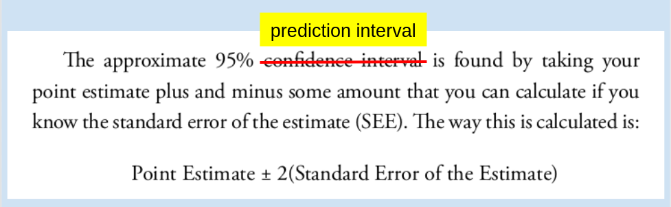
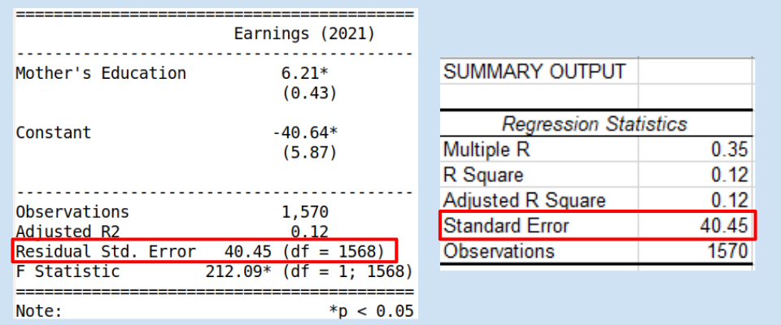

---
output:
  xaringan::moon_reader:
    css: ["default", "extra.css"]
    lib_dir: libs
    seal: false
    nature:
      highlightStyle: github
      highlightLines: true
      countIncrementalSlides: false
      ratio: '16:9'
---

```{r, echo = FALSE, warning = FALSE, message = FALSE}
##xaringan::inf_mr()
## For offline work: https://bookdown.org/yihui/rmarkdown/some-tips.html#working-offline
## Images not appearing? Put images folder inside the libs folder as that is the main data directory

library(tidyverse)
library(readxl)
library(stargazer)
library(kableExtra)
library(modelr)

knitr::opts_chunk$set(echo = FALSE,
                      eval = TRUE,
                      error = FALSE,
                      message = FALSE,
                      warning = FALSE,
                      comment = NA)

## Reviewing work from last week
d1 <- read_excel("../../Data/Dataset-3-Ross_1990/ICPSR_Ross_Survey_1990.xlsx", na = c("NA"), guess_max = 10000) %>%
    mutate(
        earnk2021 = earnk * 2.0266
    )

## Which is a better model of earnings: Mother's education or Father's education
res1 <- d1 %>% lm(data = ., earnk2021 ~ mother_education)
res2 <- d1 %>% lm(data = ., earnk2021 ~ exercise)

## Save coefs
x1 <- round(coef(res1), 2)
x2 <- round(coef(res2), 2)
```

class: slideblue

.size70[**Today's Agenda**]

<br>

.center[.size60[
Practice using OLS regressions to answer real world questions with data
]]

<br>

.center[.size45[
  Justin Leinaweaver (Spring 2022)
]]

???

## Prep for Class
1. ...

<br>

Welcome back!

### Did everybody submit their report on Friday?

<br>

### With a couple days to reflect, how did it go?


---

background-image: url('libs/Images/background-blue_triangles2.png')
background-size: 100%
background-position: center
class: middle

# Our Work So Far

.size40[
+ Descriptive statistics (mean, median, IQR, etc.)

+ Univariate Visualizations (Bar plots, Histograms)

+ Facets (any viz on subsets of data)

+ Biivariate Visualizations (Box plots, Scatterplots)

+ Fitting and evaluating simple OLS models
]

???

This is a ton of stuff!

### Which of these tools do you feel the most confident using?

### Which are the most challenging to build?

### Which are the most challenging to analyze?

<br>

Last week we started working with simple OLS regressions.

This week I want us to keep practicing those skills.


---

background-image: url('libs/Images/background-blue_triangles2.png')
background-size: 100%
background-position: center
class: middle

.center[.size70[**Which is a better model of personal income?**]]

.size60[
1. Mother's education level, or

2. Personal exercise
]

???

We ended last week with this question and an assignment for you to complete.

Your job was to fit these two regression models, evaluate them and then use them to make predictions.

### How did that go?
#### - Everybody complete the task?

<br>

Let's examine each one on its own in order to answer this question.


---

class: middle

.pull-left[
.size25[
```{r, results='asis'}
stargazer(res1, type = "html", omit.stat = c("rsq", "f"), star.cutoffs = .05, notes = "*p < 0.05", notes.append = FALSE, digits = 2, covariate.labels = c("Mother's Education", "Constant"), dep.var.labels = "Earnings (2021)", dep.var.caption = "")
```
]]

.pull-right[
```{r, fig.retina=3, fig.align = 'center', fig.asp=.618, out.width = '100%', fig.width = 5}
# Model 1 Scatter
d1 %>%
  ggplot(aes(x = mother_education, y = earnk2021)) +
  geom_point() +
  geom_smooth(method = "lm", se = FALSE) +
  theme_bw() +
  labs(x = "Mother's Education", y = "Yearly Earnings (2021)",
       title = "Scatter Plot")

# Model 1 Residuals
d1 %>%
  add_residuals(res1) %>%
  add_predictions(res1) %>%
  ggplot(aes(x = pred, y = resid)) +
  geom_point() +
  geom_smooth(method = "lm", se = FALSE) +
  theme_bw() +
    labs(x = "Model Predictions", y = "Residuals",
         title = "Residuals Plot")
```
]

???

### Did everybody get these results?

<br>

Let's use the evaluation steps.

### 1. Is the model logical? 
#### - e.g. What story does it tell?

### 2. Are the coefficients significant?
#### - What does that mean?

### 3. What does the coefficient of determination tell us about it?

### 4. Any serious problems in the residuals?

<br>

SLIDE: Making predictions (point estimates)


---

background-image: url('libs/Images/background-blue_triangles2.png')
background-size: 100%
background-position: center
class: middle

.size55[
**What is the predicted personal income if the...**

1. mother completed high school (12)

2. mother completed college (16)
]

???

Our second step was to use the models to make predictions.

### What did you get for these?

(SLIDE)


---

background-image: url('libs/Images/background-blue_triangles2.png')
background-size: 100%
background-position: center
class: middle

.size55[
**What is the predicted personal income if the...**]

.size40[
```{r, results = "asis"}
## Predictions table (manual to match students' results)
x1 <- round(coef(res1), 2)

estimates1 <- as.numeric(c(x1[1] + x1[2] * 12, x1[1] + x1[2] * 16))

tab1 <- tibble(
    Prediction = c("Mother completed high school (12)", "Mother completed college (16)"),
    Estimates = str_c('$', round(estimates1, 1), 'k')
)

kbl(tab1, align = c("l", "c")) |>
  kable_styling(bootstrap_options = c("striped", "hover", "condensed"))
```
]

<br>

.center[.size40[
Earnings = `r x1[1]` + `r x1[2]` x (Mother's Education)
]]

???

### Everybody get these point estimates?

<br>

### So, what do we learn from this model?

#### - Is mother's education a good way to estimate yearly earnings? Why or why not?

<br>

Alright, let's do it again on the second model: Personal Exercise


---

class: middle

.pull-left[
.size25[
```{r, results='asis'}
stargazer(res2, type = "html", omit.stat = c("rsq", "f"), star.cutoffs = .05, notes = "*p < 0.05", notes.append = FALSE, digits = 2, covariate.labels = c("Strenuous Exercise", "Constant"), dep.var.labels = "Earnings (2021)", dep.var.caption = "")
```
]]

.pull-right[
```{r, fig.retina=3, fig.align = 'center', fig.asp=.618, out.width = '100%', fig.width = 5, cache=TRUE}
# Model 1 Scatter
d1 %>%
  ggplot(aes(x = exercise, y = earnk2021)) +
  geom_point() +
  geom_smooth(method = "lm", se = FALSE) +
  theme_bw() +
  labs(x = "Strenuous Exercise", y = "Yearly Earnings (2021)",
       title = "Scatter Plot")

# Model 1 Residuals
d1 %>%
  add_residuals(res2) %>%
  add_predictions(res2) %>%
  ggplot(aes(x = pred, y = resid)) +
  geom_point() +
  geom_smooth(method = "lm", se = FALSE) +
  theme_bw() +
    labs(x = "Model Predictions", y = "Residuals",
         title = "Residuals Plot")
```
]

???

### Did everybody get these results?

<br>

Let's use the evaluation steps.

### 1. Is the model logical? e.g. What story does it tell?

### 2. Are the coefficients significant?

### 3. What does the coefficient of determination tell us about it?

### 4. Any serious problems in the residuals?


---

background-image: url('libs/Images/background-blue_triangles2.png')
background-size: 100%
background-position: center
class: middle

.size50[
**What is the predicted personal income if...**

1. No strenuous exercise (1)

2. Strenuous exercise > 3x per week (7)
]

???

Our second step was to use the models to make predictions.

### What did you get for these?

(SLIDE)


---

background-image: url('libs/Images/background-blue_triangles2.png')
background-size: 100%
background-position: center
class: middle

.size55[
**What is the predicted personal income if the...**]

.size40[
```{r, results = "asis"}
## Predictions table (manual to match students' results)
x2 <- round(coef(res2), 2)

estimates1 <- as.numeric(c(x2[1] + x2[2] * 1, x2[1] + x2[2] * 7))

tab1 <- tibble(
    Prediction = c("Never does strenuous exercise (1)", "Works out > 3 times per week (7)"),
    Estimates = str_c('$', round(estimates1, 1), 'k')
)

kbl(tab1, align = c("l", "c")) |>
  kable_styling(bootstrap_options = c("striped", "hover", "condensed"))
```
]

<br>

.center[.size45[
Earnings = `r x2[1]` + `r x2[2]` x (Exercise)
]]

???

### Did everybody get these results?

<br>

### So, what do we learn from this model?

#### - Are personal exercise habits a good way to estimate yearly earnings? Why or why not?

<br>

So, it seems pretty clear that parental education level seems a much stronger predictor of earnings than exercise.

Our next question is, how confident can we be in these point estimates (e.g. predictions)?


---

class: middle, slideblue

```{r}

```

<br>

<br>

.size35[**Source:** Wilson, Keating, and Beal-Hodges (2012), p67]

???

For today I assigned you ch 5 of the textbook which gives you the steps needed to add 95% CIs to our predictions.

First things first, we need to clean up some language from the book.

The authors of the textbook use the word "confidence" when they mean "prediction" and I want to make sure that's clear to you.

<br>

Technically speaking, CIs refer to uncertainty in the parameters of the model
- e.g. the regression coefficients (the slope of the line)

<br>

Prediction intervals represent uncertainty in our predictions using the model.
- e.g. point estimates

<br>

Whereas CIs focus on just one parameter, PIs focus on all sources of error in the model.

This makes them MUCH larger than CIs.

Minor but super important point if you go deeper into stats.


---

class: middle

```{r, fig.retina=3, fig.align = 'center', fig.asp=0.618, out.width = '97%', fig.width = 6, cache=TRUE}
## Visualize mother's education
p1 <- d1 %>%
  ggplot(aes(x = mother_education, y = earnk2021)) +
  geom_point() +
  geom_smooth(method = "lm", se = FALSE) +
  theme_bw() +
  labs(x = "Mother's Education", title = "Why do we need a prediction interval?", y = "Yearly Income (2021)")

## Add predictions
#predict.lm(res1, newdata = data.frame(mother_education = 12))

p1 +
  scale_x_continuous(breaks = 1:18) +
  annotate("point", x = 12, 
           y = predict.lm(res1, newdata = data.frame(mother_education = 12)), 
           color = "red", size = 4)
```

???

So, why do we need PIs?

Let's start by visualizing the data and thinking about making one prediction.

Here is what our regression model predicts given a mother's education level of 12.

Per your work this returns an estimate of $33.9k.


---

class: middle

```{r, fig.retina=3, fig.align = 'center', fig.asp=0.618, out.width = '97%', fig.width = 6, cache=TRUE}
p1 +
  scale_x_continuous(breaks = 1:18) +
  annotate("point", x = 12, y = predict.lm(res1, newdata = data.frame(mother_education = 12)), color = "red", size = 4) +
  annotate("rect", xmin = 11.5, xmax = 12.5, ymin = 0, ymax = 300, fill = NA, color = "red", size = 3)
```

???

### The question for us is, how well does that $34k summarize the actual data?

- Clearly the spread is the result of many different parts of the model: the slope, the intercept and the residual error.

<br>

PIs allow us to account for that in our predictions.


---

class: middle, slideblue

.center[.size45[
PI = Point Estimate &#177; 2 x (Standard Error)
]]

<br>

```{r}

```

???

The book process for calculating the PI is pretty simple.

Calculate a point estimate using your model and then add or subtract 2 * the model's standard error.

- Subtract to find the low end of the interval and add to find the upper end of the interval

<br>

### Questions on the process?

<br>

### Everybody test this out, calculate the PIs for the four predictions you made for class today.

- Remember, each model has a different standard error!

(SLIDE)


---

class: middle

.center[.size55[**Predictions with 95% PIs**]]

<br>

.size33[
```{r, echo = FALSE, results = "asis"}
estimates1 <- as.numeric(c(x1[1] + x1[2] * 12, x1[1] + x1[2] * 16, x2[1] + x2[2] * 1, x2[1] + x2[2] * 7))

low1 <- round(as.numeric(c((x1[1] + x1[2] * 12) - 2 * round(summary(res1)$sigma, 2),
(x1[1] + x1[2] * 16) - 2 * round(summary(res1)$sigma, 2),
(x2[1] + x2[2] * 1) - 2 * round(summary(res2)$sigma, 2),
(x2[1] + x2[2] * 7) - 2 * round(summary(res2)$sigma, 2))),1)

high1 <- round(as.numeric(c((x1[1] + x1[2] * 12) + 2 * round(summary(res1)$sigma, 2),
(x1[1] + x1[2] * 16) + 2 * round(summary(res1)$sigma, 2),
(x2[1] + x2[2] * 1) + 2 * round(summary(res2)$sigma, 2),
(x2[1] + x2[2] * 7) + 2 * round(summary(res2)$sigma, 2))), 1)

tab2 <- tibble(
    Prediction = c("Mother completed high school (12)", "Mother completed college (16)", "Never does strenuous exercise (1)", "Works out > 3 times per week (7)"),
    Estimates = str_c('$', round(estimates1, 1), 'k')
)

tab3 <- tab2 %>%
    mutate(
        Low = low1,
        High = high1
    ) %>%
    select(Prediction, Low, Estimates, High)

tab3 |>
  slice(1:2) |>
  kbl(align = c("l", "c", "c", "c")) |>
  kable_styling(bootstrap_options = c("striped", "hover", "condensed"))
```

<br>

```{r, echo = FALSE, results = "asis"}
tab3 |>
  slice(3:4) |>
  kbl(align = c("l", "c", "c", "c")) |>
  kable_styling(bootstrap_options = c("striped", "hover", "condensed"))
```
]

???

### Everybody get these results?

### How do these "confidence intervals" help us think about which model is more "useful"?

- (Narrower CI is better than large CI)
    - Clearly neither of these models is incredibly precise

- Both models need to be improved!

<br>

### How are we doing?

#### - Any questions on simple OLS regression models or making predictions with them?


---

background-image: url('libs/Images/background-blue_triangles2.png')
background-size: 100%
background-position: center
class: middle

.center[.size70[
**Dataset 1**

Why do some states attract greater investment by companies and individuals than others?
]]

???

Let's keep practicing our simple OLS skills!

Everybody shift to dataset 1 (2020 only).

- Remember, dataset 1 is focused on explaining investment in the US states.


---

class: middle, slideblue

```{r, fig.retina=3, fig.align = 'center', fig.asp=0.5, out.width = '100%', fig.width = 7, cache=TRUE}
d <- read_excel("../../Data/Dataset-1/Dataset1-2020_Only.xlsx", na = "") %>%
  mutate(
    gdp_billions = gdp_millions / 1000,
    pop_millions = population_thousands / 1000
  )

# Visualize the scaling procedure
d %>%
  pivot_longer(cols = c(gdp_millions, gdp_billions), names_to = "Predictor", values_to = "Values") %>%
  mutate(
    Predictor = if_else(Predictor == "gdp_millions", "GDP (Millions)", "GDP (Billions)"),
    Predictor_f = factor(Predictor, levels = c("GDP (Millions)", "GDP (Billions)"))
  ) %>%
  ggplot(aes(x = Values)) +
  geom_histogram(bins = 15, color = "white") +
  facet_wrap(~ Predictor_f, scales = "free") +
  theme_bw() +
  labs(x = "", y = "Count")
```

???

Before I put you to work, let's all agree on one important tweak!

Here I have a histogram of GDP in millions and the same variable re-scaled into billions.

### What do we learn from comparing and contrasting these two histograms? 
#### - How are they different and how are the the same?

+ (They are identically distributed!)

<br>

SLIDE: Even more scales...


---

class: middle, slideblue

```{r, fig.retina=3, fig.align = 'center', fig.asp=0.6, out.width = '100%', fig.width = 7, cache=TRUE}
d <- read_excel("../../Data/Dataset-1/Dataset1-2020_Only.xlsx", na = "") %>%
  mutate(
    gdp_billions = gdp_millions / 1000,
    pop_millions = population_thousands / 1000,
    gdp_thousands = gdp_millions * 1000,
    gdp_trillions = gdp_millions / 1e6
  )

# Visualize the scaling procedure
d %>%
  pivot_longer(cols = c(gdp_thousands, gdp_millions, gdp_billions, gdp_trillions), names_to = "Predictor", values_to = "Values") %>%
  # mutate(
  #   Predictor = if_else(Predictor == "gdp_millions", "GDP (Millions)", "GDP (Billions)"),
  #   Predictor_f = factor(Predictor, levels = c("GDP (Millions)", "GDP (Billions)"))
  # ) %>%
  ggplot(aes(x = Values)) +
  geom_histogram(bins = 15, color = "white") +
  facet_wrap(~ Predictor, scales = "free") +
  theme_bw() +
  labs(x = "", y = "Count")
```

???

Here we see GDP in thousands, millions, billions and trillions.

### So, what is the key lesson for us?

- **The key lesson for us: scaling a variable by moving the decimal place doesn't change anything about the distribution.**

- Convert to hundred, thousands, millions, billions, only changes the labels, NOT the data!

- Just makes it easier to read the table and the plots!

### Does this make sense?

<br>

For your purposes, choose the scale that makes it easiest to visualize your data or report it in tables.

### Deal?


---

background-image: url('libs/Images/background-blue_triangles2.png')
background-size: 100%
background-position: center
class: middle

.center[.size55[
**Dataset 1**

Based on the data for 2020 should states that want to grow the size of their economies focus on increasing college completion (bachelors) or increasing homeownership (homeowner rate)?
]]

???

Ok, our job today is to answer this question.

### How do we phrase these as separate models? 
#### - What do we need to regress here?

(SLIDE)


---

background-image: url('libs/Images/background-blue_triangles2.png')
background-size: 100%
background-position: center
class: middle

.size35[
Model 1: Regress GDP (billions) on bachelors' degrees

Model 2: Regress GDP (billions) on homeownership rates
]

<br>

.size40[
1. Fit the models, check the scatter plots, and evaluate using our four steps

2. Make predictions (with 95% PIs)
    - Model 1: Mean bachelors' degrees
    - Model 2: Mean homeownership rates
]

???

Alright, here's our challenge. 

Let's get to work!

<br>

** 15 minutes left **

WHAT DID WE FIND?

(SLIDE: Regression results and scatter plots)


---

class: middle

.pull-left[
.size23[
```{r, results='asis'}
# Scale to billions
res1 <- d %>% lm(data = ., gdp_billions ~ bachelors)
res2 <- d %>% lm(data = ., gdp_billions ~ homeowner_rate)

stargazer(res1, res2, type = "html", digits = 2, omit.stat = c("rsq", "f"), dep.var.caption = "", dep.var.labels = c("GDP (Billions USD)"), covariate.labels = c("Bachelors", "Homeownership"), star.cutoffs = .05, notes = "*p<0.05", notes.append = FALSE)
```
]]

.pull-right[
```{r, fig.retina=3, fig.align = 'center', fig.asp=.618, out.width = '100%', fig.width = 5}
# Model 1 Scatter
d %>%
  ggplot(aes(x = bachelors, y = gdp_billions)) +
  geom_point() +
  geom_smooth(method = "lm", se = FALSE) +
  theme_bw() +
  labs(x = "Bachelor's Degrees (%)", y = "GDP (billions)",
       title = "Scatter Plot")

# Model 2 Scatter
d %>%
  ggplot(aes(x = homeowner_rate, y = gdp_billions)) +
  geom_point() +
  geom_smooth(method = "lm", se = FALSE) +
  theme_bw() +
  labs(x = "Homeownership Rates (%)", y = "GDP (billions)",
       title = "Scatter Plot")
```
]

???

### Everybody get these results?

<br>

### So, based on the four evaluation steps which model is more useful? why?

#### - In other words, are you more confident saying that increasing bachelors degrees or shrinking homeownership is the better bet for increasing the size of the economy?

<br>

### Logic Test: What is going on with homeownership??? Why is this negative?


---

class: middle, slideblue

.center[.size55[**Step 4: Check the Residuals**]]

.pull-left[
```{r, fig.retina=3, fig.align = 'center', fig.asp=0.8, out.width = '100%', fig.width=5}
# Residual plots
d %>%
  add_residuals(res1, var = "Bachelors_Residuals") %>%
  add_predictions(res1, var = "Bachelors_Fitted") %>%
  ggplot(aes(x = Bachelors_Fitted, y = Bachelors_Residuals)) +
  geom_point() +
  geom_smooth(method = "lm", se = FALSE) +
  theme_bw() +
  labs(x = "Bachelors' Degrees Model Fitted Values", y = "Residuals")
```
]

.pull-right[
```{r, fig.retina=3, fig.align = 'center', fig.asp=0.8, out.width = '100%', fig.width=5}
# Residual plots
d %>%
  add_residuals(res2, var = "Homeowner_Residuals") %>%
  add_predictions(res2, var = "Homeowner_Fitted") %>%
  ggplot(aes(x = Homeowner_Fitted, y = Homeowner_Residuals)) +
  geom_point() +
  geom_smooth(method = "lm", se = FALSE) +
  theme_bw() +
  labs(x = "Homeowner (%) Model Fitted Values", y = "Residuals")
```
]

???

(Residual plots indicate our models don't fit well, need fancier tools. We'll get there this semester!)


---

class: middle

.center[.size55[**Make Predictions (with 95%)**]]

<br>

.size35[
```{r, echo=FALSE, warning = FALSE, results="asis"}
## Predictions table (manual to match students' results)
x1 <- round(coef(res1), 2)
x2 <- round(coef(res2), 2)

mean_bach <- round(mean(d$bachelors), 2)
mean_home <- round(mean(d$homeowner_rate), 2)

##summary(d$bachelors)
##summary(d$homeowner_rate)

estimates1 <- as.numeric(c(x1[1] + x1[2] * mean_bach, x2[1] + x2[2] * mean_home))

low1 <- round(as.numeric(c((x1[1] + x1[2] * mean_bach) - 2 * round(summary(res1)$sigma, 2),
(x2[1] + x2[2] * mean_home) - 2 * round(summary(res2)$sigma, 2))),1)

high1 <- round(as.numeric(c((x1[1] + x1[2] * mean_bach) + 2 * round(summary(res1)$sigma, 2),
(x2[1] + x2[2] * mean_home) + 2 * round(summary(res2)$sigma, 2))), 1)

tab1 <- tibble(
    Prediction = c("Mean Bachelors' Degrees", "Mean Homeownership Rate"),
    Low = low1,
    Estimate = str_c('$', round(estimates1, 1)),
    High = high1
)

tab1 %>%
  kbl(align = c("l", "c", "c", "c")) |>
  kable_styling(bootstrap_options = c("striped", "hover", "condensed"))
```
]

???

Let's check your predictions.

### Everybody get these results?


---

class: middle

.center[.size55[**Make Predictions (with 95%)**]]

.size35[
```{r, echo=FALSE, warning = FALSE, results="asis"}
tab1 %>%
  kbl(align = c("l", "c", "c", "c")) |>
  kable_styling(bootstrap_options = c("striped", "hover", "condensed"))
```
]

.size40[
- What is the effect of **increasing bachelors** from the mean by 10%?

- What is effect of **decreasing homeownership** from the mean by 10%?
]

???

Let's use these now to game out a situation.

What would be the effect of increasing bachelors' degree completion by 10%?

- That is increasing bachelors from 32 to 35%

And what would be the effect of reducing homeownership by 10%?

- That is decreasing homeownership from 69% to 62%


---

class: middle

.size35[
```{r, results="asis"}
#mean(d$bachelors)*1.1
tab1[1,] %>%
    add_row(Prediction = "Bachelors' Degrees + 10%",
             Low = round(as.numeric((x1[1] + x1[2] * (mean(d$bachelors)*1.1)) - 2*round(summary(res1)$sigma, 2)), 1),
             Estimate = str_c('$', as.numeric(round(x1[1] + x1[2] * (mean(d$bachelors)*1.1)), 1)),
             High = round(as.numeric((x1[1] + x1[2] * (mean(d$bachelors)*1.1)) + 2*round(summary(res1)$sigma, 2)), 1)
             ) %>%
    kbl(align = c("l", "c", "c", "c")) |>
  kable_styling(bootstrap_options = c("striped", "hover", "condensed"))
```
]

<br>

.size35[
```{r, results="asis"}
#coef(res2)[1] + (mean(d$homeowner_rate)*.9)*coef(res2)[2]
tab1[2,] %>%
    add_row(Prediction = "Homeownership - 10%",
             Low = round(as.numeric((x2[1] + x2[2] * (mean(d$homeowner_rate)*.9)) - 2*round(summary(res2)$sigma, 2)), 1),
             Estimate = str_c('$', as.numeric(round(x2[1] + x2[2] * (mean(d$homeowner_rate)*.9)), 1)),
             High = round(as.numeric((x2[1] + x2[2] * (mean(d$homeowner_rate)*.9)) + 2*round(summary(res2)$sigma, 2)), 1)
             ) %>%
    kbl(align = c("l", "c", "c", "c")) |>
  kable_styling(bootstrap_options = c("striped", "hover", "condensed"))
```
]

???

Holy cow, that housing effect appears to be massive!

<br>

### So, bottom line, which is the more useful model of GDP?

#### - According to our models should states focus more on reducing  homeownership or increasing college education? Why?


