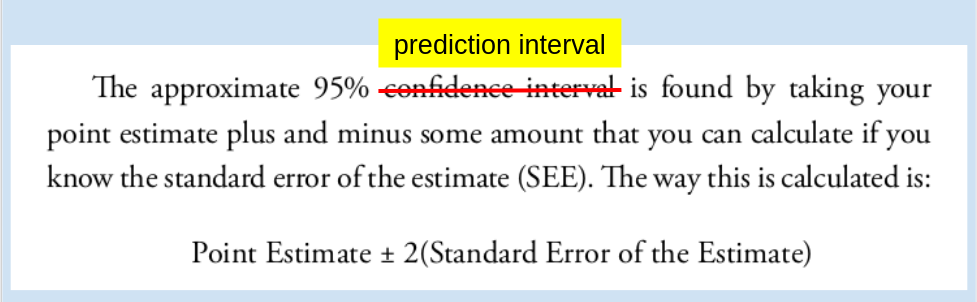
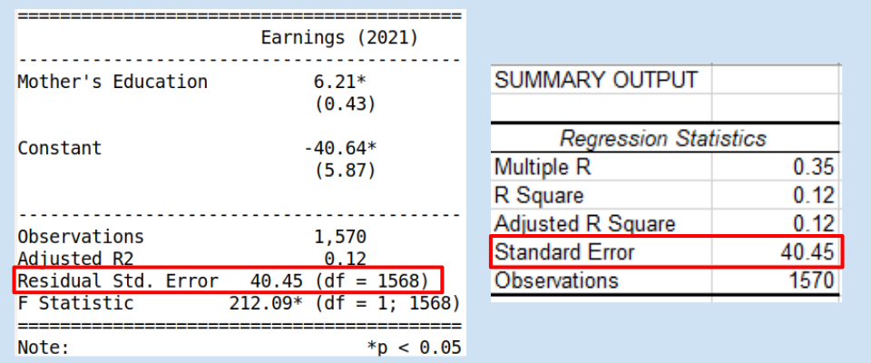

---
output:
  beamer_presentation:
    theme: "CambridgeUS"
    colortheme: "dolphin"
    fonttheme: "structurebold"
fontsize: 14pt
classoption: "aspectratio=169"
header-includes:
- \usepackage{caption}
- \captionsetup[figure]{labelformat=empty}
- \captionsetup[table]{labelformat=empty}
---


```{r, setup, include = FALSE}
##rmarkdown::render(input = "./06_1-Practicing_Simple_OLS_Regressions.Rmd", output_file = "./06_1-Practicing_Simple_OLS_Regressions.pdf")

##fontsizes for tables: ‘"tiny"’, ‘"scriptsize"’, ‘"footnotesize"’, ‘"small"’, ‘"normalsize"’, ‘"large"’, ‘"Large"’, ‘"LARGE"’, ‘"huge"’, ‘"Huge"’

library(tidyverse)
library(readxl)
library(stargazer)
library(modelr)

knitr::opts_chunk$set(echo = FALSE,
                      eval = TRUE,
                      error = FALSE,
                      message = FALSE,
                      warning = FALSE,
                      comment = NA)
```


# Today's Agenda

\begin{large}
1. Practice fitting and evaluating simple OLS regressions

\vspace{.25in}

2. Make and interpret point estimates with prediction intervals
\end{large}

\vspace{.5in}

\begin{center}
Justin Leinaweaver (Spring 2022)
\end{center}


# Let's check in on your new skills!

+ Bar plots (categorical variables)

+ Histograms (numerical variables)

+ Box plots (numerical x categorical)

+ Scatterplots (numerical x numerical)

+ Descriptive statistics 
  + mean, sd, median, min, max, range, IQR

+ Simple OLS models
  + Table, scatterplot with regression line and residual plot


# Which is a better model of personal income (earnk2021)?

\begin{huge}

1. Mother's education level, or

2. Personal exercise

\end{huge}


# Make Predictions with 95% CIs

\begin{center}

```{r, echo = FALSE, results = "asis"}
## Reviewing work from last week
d <- read_excel("../../Data/Dataset-3-Ross_1990/ICPSR_Ross_Survey_1990.xlsx", na = c("NA"), guess_max = 10000) %>%
    mutate(
        earnk2021 = earnk * 2.0266
    )

## Which is a better model of earnings: Mother's education or Father's education
res1 <- d %>% lm(data = ., earnk2021 ~ mother_education)
res2 <- d %>% lm(data = ., earnk2021 ~ exercise)

## Predictions table (manual to match students' results)
x1 <- round(coef(res1), 2)
x2 <- round(coef(res2), 2)

estimates1 <- as.numeric(c(x1[1] + x1[2] * 12, x1[1] + x1[2] * 16, x2[1] + x2[2] * 1, x2[1] + x2[2] * 7))

tab1 <- tibble(
    Prediction = c("Mother completed high school (12)", "Mother completed college (16)", "Never does strenuous exercise (1)", "Works out > 3 times per week (7)"),
    Estimates = str_c('$', round(estimates1, 1), 'k')
)

tab1 %>%
    stargazer(summary = FALSE, type = "latex", header = FALSE, rownames = FALSE, float = FALSE)

```
\end{center}


# Make Predictions with 95% CIs

\begin{center}

```{r, echo = FALSE, results = "asis"}
low1 <- round(as.numeric(c((x1[1] + x1[2] * 12) - 2 * round(summary(res1)$sigma, 2),
(x1[1] + x1[2] * 16) - 2 * round(summary(res1)$sigma, 2),
(x2[1] + x2[2] * 1) - 2 * round(summary(res2)$sigma, 2),
(x2[1] + x2[2] * 7) - 2 * round(summary(res2)$sigma, 2))),1)

high1 <- round(as.numeric(c((x1[1] + x1[2] * 12) + 2 * round(summary(res1)$sigma, 2),
(x1[1] + x1[2] * 16) + 2 * round(summary(res1)$sigma, 2),
(x2[1] + x2[2] * 1) + 2 * round(summary(res2)$sigma, 2),
(x2[1] + x2[2] * 7) + 2 * round(summary(res2)$sigma, 2))), 1)

tab1 %>%
    mutate(
        Low = low1,
        High = high1
    ) %>%
    select(Prediction, Low, Estimates, High) %>%
    stargazer(summary = FALSE, type = "latex", header = FALSE, rownames = FALSE, float = FALSE)
```
\end{center}


# Confidence Intervals
::: columns
:::: column

\vspace{.5in}

How confident are you in the parameter estimates in your model?

\vspace{.25in}

+ e.g. the regression coefficients

\vspace{.25in}

::::
:::: column

```{r, echo = FALSE, results = "asis", out.width = '50%'}
##‘"tiny"’, ‘"scriptsize"’, ‘"footnotesize"’, ‘"small"’, ‘"normalsize"’, ‘"large"’, ‘"Large"’, ‘"LARGE"’, ‘"huge"’, ‘"Huge"’
stargazer(res1, type = "latex", digits = 2, omit.stat = "rsq", header = FALSE, font.size = "footnotesize", star.cutoffs = .05, notes = "*p < 0.05", notes.append = FALSE, covariate.labels = c("Mother's Education"), dep.var.labels = "Earnings (2021)", dep.var.caption = "", float = FALSE)
```
::::
:::


# 95\% Confidence Intervals
::: columns
:::: column
\vspace{.2in}
\begin{Large}
\begin{itemize}[<+->]
\item $\beta \pm 2 * SE$
\vspace{.25in}
\item $`r as.numeric(x1[2])` \pm 2 * (`r round(coef(summary(res1))[2,2], 2)`)$
\vspace{.25in}
\item Low $\approx$ `r as.numeric(x1[2]) - 2 * round(coef(summary(res1))[2,2], 2)`
\vspace{.25in}
\item High $\approx$ `r as.numeric(x1[2]) + 2 * round(coef(summary(res1))[2,2], 2)`
\end{itemize}
\end{Large}

::::
:::: column

```{r, echo = FALSE, results = "asis", out.width = '50%'}
##‘"tiny"’, ‘"scriptsize"’, ‘"footnotesize"’, ‘"small"’, ‘"normalsize"’, ‘"large"’, ‘"Large"’, ‘"LARGE"’, ‘"huge"’, ‘"Huge"’

stargazer(res1, type = "latex", digits = 2, omit.stat = "rsq", header = FALSE, font.size = "footnotesize", star.cutoffs = .05, notes = "*p < 0.05", notes.append = FALSE, covariate.labels = c("Mother's Education"), dep.var.labels = "Earnings (2021)", dep.var.caption = "", float = FALSE)
```
::::
:::


# Estimating Uncertainty 

## Confidence intervals

+ How confident are you in the parameter estimates in your model?

+ e.g. the regression coefficients

## Prediction intervals

+ How confident are you in the predictions made by your model?

+ e.g. point estimates


# 
```{r, echo = FALSE, message = FALSE, warning = FALSE, fig.align = 'center', fig.asp=0.618, out.width = '85%', fig.width = 6}
## Visualize mother's education
p1 <- d %>%
  ggplot(aes(x = mother_education, y = earnk2021)) +
  geom_point() +
  geom_smooth(method = "lm", se = FALSE) +
  theme_minimal() +
  labs(x = "Mother's Education", title = "Why do we need a prediction interval?", y = "Yearly Income (2021)")

## Add predictions
p1 +
  scale_x_continuous(breaks = 1:18) +
  annotate("point", x = 12, y = 16.7, color = "red", size = 4)
```


# 
```{r, echo = FALSE, message = FALSE, warning = FALSE, fig.align = 'center', fig.asp=0.618, out.width = '85%', fig.width = 6}
## Why do we need a "prediction interval"?

p1 +
  scale_x_continuous(breaks = 1:18) +
  annotate("point", x = 12, y = 16.7, color = "red", size = 4) +
  annotate("rect", xmin = 11.5, xmax = 12.5, ymin = 0, ymax = 150, fill = NA, color = "red", size = 3)
```


# Make Predictions with 95% PIs

 

Source: Wilson, Keating, and Beal-Hodges (2012), p67


# Make Predictions with 95% PIs

 


# What are the predicted earnings...

\begin{center}

```{r, echo = FALSE, results = "asis"}
tab1 %>%
    mutate(
        Low = low1,
        High = high1
    ) %>%
    select(Prediction, Low, Estimates, High) %>%
    stargazer(summary = FALSE, type = "latex", header = FALSE, rownames = FALSE, float = FALSE)
```

\end{center}


# Dataset 1\: The Motivating Problem

\begin{LARGE}

Why do some states attract greater investment by companies and individuals than others?

\end{LARGE}


# Dataset 1

\begin{Large}

Based on the data for 2020 should states that want to grow the size of their economies focus on increasing college completion (bachelors) or increasing homeownership (homeowner rate)?

\end{Large}


# 
Based on the data for 2020 should states that want to grow the size of their economies focus on increasing college completion (bachelors) or increasing homeownership (homeowner rate)?

### Fit and evaluate the two models
1. Model 1: Regress GDP on bachelors' degrees
2. Model 2: Regress GDP on homeownership rates

### Calculate PEs with 95\% CIs
1. Set Model 1 to the mean rate of bachelors' degrees
2. Set Model 2 to the mean rate of homeownership


# 

\begin{center}

```{r, echo = FALSE, results = "asis"}
##‘"tiny"’, ‘"scriptsize"’, ‘"footnotesize"’, ‘"small"’, ‘"normalsize"’, ‘"large"’, ‘"Large"’, ‘"LARGE"’, ‘"huge"’, ‘"Huge"’

d <- read_excel("../../Data/Dataset-1/Dataset1-2020_Only.xlsx", na = "") %>%
  mutate(
    gdp_billions = gdp_millions / 1000,
    pop_millions = population_thousands / 1000
  )

# Show unscaled first
res1a <- d %>% lm(data = ., gdp_millions ~ bachelors)
res2a <- d %>% lm(data = ., gdp_millions ~ homeowner_rate)

stargazer(res1a, res2a, type = "latex", digits = 2, omit.stat = "rsq", dep.var.caption = "", dep.var.labels = "GDP (Millions USD)", covariate.labels = c("Bachelors", "Homeownership"), star.cutoffs = .05, notes = "*p<0.05", notes.append = FALSE, header = FALSE, font.size = "footnotesize", float = FALSE)

##knitr::kable(res1a)
```

\end{center}


# 
```{r, echo = FALSE, message = FALSE, warning = FALSE, fig.align = 'center', fig.asp=0.5, out.width = '100%', fig.width = 7}
# Visualize the scaling procedure
d %>%
  pivot_longer(cols = c(gdp_millions, gdp_billions), names_to = "Predictor", values_to = "Values") %>%
  mutate(
    Predictor = if_else(Predictor == "gdp_millions", "GDP (Millions)", "GDP (Billions)"),
    Predictor_f = factor(Predictor, levels = c("GDP (Millions)", "GDP (Billions)"))
  ) %>%
  ggplot(aes(x = Values)) +
  geom_histogram(bins = 15, color = "white") +
  facet_wrap(~ Predictor_f, scales = "free") +
  theme_bw() +
  labs(x = "", y = "Count")
```


# 
\begin{center}

```{r, echo = FALSE, results = "asis"}
##‘"tiny"’, ‘"scriptsize"’, ‘"footnotesize"’, ‘"small"’, ‘"normalsize"’, ‘"large"’, ‘"Large"’, ‘"LARGE"’, ‘"huge"’, ‘"Huge"’

# Scale to billions
res1 <- d %>% lm(data = ., gdp_billions ~ bachelors)
res2 <- d %>% lm(data = ., gdp_billions ~ homeowner_rate)

stargazer(res1a, res2a, res1, res2, type = "latex", digits = 2, omit.stat = "rsq", dep.var.caption = "", dep.var.labels = c("GDP (Millions USD)", "GDP (Billions USD)"), covariate.labels = c("Bachelors", "Homeownership"), star.cutoffs = .05, notes = "*p<0.05", notes.append = FALSE, header = FALSE, font.size = "footnotesize", float = FALSE)
```
\end{center}


# Step 4: Check the Residuals

::: columns

:::: column

```{r, echo = FALSE, message = FALSE, warning = FALSE, fig.align = 'center', fig.asp=0.8, out.width = '100%', fig.width=5}
# Residual plots
d %>%
  add_residuals(res1, var = "Bachelors_Residuals") %>%
  add_predictions(res1, var = "Bachelors_Fitted") %>%
  ggplot(aes(x = Bachelors_Fitted, y = Bachelors_Residuals)) +
  geom_point() +
  geom_smooth(method = "lm", se = FALSE) +
  theme_bw() +
  labs(x = "Bachelors' Degrees Model Fitted Values", y = "Residuals")
```

::::

:::: column

```{r, echo = FALSE, message = FALSE, warning = FALSE, fig.align = 'center', fig.asp=0.8, out.width = '100%', fig.width=5}
d %>%
  add_residuals(res2, var = "Homeowner_Residuals") %>%
  add_predictions(res2, var = "Homeowner_Fitted") %>%
  ggplot(aes(x = Homeowner_Fitted, y = Homeowner_Residuals)) +
  geom_point() +
  geom_smooth(method = "lm", se = FALSE) +
  theme_bw() +
  labs(x = "Homeowner (%) Model Fitted Values", y = "Residuals")
```

::::

:::


# Making Predictions of GDP (Billions USD)

\begin{center}
```{r, echo=FALSE, warning = FALSE, results="asis"}
tibble(
    Prediction = c("Mean Bachelors' Degrees", "Mean Homeownership Rate"),
    Low = c("", ""),
    Estimates = c("", ""),
    High = c("", "")
) %>%
    stargazer(summary = FALSE, type = "latex", header = FALSE, rownames = FALSE, float = FALSE)
```
\end{center}


# Making Predictions of GDP (Billions USD)

\begin{center}
```{r, echo=FALSE, warning = FALSE, results="asis"}
res1 <- d %>% lm(data = ., gdp_billions ~ bachelors)
res2 <- d %>% lm(data = ., gdp_billions ~ homeowner_rate)

## Predictions table (manual to match students' results)
x1 <- round(coef(res1), 2)
x2 <- round(coef(res2), 2)

mean_bach <- round(mean(d$bachelors), 2)
mean_home <- round(mean(d$homeowner_rate), 2)

##summary(d$bachelors)
##summary(d$homeowner_rate)

estimates1 <- as.numeric(c(x1[1] + x1[2] * mean_bach, x2[1] + x2[2] * mean_home))

low1 <- round(as.numeric(c((x1[1] + x1[2] * mean_bach) - 2 * round(summary(res1)$sigma, 2),
(x2[1] + x2[2] * mean_home) - 2 * round(summary(res2)$sigma, 2))),1)

high1 <- round(as.numeric(c((x1[1] + x1[2] * mean_bach) + 2 * round(summary(res1)$sigma, 2),
(x2[1] + x2[2] * mean_home) + 2 * round(summary(res2)$sigma, 2))), 1)

tab1 <- tibble(
    Prediction = c("Mean Bachelors' Degrees", "Mean Homeownership Rate"),
    Low = low1,
    Estimate = str_c('$', round(estimates1, 1), 'k'),
    High = high1
)

tab1 %>%
    stargazer(summary = FALSE, type = "latex", header = FALSE, rownames = FALSE, float = FALSE)
```
\end{center}


# Making Predictions of GDP (Billions USD)

\begin{center}
```{r, echo=FALSE, warning = FALSE, results="asis"}
tab1[1,] %>%
    add_row(Prediction = "Max Bachelors' Degrees",
             Low = as.numeric((x1[1] + x1[2] * max(d$bachelors)) - 2*round(summary(res1)$sigma, 2)),
             Estimate = str_c('$', as.numeric(round(x1[1] + x1[2] * max(d$bachelors)), 1), 'k'),
             High = as.numeric((x1[1] + x1[2] * max(d$bachelors)) + 2*round(summary(res1)$sigma, 2))
             ) %>%
    stargazer(summary = FALSE, type = "latex", header = FALSE, rownames = FALSE, float = FALSE)
```

```{r, echo=FALSE, warning = FALSE, results="asis"}
tab1[2,] %>%
    add_row(Prediction = "Min Homeownership",
             Low = as.numeric((x2[1] + x2[2] * min(d$homeowner_rate)) - 2*round(summary(res2)$sigma, 2)),
             Estimate = str_c('$', as.numeric(round(x2[1] + x2[2] * min(d$homeowner_rate)), 1), 'k'),
             High = as.numeric((x2[1] + x2[2] * min(d$homeowner_rate)) + 2*round(summary(res2)$sigma, 2))
             ) %>%
    stargazer(summary = FALSE, type = "latex", header = FALSE, rownames = FALSE, float = FALSE)
```
\end{center}


# 
```{r, echo = FALSE, message = FALSE, warning = FALSE, fig.align = 'center', fig.asp=0.45, out.width = '100%', fig.width=7}
# Visualize
d %>%
  select(gdp_billions, bachelors, homeowner_rate) %>%
  pivot_longer(cols = bachelors:homeowner_rate, names_to = "Predictor", values_to = "Values") %>%
  ggplot(aes(x = Values, y = gdp_billions)) +
  geom_point() +
  geom_smooth(method = "lm", se = FALSE) +
  theme_bw() +
  facet_wrap(~ Predictor, scales = "free") +
  labs(x = "", y = "GDP (billions)")
```


