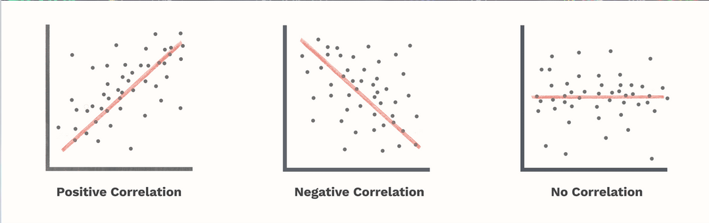
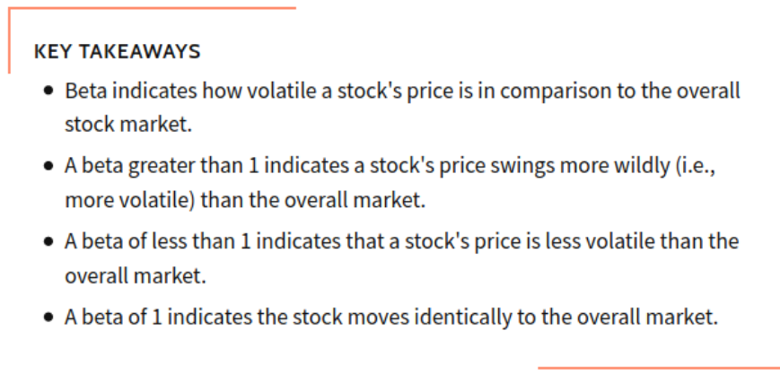
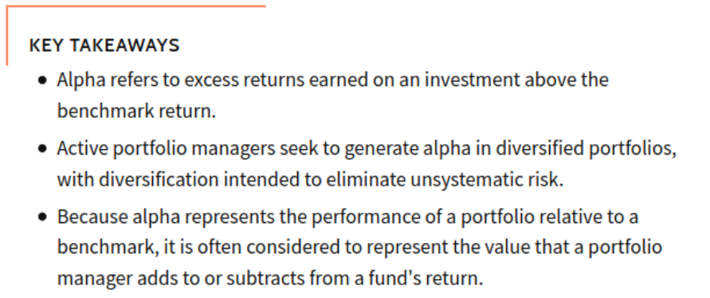

---
output:
  beamer_presentation:
    theme: "CambridgeUS"
    colortheme: "dolphin"
    fonttheme: "structurebold"
fontsize: 14pt
classoption: "aspectratio=169"
header-includes:
- \usepackage{caption}
- \captionsetup[figure]{labelformat=empty}
- \captionsetup[table]{labelformat=empty}
- \setbeamertemplate{page number in head/foot}[]{}
---

```{r, echo = FALSE, warning = FALSE, message = FALSE}
##fontsizes for tables: ‘"tiny"’, ‘"scriptsize"’, ‘"footnotesize"’, ‘"small"’, ‘"normalsize"’, ‘"large"’, ‘"Large"’, ‘"LARGE"’, ‘"huge"’, ‘"Huge"’

library(tidyverse)
library(readxl)
library(stargazer)
##library(kableExtra)
library(modelr)
library(lubridate)

knitr::opts_chunk$set(echo = FALSE,
                      eval = TRUE,
                      error = FALSE,
                      message = FALSE,
                      warning = FALSE,
                      comment = NA)

#############################################################
## Stargazer code
```


# Today's Agenda

\begin{Large}

Using OLS regressions to analyze the stock market

\vspace{.25in}

Download the stock market data from Moodle

\end{Large}

\vspace{.5in}

\begin{center}
Justin Leinaweaver (Spring 2022)
\end{center}


# Analyzing the Stock Market with OLS
```{r, fig.align = 'center', fig.asp=0.618, out.height = '85%', fig.width = 7}
knitr::include_graphics("./Images/06_2-stock_market_image.jpg")
```


# Analyzing the Stock Market with OLS
```{r, fig.align = 'center', fig.asp=0.618, out.width = '97%', fig.width = 7}

```


# Analyzing the Stock Market with OLS

\begin{center}

\begin{LARGE}

What does the 'beta' tell us about a stock? 

\end{LARGE}

\end{center}


# Analyzing the Stock Market with OLS
```{r, fig.align = 'center', fig.asp=0.618, out.width = '90%', fig.width = 7}

```


# Analyzing the Stock Market with OLS

\begin{center}

\begin{LARGE}

What does the 'alpha' tell us about a stock? 

\end{LARGE}

\end{center}


# Analyzing the Stock Market with OLS
```{r, fig.align = 'center', fig.asp=0.618, out.width = '90%', fig.width = 7}

```


# 
```{r, fig.align = 'center', fig.asp=0.618, out.width = '92%', fig.width = 7}
## Input data
d <- read_excel("../../Data/Dataset-4-Stock_Data/Stock_Data_2021.xlsx") %>%
  mutate(
    date = lubridate::ymd(date)
  )

## Convert adjusted closing prices to rate
d2 <- d %>%
  pivot_longer(cols = SP500:YETI, names_to = "symbol", values_to = "adjusted") %>%
  group_by(symbol) %>%
  mutate(
    Rate = (adjusted / lag(adjusted, n = 1)) - 1
  ) %>%
  ungroup %>%
  select(-adjusted) %>%
  pivot_wider(names_from = symbol, values_from = Rate)

#### Line plots
d2 %>%
  ggplot(aes(x = date, y = SP500)) +
  geom_line() +
  theme_minimal() +
  labs(x = "", y = "Daily Returns (%)", title = "S&P 500") +
  geom_hline(yintercept = 0, color = "red") +
  coord_cartesian(ylim = c(-.03, .03)) +
  scale_y_continuous(labels = scales::percent_format())
```


# Analyzing the Stock Market with OLS

1. Calculate the rate of return for the stock you are analyzing (e.g. WMT) AND the market (e.g S&P 500)

     + = (Current / Last) - 1
	 
\vspace{.3in}

2. Regress the returns of the stock (the outcome) on the returns of the market (the predictor)


# Analyzing the Stock Market with OLS

\begin{large}

Market: S\&P 500

Analyze: Walmart, Zoom, Six Flags and Yeti

\end{large}

\vspace{.3in}

## For Each Stock:

1. Fit regressions and format in a table

2. Line plot: Market vs Stock Returns

3. \$100 investment in 2020?


# 

\begin{center}
```{r, results = "asis"}
#### Regressions
res1 <- d2 %>% lm(data = ., WMT ~ SP500)
res2 <- d2 %>% lm(data = ., ZM ~ SP500)
res3 <- d2 %>% lm(data = ., SIX ~ SP500)
res4 <- d2 %>% lm(data = ., YETI ~ SP500)

stargazer(res1, res2, res3, res4, digits = 2, type = "latex", omit.stat = "rsq", star.cutoffs = .05, notes = "*p<0.05", notes.append = FALSE, dep.var.caption = "", float = FALSE, header = FALSE, font.size = 'footnotesize')
```
\end{center}


# 
```{r, fig.align = 'center', fig.asp=0.618, out.width = '90%', fig.width = 7}
d2 %>%
  pivot_longer(cols = WMT:YETI, names_to = "Stocks", values_to = "Returns") %>%
  ggplot(aes(x = date, y = SP500)) +
  geom_line(color = "black") +
  geom_line(aes(y = Returns, color = Stocks)) +
  facet_wrap(~ Stocks, ncol = 2) +
  theme_bw() +
  labs(x = "", y = "Stock Daily Returns (%)") +
  guides(color = "none") +
  scale_y_continuous(labels = scales::percent_format())
```


# 

\begin{center}
```{r, results = "asis"}
stargazer(res1, res2, res3, res4, digits = 2, type = "latex", omit.stat = "rsq", star.cutoffs = .05, notes = "*p<0.05", notes.append = FALSE, dep.var.caption = "", float = FALSE, header = FALSE, font.size = 'scriptsize')

#### Investments
d3 <- d2 %>%
  mutate(
    invest_sp500 = 100,
    invest_wmt = 100,
    invest_zm = 100,
    invest_six = 100,
    invest_yeti = 100
  )

for (i in 2:251) {
  
  d3$invest_sp500[i] <- d3$invest_sp500[i-1] * (1 + d3$SP500[i])
  d3$invest_wmt[i] <- d3$invest_wmt[i-1] * (1 + d3$WMT[i])
  d3$invest_zm[i] <- d3$invest_zm[i-1] * (1 + d3$ZM[i])
  d3$invest_six[i] <- d3$invest_six[i-1] * (1 + d3$SIX[i])
  d3$invest_yeti[i] <- d3$invest_yeti[i-1] * (1 + d3$YETI[i])

}

d3 %>%
  select(starts_with("invest")) %>%
    tail(n = 1) %>%
    pivot_longer(cols = invest_sp500:invest_yeti, names_to = "Stock", values_to = "Amount") %>%
    mutate(
        Amount = str_c('$', round(Amount, 2))
    ) %>%
    pivot_wider(names_from = Stock, values_from = Amount) %>%
    stargazer(summary = FALSE, type = "latex", float = FALSE, header = FALSE, rownames = FALSE, font.size = "scriptsize")

```
\end{center}

