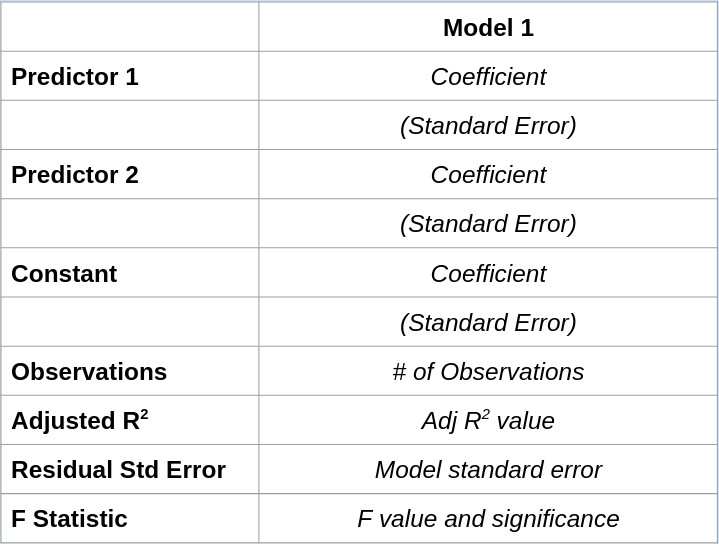
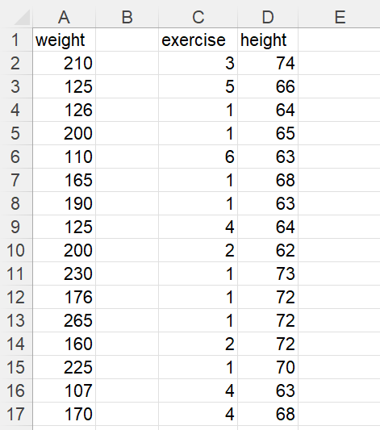
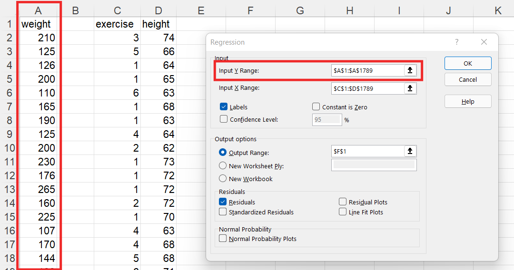
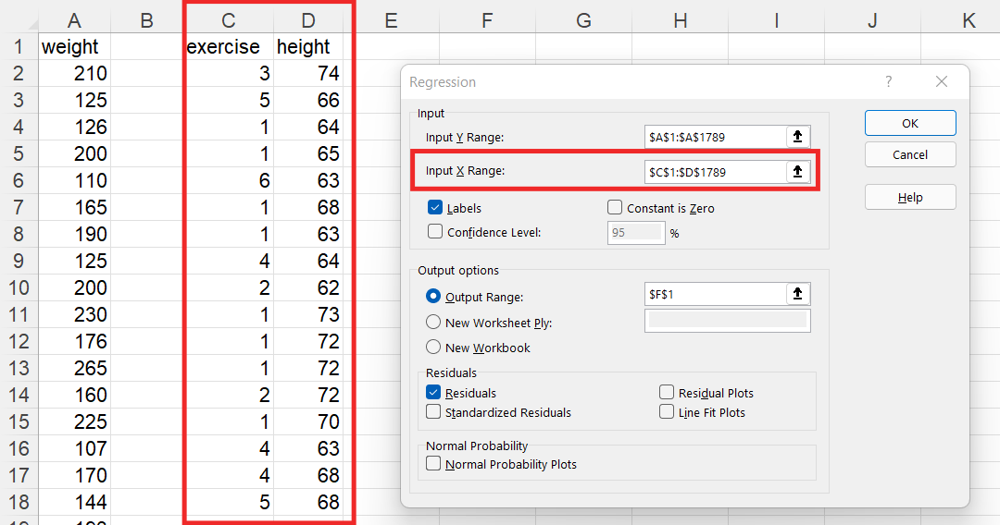
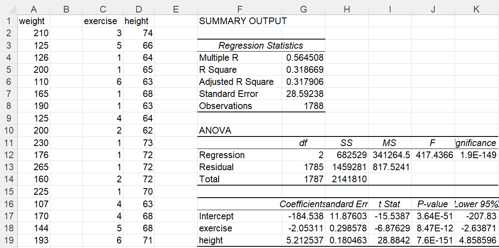
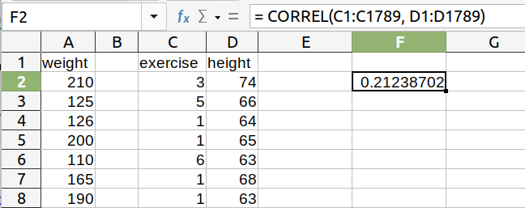

---
output:
  beamer_presentation:
    theme: "CambridgeUS"
    colortheme: "dolphin"
    fonttheme: "structurebold"
fontsize: 14pt
classoption: "aspectratio=169"
header-includes:
- \usepackage{caption}
- \captionsetup[figure]{labelformat=empty}
- \captionsetup[table]{labelformat=empty}
- \setbeamertemplate{page number in head/foot}[]{}
---

```{r, echo = FALSE, warning = FALSE, message = FALSE}
##rmarkdown::render(input = "./08_1-Multiple_Regression1.Rmd", output_file = "./08_1-Multiple_Regression1.pdf")

##fontsizes for tables: ‘"tiny"’, ‘"scriptsize"’, ‘"footnotesize"’, ‘"small"’, ‘"normalsize"’, ‘"large"’, ‘"Large"’, ‘"LARGE"’, ‘"huge"’, ‘"Huge"’

library(tidyverse)
library(readxl)
library(stargazer)
##library(kableExtra)
library(modelr)

knitr::opts_chunk$set(echo = FALSE,
                      eval = TRUE,
                      error = FALSE,
                      message = FALSE,
                      warning = FALSE,
                      comment = NA)

#############################################################
## Stargazer code

## Regular Table
##stargazer(summary = FALSE, type = "latex", header = FALSE, rownames = FALSE, float = FALSE)

## Regression Results
##stargazer(res1, type = "latex", digits = 2, omit.stat = "rsq", header = FALSE, font.size = "footnotesize", star.cutoffs = .05, notes = "*p < 0.05", notes.append = FALSE, dep.var.caption = "", float = FALSE)

##covariate.labels = c("Mother's Education")
##dep.var.labels = "Earnings (2021)"

#############################################################
## Figures

## ```{r, fig.align = 'center', fig.asp=0.618, out.width = '100%', fig.width = 7}

##knitr::include_graphics()

#############################################################
## Side-by-side columns

## ::: columns

## :::: column
## Content in left column

## ::::

## :::: column
## Content in right column

## ::::

## :::

```


# Today's Agenda

\begin{LARGE}

\begin{center}

\vspace{.25in}

Extending our Models: 

Multiple Linear Regressions (ch 6)

\end{center}

\end{LARGE}

\vspace{.5in}

\begin{center}
Justin Leinaweaver (Spring 2022)
\end{center}


# Multiple Linear Regression: Point Estimates

\begin{center}

\begin{Large}

\textbf{Simple linear regression model}

$Y = \alpha + \beta X$

\vspace{.25in}

\textbf{Multiple linear regression model}

$Y = \alpha + \beta_1 X_1 + \beta_2 X_2 + ... + \beta_k X_k$

\end{Large}

\end{center}


# 
```{r, fig.align = 'center', fig.asp=0.618, out.width = '70%', fig.width = 7}

```


#
\begin{Large}
\textbf{What is the most "useful" model of weight in the Ross (1990) dataset?}
\end{Large}

::: columns

:::: column

\vspace{.2in}

```{r, fig.align = 'center', fig.asp=0.618, out.width = '100%', fig.width = 7}
d <- read_excel("../../Data/Dataset-3-Ross_1990/ICPSR_Ross_Survey_1990.xlsx", na = c("NA"), guess_max = 10000)

d %>%
  ggplot(aes(x = weight)) +
  geom_histogram(bins = 10, color = "white") +
  theme_bw() +
  labs(x = "Weight (lb)", y = "Count", caption = "Source: Ross (1990)")
```


::::

:::: column

\vspace{.25in}

\begin{Large}

\begin{center}

Predictors to Explore

\begin{itemize}

\item Height

\item Exercise

\item Age

\end{itemize}

\end{center}

\end{Large}

::::

:::


# Model 1: Regress weight on height

::: columns

:::: column

\vspace{.2in}

```{r, results = "asis"}
## Model 1: Regress weight on height
res1 <- d %>% lm(data = ., weight ~ height)

## Save coefs
x1 <- round(coef(res1), 2)

stargazer(res1, omit.stat = "rsq", star.cutoffs = .05, notes = "*p < 0.05", notes.append = FALSE, digits = 2, dep.var.labels = "Weight (lb)", dep.var.caption = "", covariate.labels = c("Height (in)"), header = FALSE, float = FALSE, font.size = "footnotesize")

```


::::

:::: column

```{r, fig.align = 'center', fig.asp=0.9, out.width = '100%', fig.width = 5}
p1 <- d %>%
  ggplot(aes(x = height, y = weight)) +
  geom_point(alpha = .2) +
  theme_bw() +
  geom_smooth(method = "lm", se = FALSE) +
  labs(x = "Height (in)", y = "Weight (lb)", caption = "Source: Ross (1990)", title = "Visualize: Model 1")

p1
```

::::

:::


# Model 1: Regress weight on height

::: columns

:::: column

\vspace{.2in}

```{r, results = "asis"}
## Model 1: Regress weight on height
stargazer(res1, omit.stat = "rsq", star.cutoffs = .05, notes = "*p < 0.05", notes.append = FALSE, digits = 2, dep.var.labels = "Weight (lb)", dep.var.caption = "", covariate.labels = c("Height (in)"), header = FALSE, float = FALSE, font.size = "footnotesize")

```


::::

:::: column

```{r, fig.align = 'center', fig.asp=0.9, out.width = '100%', fig.width = 5}
## Residuals
d %>%
  add_residuals(res1) %>%
  add_predictions(res1) %>%
  ggplot(aes(x = pred, y = resid)) +
  geom_point(alpha = .2) +
  theme_bw() +
  geom_smooth(method = "lm", se = FALSE) +
  labs(x = "Fitted Model Predictions", y = "Residuals", title = "Residuals: Model 1")
```

::::

:::


# 
::: columns

:::: column

\vspace{.2in}

```{r, results = "asis"}
## Model 1: Regress weight on height
stargazer(res1, omit.stat = "rsq", star.cutoffs = .05, notes = "*p < 0.05", notes.append = FALSE, digits = 2, dep.var.labels = "Weight (lb)", dep.var.caption = "", covariate.labels = c("Height (in)"), header = FALSE, float = FALSE, font.size = "scriptsize")

```


::::

:::: column

```{r, fig.align = 'center', fig.asp=0.9, out.width = '80%', fig.width = 5}
p1
```

::::

:::

\begin{center}

\begin{large}

\textbf{Calculate a PE (w/ 95\% PI) for a person of average height (5' 7")}

\end{large}

\end{center}


# 
::: columns

:::: column

\vspace{.2in}

```{r, results = "asis"}
## Model 1: Regress weight on height
stargazer(res1, omit.stat = "rsq", star.cutoffs = .05, notes = "*p < 0.05", notes.append = FALSE, digits = 2, dep.var.labels = "Weight (lb)", dep.var.caption = "", covariate.labels = c("Height (in)"), header = FALSE, float = FALSE, font.size = "scriptsize")

```


::::

:::: column

```{r, fig.align = 'center', fig.asp=0.9, out.width = '80%', fig.width = 5}
p1
```

::::

:::

\vspace{.2in}

\begin{center}

\begin{Large}

Weight = `r x1[1]` + `r x1[2]` x (67in) = `r str_c(x1[1]+x1[2]*67, 'lb')`

\end{Large}

\end{center}


# 
::: columns

:::: column

\vspace{.2in}

```{r, results = "asis"}
## Model 1: Regress weight on height
stargazer(res1, omit.stat = "rsq", star.cutoffs = .05, notes = "*p < 0.05", notes.append = FALSE, digits = 2, dep.var.labels = "Weight (lb)", dep.var.caption = "", covariate.labels = c("Height (in)"), header = FALSE, float = FALSE, font.size = "scriptsize")

```


::::

:::: column

```{r, fig.align = 'center', fig.asp=0.9, out.width = '80%', fig.width = 5}
p1
```

::::

:::

\vspace{.2in}

\begin{center}

\begin{Large}

```{r, include = FALSE}
preds1 <- x1[1]+x1[2]*67
error1 <- round(summary(res1)$sigma, 2)
low1 <- preds1 - 2*error1
high1 <- preds1 + 2*error1
```

`r as.numeric(preds1)` $\pm$ 2 x `r as.numeric(error1)` $\approx$ `r as.numeric(low1)` to `r as.numeric(high1)` lb

\end{Large}

\end{center}


#
\center
\huge
**Model 2**

\vspace{.25in}

Fit a regression model of weight on height and exercise


# M2: Regress weight on height and exercise
```{r, fig.align='center', out.width='40%'}

```


# M2: Regress weight on height and exercise
```{r, fig.align='center', out.width='90%'}

```


# M2: Regress weight on height and exercise
```{r, fig.align='center', out.width='90%'}

```


# M2: Regress weight on height and exercise
```{r, fig.align='center', out.width='90%'}

```


# M2: Regress weight on height and exercise
\Large

1. Put the results into a regression table

2. Evaluate the regression with all five steps 
   + \large Logical
   + Statistical Significance
   + Explanatory Power: R2 and F Statistic 
   + Check the Residuals
   + Check for Multicollinearity


# 

\begin{center}

```{r, results = "asis"}
## Model 2: Regress weight on height and exercise
res2 <- d %>% lm(data = ., weight ~ height + exercise)

## Save coefs
x2 <- round(coef(res2), 2)

stargazer(res2, omit.stat = "rsq", star.cutoffs = .05, notes = "*p < 0.05", notes.append = FALSE, digits = 2, dep.var.labels = "Weight (lb)", dep.var.caption = "", covariate.labels = c("Height (in)", "Exercise"), header = FALSE, float = FALSE, font.size = "footnotesize")
```

\end{center}


# 
::: columns

:::: column

\vspace{1in}

\begin{Large}

\begin{center}

1. Does the model make sense?

\end{center}

\end{Large}

::::

:::: column

```{r, results = "asis"}
## Model 2: Regress weight on height and exercise
stargazer(res2, omit.stat = "rsq", star.cutoffs = .05, notes = "*p < 0.05", notes.append = FALSE, digits = 2, dep.var.labels = "Weight (lb)", dep.var.caption = "", covariate.labels = c("Height (in)", "Exercise"), header = FALSE, float = FALSE, font.size = "footnotesize")
```

::::

:::


# 
::: columns

:::: column

\vspace{1in}

\begin{Large}

\begin{center}

2. Check for statistical significance

\end{center}

\end{Large}

::::

:::: column

```{r, results = "asis"}
## Model 2: Regress weight on height and exercise
stargazer(res2, omit.stat = "rsq", star.cutoffs = .05, notes = "*p < 0.05", notes.append = FALSE, digits = 2, dep.var.labels = "Weight (lb)", dep.var.caption = "", covariate.labels = c("Height (in)", "Exercise"), header = FALSE, float = FALSE, font.size = "footnotesize")
```

::::

:::


# 
::: columns

:::: column

\vspace{1in}

\begin{Large}

\begin{center}

3. Determine the explanatory power of the model

\end{center}

\end{Large}

::::

:::: column

```{r, results = "asis"}
## Model 2: Regress weight on height and exercise
stargazer(res2, omit.stat = "rsq", star.cutoffs = .05, notes = "*p < 0.05", notes.append = FALSE, digits = 2, dep.var.labels = "Weight (lb)", dep.var.caption = "", covariate.labels = c("Height (in)", "Exercise"), header = FALSE, float = FALSE, font.size = "footnotesize")
```

::::

:::


# 4. Check for problems in the residuals

```{r, fig.align = 'center', fig.asp=0.618, out.height = '85%', fig.width = 5}
# Residuals
d %>%
  add_residuals(res2) %>%
  add_predictions(res2) %>%
  ggplot(aes(x = pred, y = resid)) +
  geom_point(alpha = .2) +
  theme_bw() +
  geom_smooth(method = "lm", se = FALSE) +
  labs(x = "Fitted Model Predictions", y = "Residuals", title = "Residuals: Model 2")
```


# 5. Check for multicollinearity (predictors)

\begin{center}

```{r, fig.align='center', out.width='75%'}

```

\end{center}


# 5. Check for multicollinearity (predictors)

\begin{center}

```{r, fig.align='center', out.width='40%'}

```

```{r, results = "asis"}
# Correlations
d %>%
  select(height, exercise) %>%
  cor() %>%
  stargazer(header = FALSE, float = FALSE, font.size = "large")
```

\end{center}


# M2: Regress weight on height and exercise

\begin{center}

\begin{Large}

Calculate a point estimate (w/ 95\% PI) for a person of average height (5'7") and average exercise (3).

\end{Large}

\end{center}


# M2: Regress weight on height and exercise

```{r, include = FALSE}
preds2 <- x2[1] + x2[2]*67 + x2[3]*3
error2 <- round(summary(res2)$sigma, 2)
low2 <- preds2 - 2*error2
high2 <- preds2 + 2*error2
```

\begin{center}

\begin{Large}

Calculate a point estimate (w/ 95\% PI) for a person of average height (5'7") and average exercise (3).

\end{Large}

\end{center}

\vspace{.1in}

\begin{large}

\begin{itemize}[<+->]

\item Weight $\approx$ `r as.numeric(x2[1])` + `r as.numeric(x2[2])` x (Height) + `r as.numeric(x2[3])` x (Exercise)

\item Weight $\approx$ `r as.numeric(x2[1])` + `r as.numeric(x2[2])` x (67) + `r as.numeric(x2[3])` x (3)

\item Weight $\approx$ `r preds2` lb

\end{itemize}

\end{large}


# Estimate the Prediction Interval (95%)

\begin{Large}

\begin{center}

Residual Standard Error = `r error2`

\end{center}

\vspace{.4in}

Weight $\approx$ 158.4 lb

\begin{itemize}

\item 95\% PI (Low): `r preds2` - 2 x `r error2` = `r low2` lb

\item 95\% PI (High): `r preds2` + 2 x `r error2` = `r high2` lb

\end{itemize}

\end{Large}


# 
\begin{center}

```{r, results = "asis"}
stargazer(res1, res2, omit.stat = "rsq", star.cutoffs = .05, notes = "*p < 0.05", notes.append = FALSE, digits = 2, dep.var.labels = "Weight (lb)", dep.var.caption = "", covariate.labels = c("Height (in)", "Exercise"), header = FALSE, float = FALSE, font.size = "footnotesize")
```

\end{center}


# M3: Regress weight on height and age

\begin{Large}

\begin{enumerate}

\item Put the results into a regression table

\item Evaluate the regression with all five steps 

\item Calculate a point estimate (w/ 95\% PI) for a person of average height (5'7") and average age (43).

\end{enumerate}

\end{Large}


# 

::: columns

:::: column

\vspace{.2in}

```{r, results = "asis"}
## Model 3
res3 <- d %>% lm(data = ., weight ~ height + age)

## Save coefs
x3 <- round(coef(res3), 2)

stargazer(res3, omit.stat = "rsq", star.cutoffs = .05, notes = "*p < 0.05", notes.append = FALSE, digits = 2, dep.var.labels = "Weight (lb)", dep.var.caption = "", covariate.labels = c("Height (in)", "Age"), header = FALSE, float = FALSE, font.size = "footnotesize")
```


::::

:::: column

\vspace{.4in}

```{r, fig.align = 'center', fig.asp=0.9, out.width = '100%', fig.width = 5}
## Residuals
d %>%
  add_residuals(res3) %>%
  add_predictions(res3) %>%
  ggplot(aes(x = pred, y = resid)) +
  geom_point(alpha = .2) +
  theme_bw() +
  geom_smooth(method = "lm", se = FALSE) +
  labs(x = "Fitted Model Predictions", y = "Residuals", title = "Residuals: Model 3")
```

::::

:::


# M3: Regress weight on height and age

```{r, include = FALSE}
preds3 <- x3[1] + x3[2]*67 + x3[3]*43
error3 <- round(summary(res3)$sigma, 2)
low3 <- preds3 - 2*error3
high3 <- preds3 + 2*error3
```

\begin{center}

\begin{Large}

Calculate a point estimate (w/ 95\% PI) for a person of average height (5'7") and average age (43).

\end{Large}

\end{center}

\vspace{.1in}

\begin{large}

\begin{itemize}

\item Weight $\approx$ `r as.numeric(x3[1])` + `r as.numeric(x3[2])` x (Height) + `r as.numeric(x3[3])` x (Age)

\item Weight $\approx$ `r as.numeric(x3[1])` + `r as.numeric(x3[2])` x (67) + `r as.numeric(x3[3])` x (43)

\item Weight $\approx$ `r preds3` lb

\end{itemize}

\end{large}


# M3: Regress weight on height and age

\begin{Large}

\begin{center}

Residual Standard Error = `r error3`

\end{center}

\vspace{.4in}

Weight $\approx$ `r preds3` lb

\begin{itemize}

\item 95\% PI (Low): `r preds3` - 2 x `r error3` = `r low3` lb

\item 95\% PI (High): `r preds3` + 2 x `r error3` = `r high3` lb

\end{itemize}

\end{Large}


# 
\begin{center}

```{r, results = "asis"}
stargazer(res1, res2, res3, omit.stat = "rsq", star.cutoffs = .05, notes = "*p < 0.05", notes.append = FALSE, digits = 2, dep.var.labels = "Weight (lb)", dep.var.caption = "", covariate.labels = c("Height (in)", "Exercise", "Age"), header = FALSE, float = FALSE, font.size = "scriptsize")
```

\end{center}


# M4: Regress weight on height, excercise \& age

\begin{Large}

\begin{enumerate}

\item Put the results into a regression table

\item Evaluate the regression with all five steps 

\item Calculate a point estimate (w/ 95\% PI) for a person of average height (5'7"), exercise (3) and average age (43).

\end{enumerate}

\end{Large}


# 

::: columns

:::: column

\vspace{.2in}

```{r, results = "asis"}
## Model 4: Regress weight on height, exercise and age
res4 <- d %>% lm(data = ., weight ~ height + exercise + age)

## Save coefs
x4 <- round(coef(res4), 2)

## Predictions
preds4 <- x4[1] + x4[2]*67 + x4[3]*3 + x4[4]*43
error4 <- round(summary(res4)$sigma, 2)
low4 <- preds4 - 2*error4
high4 <- preds4 + 2*error4

stargazer(res4, omit.stat = "rsq", star.cutoffs = .05, notes = "*p < 0.05", notes.append = FALSE, digits = 2, dep.var.labels = "Weight (lb)", dep.var.caption = "", covariate.labels = c("Height (in)", "Exercise", "Age"), header = FALSE, float = FALSE, font.size = "scriptsize")
```


::::

:::: column

\vspace{.1in}

```{r, fig.align = 'center', fig.asp=0.9, out.width = '100%', fig.width = 5}
# Residuals
d %>%
  add_residuals(res4) %>%
  add_predictions(res4) %>%
  ggplot(aes(x = pred, y = resid)) +
  geom_point(alpha = .2) +
  theme_bw() +
  geom_smooth(method = "lm", se = FALSE) +
  labs(x = "Fitted Model Predictions", y = "Residuals", title = "Residuals: Model 4")
```

::::

:::


# Model 4

\begin{center}

\begin{large}

Calculate a point estimate (w/ 95\% PI) for a person of average height (5'7"), exercise (3) and average age (43).

\end{large}

\end{center}

\vspace{.3in}

\begin{itemize}

\item Weight $\approx$ `r as.numeric(x4[1])` + `r as.numeric(x4[2])` x (Height) + `r as.numeric(x4[3])` x (Exercise) + `r as.numeric(x4[4])` x (Age) 

\item Weight $\approx$ `r as.numeric(x4[1])` + `r as.numeric(x4[2])` x (67) + `r as.numeric(x4[3])` x (3) + `r as.numeric(x4[4])` x (43) 

\item Weight $\approx$ `r preds4` lb

\end{itemize}


# Model 4

\begin{Large}

\begin{center}

Residual Standard Error = `r error4`

\end{center}

\vspace{.4in}

Weight $\approx$ `r preds4` lb

\begin{itemize}

\item 95\% PI (Low): `r preds4` - 2 x `r error4` = `r low4` lb

\item 95\% PI (High): `r preds4` + 2 x `r error4` = `r high4` lb

\end{itemize}

\end{Large}


# 
\begin{center}

```{r, results = "asis"}
stargazer(res1, res2, res3, res4, omit.stat = "rsq", star.cutoffs = .05, notes = "*p < 0.05", notes.append = FALSE, digits = 2, dep.var.labels = "Weight (lb)", dep.var.caption = "", header = FALSE, float = FALSE, font.size = "tiny")
```

\end{center}


# For Thursday

\begin{Large}

Evaluate our four models using Wheelan ch 12

\begin{itemize}

\item Model 1: Height

\item Model 2: Height and Exercise

\item Model 3: Height and Age

\item Model 4: Height, Exercise and Age

\end{itemize}

\end{Large}
