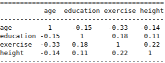

---
output:
  beamer_presentation:
    theme: "CambridgeUS"
    colortheme: "dolphin"
    fonttheme: "structurebold"
fontsize: 14pt
classoption: "aspectratio=169"
header-includes:
- \usepackage{caption}
- \captionsetup[figure]{labelformat=empty}
- \captionsetup[table]{labelformat=empty}
- \usepackage{xcolor}
---

```{r, echo = FALSE, warning = FALSE, message = FALSE}
## Render
##rmarkdown::render(input = "", output_file = "")

##fontsizes for tables: ‘"tiny"’, ‘"scriptsize"’, ‘"footnotesize"’, ‘"small"’, ‘"normalsize"’, ‘"large"’, ‘"Large"’, ‘"LARGE"’, ‘"huge"’, ‘"Huge"’

library(tidyverse)
library(readxl)
library(stargazer)
##library(kableExtra)
library(modelr)

knitr::opts_chunk$set(echo = FALSE,
                      eval = TRUE,
                      error = FALSE,
                      message = FALSE,
                      warning = FALSE,
                      comment = NA)

#############################################################
## Stargazer code

## Regular Table
##stargazer(summary = FALSE, type = "latex", header = FALSE, rownames = FALSE, float = FALSE)

## Regression Results
##stargazer(res1, type = "latex", digits = 2, omit.stat = "rsq", header = FALSE, font.size = "footnotesize", star.cutoffs = .05, notes = "*p < 0.05", notes.append = FALSE, dep.var.caption = "", float = FALSE)

##covariate.labels = c("Mother's Education")
##dep.var.labels = "Earnings (2021)"

#############################################################
## Figures

## ```{r, fig.align = 'center', fig.asp=0.618, out.width = '100%', fig.width = 7}

##knitr::include_graphics()

#############################################################
## Side-by-side columns

## ::: columns

## :::: column
## Content in left column

## ::::

## :::: column
## Content in right column

## ::::

## :::

```


# Today's Agenda

\begin{LARGE}

\begin{center}

\vspace{.25in}

Practice fitting, evaluating and making point estimates using multiple linear regression models (ch 6)

\end{center}

\end{LARGE}

\vspace{.5in}

\begin{center}
Justin Leinaweaver (Spring 2022)
\end{center}


#
\begin{Large}
\textbf{What is the most "useful" model of weight in the Ross (1990) dataset?}
\end{Large}

::: columns

:::: column

\vspace{.2in}

```{r, fig.align = 'center', fig.asp=0.618, out.width = '100%', fig.width = 7}
d <- read_excel("../../Data/Dataset-3-Ross_1990/ICPSR_Ross_Survey_1990.xlsx", na = c("NA"), guess_max = 10000)

d %>%
  ggplot(aes(x = weight)) +
  geom_histogram(bins = 10, color = "white") +
  theme_bw() +
  labs(x = "Weight (lb)", y = "Count", caption = "Source: Ross (1990)")
```


::::

:::: column

\vspace{.25in}

\begin{center}

\begin{Large}

Predictors to Explore

\begin{itemize}

\item Height

\item Exercise

\item Age

\end{itemize}

\end{Large}

\end{center}

::::

:::


# For Today

\begin{Large}

Evaluate our four models using Wheelan ch 12

\begin{itemize}

\item Model 1: Height

\item Model 2: Height and Exercise

\item Model 3: Height and Age

\item Model 4: Height, Exercise and Age

\end{itemize}

\end{Large}


# 

## Common Regression Mistakes (Wheelan ch12)

\begin{large}
\begin{enumerate}
\item Linear regression on nonlinear relationships
\item Correlation does not equal causation
\item Reverse causality
\item Omitted variable bias (too few variables)
\item Highly correlated explanatory variables (multicollinearity)
\item Extrapolating beyond the data
\item Data mining (too many variables)
\end{enumerate}
\end{large}


# 

## Common Regression Mistakes (Wheelan ch12)

\begin{large}
\begin{enumerate}
\item \textcolor{red}{Nonlinearity: Residuals Plots}
\item Correlation does not equal causation
\item Reverse causality
\item Omitted variable bias (too few variables)
\item \textcolor{red}{Multicollinearity: Correlation Matrix}
\item \textcolor{red}{Outside Data: Scatterplot}
\item Data mining (too many variables)
\end{enumerate}
\end{large}


# 
\begin{large}
\textbf{Common Regression Mistakes (Wheelan ch12)}
\end{large}

## Check the Data
\begin{enumerate}
\item Nonlinearity: Residuals Plots
\item Multicollinearity: Correlation Matrix
\item Outside Data: Scatterplot
\end{enumerate}

## Make an Argument
\begin{enumerate}
\item Correlation does not equal causation
\item Reverse causality
\item Omitted variable bias (too few variables)
\item Data mining (too many variables)
\end{enumerate}


# For Today

\begin{Large}

Evaluate our four models using Wheelan ch 12

\begin{itemize}

\item Model 1: Height

\item Model 2: Height and Exercise

\item Model 3: Height and Age

\item Model 4: Height, Exercise and Age

\end{itemize}

\end{Large}


# 
\begin{center}

```{r, results = "asis"}
## Input data
d <- read_excel("../../Data/Dataset-3-Ross_1990/ICPSR_Ross_Survey_1990.xlsx", na = "NA")

## Models
res1 <- d %>% lm(data = ., weight ~ height)
res2 <- d %>% lm(data = ., weight ~ height + exercise)
res3 <- d %>% lm(data = ., weight ~ height + age)
res4 <- d %>% lm(data = ., weight ~ height + exercise + age)

stargazer(res1, res2, res3, res4, omit.stat = "rsq", star.cutoffs = .05, notes = "*p < 0.05", notes.append = FALSE, digits = 2, dep.var.labels = "Weight (lb)", dep.var.caption = "", header = FALSE, float = FALSE, font.size = "tiny")
```

\end{center}


# 
\begin{Large}
\begin{center}
\textbf{One approach to building a "best" multiple regression model}
\end{center}
\end{Large}

\begin{large}
\begin{enumerate}
\item Choose the logical predictors
\item Fit a simple OLS regression to each predictor
\item Fit a multiple regression with the "best" of those
\item Evaluate the model using all five steps
\item Use the model to make predictions
\end{enumerate}
\end{large}


# 
\begin{large}
\begin{center}
\textbf{What is the "best" multiple regression model of earnings in the Ross (1990) dataset?}
\end{center}
\end{large}

\vspace{.5in}

## Outcome
Yearly income in thousands of dollars (earnk2021)

## Predictors to Consider
Age, angry, education, ethnicity, exercise, father's education, height, male, mother's education, smoker, tense, walk and weight


# 
\begin{large}
\begin{center}
\textbf{What is the "best" multiple regression model of earnings in the Ross (1990) dataset?}
\end{center}
\end{large}

\vspace{.5in}

## Outcome
Yearly income in thousands of dollars (earnk2021)

## Predictors to Consider
\textbf{Age}, ~~angry~~, \textbf{education}, ~~ethnicity~~, \textbf{exercise}, ~~father's education~~, \textbf{height}, ~~male~~, \textbf{mother's education}, ~~smoker~~, ~~tense, walk and weight~~


# 
\begin{center}

```{r, results = "asis"}
## Input data
d <- read_excel("../../Data/Dataset-3-Ross_1990/ICPSR_Ross_Survey_1990.xlsx", na = c("NA"), guess_max = 10000) %>%
    mutate(
        earnk2021 = earnk * 2.0266
    )

# 2. Fit a simple OLS regression for each predictor
# YOU select a subset for them to check
res1a <- d %>% lm(data = ., earnk2021 ~ age)
res1b <- d %>% lm(data = ., earnk2021 ~ education)
res1c <- d %>% lm(data = ., earnk2021 ~ exercise)
res1d <- d %>% lm(data = ., earnk2021 ~ height)
res1e <- d %>% lm(data = ., earnk2021 ~ mother_education)

stargazer(res1a, res1b, res1c, res1d, res1e, omit.stat = c("f", "rsq"), star.cutoffs = .05, notes = "*p < 0.05", notes.append = FALSE, digits = 2, dep.var.labels = "Earnings (2021)", dep.var.caption = "", header = FALSE, float = FALSE, font.size = "tiny")
```

\end{center}


# 
::: columns

:::: column

```{r, results = "asis"}
# Fit a multiple regression with the "best" of those
## Can't use both education and mother's education
##res1f <- d %>% lm(data = ., earnk2021 ~ age + education + exercise + height + mother_education)

res1g <- d %>% lm(data = ., earnk2021 ~ age + education + exercise + height)

stargazer(res1g, omit.stat = "rsq", star.cutoffs = .05, notes = "*p < 0.05", notes.append = FALSE, digits = 2, dep.var.labels = "Earnings (2021 USD)", dep.var.caption = "", covariate.labels = c("Age", "Education", "Exercise", "Height", "Mother's Education"), header = FALSE, float = FALSE, font.size = "scriptsize")
```


::::

:::: column

```{r, fig.align = 'center', fig.asp=0.618, out.height = '50%', fig.width = 5}
# residuals
d %>%
  add_predictions(res1g) %>%
  add_residuals(res1g) %>%
  ggplot(aes(x = pred, y = resid)) +
  geom_point(alpha = .25) +
  theme_bw() +
  labs(x = "Model Predicted Values", y = "Residuals") +
    geom_smooth(method = "lm", se = FALSE)
```

\vspace{.2in}

```{r, out.height = '33%'}
## Correlations table won't output
##cor1 <- cor(d[, c("age", "education", "exercise", "height")], use = "pairwise")



```

::::

:::


# 
\begin{center}

```{r, results = "asis"}
stargazer(res1a, res1b, res1c, res1d, res1g, omit.stat = c("f", "rsq"), star.cutoffs = .05, notes = "*p < 0.05", notes.append = FALSE, digits = 2, dep.var.labels = "Earnings (2021)", dep.var.caption = "", header = FALSE, float = FALSE, font.size = "tiny", covariate.labels = c("Age", "Education", "Exercise", "Height"))
```

\end{center}


# For Tuesday - Make Predictions (w/ 95% PIs)

Establish a baseline prediction for a hypothetical person who is 25 (Age), Education 13, Exercise 1, Height 67

\vspace{.2in}

Then calculate the predicted income if:

\begin{enumerate}
\item Finish college? (16)
\item Finish grad school? (18)
\item Increase exercise to 1x / week? (4)
\item Increase exercise to 3x / week? (7)
\end{enumerate}

