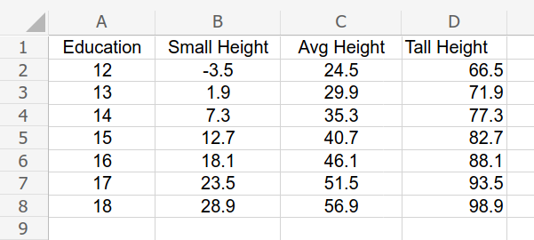

---
output:
  beamer_presentation:
    theme: "CambridgeUS"
    colortheme: "dolphin"
    fonttheme: "structurebold"
fontsize: 14pt
classoption: "aspectratio=169"
header-includes:
- \usepackage{caption}
- \captionsetup[figure]{labelformat=empty}
- \captionsetup[table]{labelformat=empty}
- \usepackage{xcolor}
- \setbeamertemplate{page number in head/foot}[]{}
---

```{r, echo = FALSE, warning = FALSE, message = FALSE}
## Render
##rmarkdown::render(input = "./09_1-Multiple_Regression3.Rmd", output_file = "./09_1-Multiple_Regression3.pdf")

##fontsizes for tables: ‘"tiny"’, ‘"scriptsize"’, ‘"footnotesize"’, ‘"small"’, ‘"normalsize"’, ‘"large"’, ‘"Large"’, ‘"LARGE"’, ‘"huge"’, ‘"Huge"’

library(tidyverse)
library(readxl)
library(stargazer)
##library(kableExtra)
library(modelr)

knitr::opts_chunk$set(echo = FALSE,
                      eval = TRUE,
                      error = FALSE,
                      message = FALSE,
                      warning = FALSE,
                      comment = NA)

#############################################################
## Stargazer code

## Regular Table
##stargazer(summary = FALSE, type = "latex", header = FALSE, rownames = FALSE, float = FALSE)

## Regression Results
##stargazer(res1, type = "latex", digits = 2, omit.stat = "rsq", header = FALSE, font.size = "footnotesize", star.cutoffs = .05, notes = "*p < 0.05", notes.append = FALSE, dep.var.caption = "", float = FALSE)

##covariate.labels = c("Mother's Education")
##dep.var.labels = "Earnings (2021)"

#############################################################
## Figures

## ```{r, fig.align = 'center', fig.asp=0.618, out.width = '100%', fig.width = 7}

##knitr::include_graphics()

#############################################################
## Side-by-side columns

## ::: columns

## :::: column
## Content in left column

## ::::

## :::: column
## Content in right column

## ::::

## :::

```


# Today's Agenda

\begin{LARGE}

\begin{center}

\vspace{.25in}

Practicing Multiple Linear Regressions

\end{center}

\end{LARGE}

\vspace{.5in}

\begin{center}
Justin Leinaweaver (Spring 2022)
\end{center}


# 
::: columns

:::: column

```{r, results = "asis"}
## Input data
d <- read_excel("../../Data/Dataset-3-Ross_1990/ICPSR_Ross_Survey_1990.xlsx", na = c("NA"), guess_max = 10000) %>%
    mutate(
        earnk2021 = earnk * 2.0266
    )

# Multiple OLS
res1g <- d %>% lm(data = ., earnk2021 ~ age + education + exercise + height)

stargazer(res1g, omit.stat = "rsq", star.cutoffs = .05, notes = "*p < 0.05", notes.append = FALSE, digits = 2, dep.var.labels = "Earnings (2021 USD)", dep.var.caption = "", covariate.labels = c("Age", "Education", "Exercise", "Height"), header = FALSE, float = FALSE, font.size = "scriptsize")
```


::::

:::: column

```{r, fig.align = 'center', fig.asp=0.618, out.height = '50%', fig.width = 5}
# residuals
d %>%
  add_predictions(res1g) %>%
  add_residuals(res1g) %>%
  ggplot(aes(x = pred, y = resid)) +
  geom_point(alpha = .25) +
  theme_bw() +
  labs(x = "Model Predicted Values", y = "Residuals") +
    geom_smooth(method = "lm", se = FALSE)
```

\vspace{.2in}

```{r, out.width='85%'}
## Correlations table won't output
##cor1 <- cor(d[, c("age", "education", "exercise", "height")], use = "pairwise")

knitr::include_graphics("./Images/08_2-correlations.png")

```

::::
:::


# For Today - Make Predictions (w/ 95% PIs)

Establish a baseline prediction for a hypothetical person who is 25 (Age), Education 13, Exercise 1, Height 67

\vspace{.2in}

Then calculate the predicted income if:

\begin{enumerate}
\item Finish college? (16)
\item Finish grad school? (18)
\item Increase exercise to 1x / week? (4)
\item Increase exercise to 3x / week? (7)
\end{enumerate}


# 
::: columns
:::: column

```{r, results = "asis"}
stargazer(res1g, omit.stat = "rsq", star.cutoffs = .05, notes = "*p < 0.05", notes.append = FALSE, digits = 2, dep.var.labels = "Earnings (2021 USD)", dep.var.caption = "", covariate.labels = c("Age", "Education", "Exercise", "Height"), header = FALSE, float = FALSE, font.size = "scriptsize")
```

::::
:::: column

\vspace{.5in}

\begin{center}

```{r, results = "asis"}
#Use the model to make predictions

## Education
x1 <- round(coef(res1g), 1)
sigma <- round(summary(res1g)$sigma, 1)

estimates1 <- as.numeric(c(x1[1] + x1[2] * 25 + x1[3] * 13 + x1[4] * 1 + x1[5] * 67,
                x1[1] + x1[2] * 25 + x1[3] * 16 + x1[4] * 1 + x1[5] * 67,
                x1[1] + x1[2] * 25 + x1[3] * 18 + x1[4] * 1 + x1[5] * 67))

low1 <- estimates1 - 2 * sigma
high1 <- estimates1 + 2 * sigma

tibble(
    Prediction = c("Baseline", "Finish College", "Finish Grad School"),
    Low = low1,
    Estimate = estimates1,
    High = high1
) %>%
    stargazer(rownames = FALSE, summary = FALSE, header = FALSE, float = FALSE, font.size = "footnotesize")
```

\vspace{.25in}

```{r, results = "asis"}
## Exercise
estimates2 <- as.numeric(c(x1[1] + x1[2] * 25 + x1[3] * 13 + x1[4] * 1 + x1[5] * 67,
                x1[1] + x1[2] * 25 + x1[3] * 13 + x1[4] * 4 + x1[5] * 67,
                x1[1] + x1[2] * 25 + x1[3] * 13 + x1[4] * 7 + x1[5] * 67))

low2 <- estimates2 - 2 * sigma
high2 <- estimates2 + 2 * sigma

tibble(
    Prediction = c("Baseline", "Exercise 1x / week", "Exercise > 3x"),
    Low = low2,
    Estimate = estimates2,
    High = high2
) %>%
    stargazer(rownames = FALSE, summary = FALSE, header = FALSE, float = FALSE, font.size = "footnotesize")

```
\end{center}

::::
:::


# 
\center

```{r, results = "asis"}
# Simple OLS
res100 <- d %>% lm(data = ., earnk2021 ~ education)

stargazer(res100, omit.stat = "rsq", star.cutoffs = .05, notes = "*p < 0.05", notes.append = FALSE, digits = 2, dep.var.labels = "Earnings (2021 USD)", dep.var.caption = "", covariate.labels = c("Education"), header = FALSE, float = FALSE, font.size = "footnotesize")
```


# 
::: columns
:::: column

```{r, results = "asis"}
stargazer(res100, omit.stat = "rsq", star.cutoffs = .05, notes = "*p < 0.05", notes.append = FALSE, digits = 2, dep.var.labels = "Earnings (2021 USD)", dep.var.caption = "", covariate.labels = c("Education"), header = FALSE, float = FALSE, font.size = "footnotesize")
```

::::
:::: column
```{r, fig.align = 'center', fig.asp=0.85, out.height = '75%', fig.width = 5}
d %>%
  add_predictions(res100) %>%
  ggplot(aes(x = education, y = earnk2021)) +
  geom_point(alpha = .25) +
  theme_bw() +
  labs(x = "Education (Years)", y = "Yearly Earnings (2021 USD)") +
    geom_smooth(method = "lm", se = FALSE)
```

::::
:::


# 
::: columns
:::: column

```{r, results = "asis"}
stargazer(res1g, omit.stat = "rsq", star.cutoffs = .05, notes = "*p < 0.05", notes.append = FALSE, digits = 2, dep.var.labels = "Earnings (2021 USD)", dep.var.caption = "", covariate.labels = c("Age", "Education", "Exercise", "Height"), header = FALSE, float = FALSE, font.size = "scriptsize")
```

::::
:::: column

\center
\Huge

\vspace{1.1in}

?

::::
:::


# 
::: columns
:::: column

```{r, results = "asis"}
stargazer(res1g, omit.stat = "rsq", star.cutoffs = .05, notes = "*p < 0.05", notes.append = FALSE, digits = 2, dep.var.labels = "Earnings (2021 USD)", dep.var.caption = "", covariate.labels = c("Age", "Education", "Exercise", "Height"), header = FALSE, float = FALSE, font.size = "scriptsize")
```

::::
:::: column

\vspace{.5in}

\begin{center}

```{r, results = "asis"}
#Use the model to make predictions

## Education
x1 <- round(coef(res1g), 1)
sigma <- round(summary(res1g)$sigma, 1)

estimates1 <- as.numeric(c(x1[1] + x1[2] * 25 + x1[3] * 13 + x1[4] * 1 + x1[5] * 67,
                x1[1] + x1[2] * 25 + x1[3] * 16 + x1[4] * 1 + x1[5] * 67,
                x1[1] + x1[2] * 25 + x1[3] * 18 + x1[4] * 1 + x1[5] * 67))

low1 <- estimates1 - 2 * sigma
high1 <- estimates1 + 2 * sigma

tibble(
    Prediction = c("Baseline", "Finish College", "Finish Grad School"),
    Low = low1,
    Estimate = estimates1,
    High = high1
) %>%
    stargazer(rownames = FALSE, summary = FALSE, header = FALSE, float = FALSE, font.size = "footnotesize")
```

\vspace{.25in}

```{r, results = "asis"}
## Exercise
estimates2 <- as.numeric(c(x1[1] + x1[2] * 25 + x1[3] * 13 + x1[4] * 1 + x1[5] * 67,
                x1[1] + x1[2] * 25 + x1[3] * 13 + x1[4] * 4 + x1[5] * 67,
                x1[1] + x1[2] * 25 + x1[3] * 13 + x1[4] * 7 + x1[5] * 67))

low2 <- estimates2 - 2 * sigma
high2 <- estimates2 + 2 * sigma

tibble(
    Prediction = c("Baseline", "Exercise 1x / week", "Exercise > 3x"),
    Low = low2,
    Estimate = estimates2,
    High = high2
) %>%
    stargazer(rownames = FALSE, summary = FALSE, header = FALSE, float = FALSE, font.size = "footnotesize")

```
\end{center}

::::
:::


# 
::: columns
:::: column

```{r, results = "asis"}
stargazer(res1g, omit.stat = "rsq", star.cutoffs = .05, notes = "*p < 0.05", notes.append = FALSE, digits = 2, dep.var.labels = "Earnings (2021 USD)", dep.var.caption = "", covariate.labels = c("Age", "Education", "Exercise", "Height"), header = FALSE, float = FALSE, font.size = "scriptsize")
```

::::
:::: column

\begin{center}

```{r, results = "asis"}
preds1 <- x1[1] + x1[2] * 25 + x1[3] * 12:18 + x1[4] * 1 + x1[5] * 67
preds2 <- str_c('$', preds1, 'k')

tibble(
    Education = 12:18,
    Prediction = c("", "", "", "", preds2[5], "", preds2[7])
) %>%
    stargazer(rownames = FALSE, summary = FALSE, header = FALSE, float = FALSE, font.size = "large")

```
\end{center}

::::
:::


# 
::: columns

:::: column

```{r, results = "asis"}
stargazer(res1g, omit.stat = "rsq", star.cutoffs = .05, notes = "*p < 0.05", notes.append = FALSE, digits = 2, dep.var.labels = "Earnings (2021 USD)", dep.var.caption = "", covariate.labels = c("Age", "Education", "Exercise", "Height"), header = FALSE, float = FALSE, font.size = "scriptsize")
```

::::

:::: column

\begin{center}

```{r, results = "asis"}
preds1 <- x1[1] + x1[2] * 25 + x1[3] * 12:18 + x1[4] * 1 + x1[5] * 67
preds2 <- str_c('$', preds1, 'k')

tibble(
    Education = 12:18,
    Prediction = preds2
) %>%
    stargazer(rownames = FALSE, summary = FALSE, header = FALSE, float = FALSE, font.size = "large")

```
\end{center}

::::
:::


# 
::: columns
:::: column

```{r, results = "asis"}
tibble(
    Education = 12:18,
    Prediction = preds2
) %>%
    stargazer(rownames = FALSE, summary = FALSE, header = FALSE, float = FALSE, font.size = "large")
```

::::
:::: column

\vspace{.2in}

```{r, fig.align = 'center', fig.asp=0.9, out.width = '100%', fig.width = 5}
## Expand to all education levels for visualizing scatter plot
tibble(
  Education = 12:18,
  Predicted = x1[1] + x1[2]*25 + x1[3]*Education + x1[4]*1 + x1[5]*67
) %>%
  ggplot(aes(x = Education, y = Predicted)) +
  geom_line(size = 1.5) +
  theme_minimal() +
  labs(x = "Years of Education", y = "Predicted Earnings ($k)",
       title = "The Marginal Effect of Education on Earnings",
       subtitle = "Assumes a 25 year old who is 5ft 7in and doesn't exercise") +
  coord_cartesian(ylim = c(20, 60))
```
::::
:::


# 
::: columns
:::: column

```{r, results = "asis"}
stargazer(res1g, omit.stat = "rsq", star.cutoffs = .05, notes = "*p < 0.05", notes.append = FALSE, digits = 2, dep.var.labels = "Earnings (2021 USD)", dep.var.caption = "", covariate.labels = c("Age", "Education", "Exercise", "Height"), header = FALSE, float = FALSE, font.size = "scriptsize")
```

::::
:::: column

\vspace{.2in}

```{r, fig.align = 'center', fig.asp=0.9, out.width = '100%', fig.width = 5}
## Expand to all education levels for visualizing scatter plot
tibble(
  Education = 12:18,
  Predicted = x1[1] + x1[2]*25 + x1[3]*Education + x1[4]*1 + x1[5]*67
) %>%
  ggplot(aes(x = Education, y = Predicted)) +
  geom_line(size = 1.5) +
  theme_minimal() +
  labs(x = "Years of Education", y = "Predicted Earnings ($k)",
       title = "The Marginal Effect of Education on Earnings",
       subtitle = "Assumes a 25 year old who is 5ft 7in and doesn't exercise") +
  coord_cartesian(ylim = c(20, 60))
```
::::
:::


# 
\large
Create a marginal effects plot with THREE prediction lines

1. Predict the effect of education (12-18) for a 25 year old who doesn't exercise and is the shortest person in the sample (4'9")

2. Repeat above but assume a person of average height (5'7")

3. Repeat above but assume the tallest person in the sample (6'10")


# 

```{r, fig.align = 'center', fig.asp=0.618, out.height = '95%', fig.width = 6}
## Repeat with lines by shortest, avg and tallest
tibble(
  Education = 12:18,
  Shortest = x1[1] + x1[2]*25 + x1[3]*Education + x1[4]*1 + x1[5]*57,
  Average = x1[1] + x1[2]*25 + x1[3]*Education + x1[4]*1 + x1[5]*67,
  Tallest = x1[1] + x1[2]*25 + x1[3]*Education + x1[4]*1 + x1[5]*82
) %>%
  pivot_longer(cols = Shortest:Tallest, names_to = "Height", values_to = "Values") %>%
  ggplot(aes(x = Education, y = Values, color = Height)) +
  geom_line(size = 2) +
  scale_color_discrete(limits = c("Tallest", "Average", "Shortest")) +
  theme_minimal() +
  labs(x = "Years of Education", y = "Predicted Earnings ($k)",
       title = "The Marginal Effect of Education on Earnings",
       subtitle = "Assumes a 25 year old who doesn't exercise")
```


#
```{r, fig.align='center', out.width='90%'}

```


#
```{r, fig.align='center', out.width='100%'}
knitr::include_graphics('Images/09-1-marginal_effects2.png')
```


# 

```{r, fig.align = 'center', fig.asp=0.618, out.height = '95%', fig.width = 6}
## Repeat with lines by shortest, avg and tallest
tibble(
  Education = 12:18,
  Shortest = x1[1] + x1[2]*25 + x1[3]*Education + x1[4]*1 + x1[5]*57,
  Average = x1[1] + x1[2]*25 + x1[3]*Education + x1[4]*1 + x1[5]*67,
  Tallest = x1[1] + x1[2]*25 + x1[3]*Education + x1[4]*1 + x1[5]*82
) %>%
  pivot_longer(cols = Shortest:Tallest, names_to = "Height", values_to = "Values") %>%
  ggplot(aes(x = Education, y = Values, color = Height)) +
  geom_line(size = 2) +
  scale_color_discrete(limits = c("Tallest", "Average", "Shortest")) +
  theme_minimal() +
  labs(x = "Years of Education", y = "Predicted Earnings ($k)",
       title = "The Marginal Effect of Education on Earnings",
       subtitle = "Assumes a 25 year old who doesn't exercise")
```


# 
\begin{large}
\begin{center}
\textbf{What is the "best" model of bachelor's degree completion in dataset 1?}
\end{center}
\end{large}

```{r, fig.align = 'center', fig.asp=0.618, out.height = '75%', fig.width = 6}
# Input dataset 1
d <- read_excel("../../Data/Dataset-1/Dataset1-2020_Only.xlsx", na = "NA") %>%
  mutate(
    gdp_billions = gdp_millions / 1000
  )

# Let's build a model of bachelors
d %>%
  ggplot(aes(x = bachelors)) +
  geom_histogram(bins = 8, color = "white") +
  theme_bw() +
  labs(x = "Bachelors' Degrees (%) in 2020", y = "") +
  scale_y_continuous(breaks = seq(1, 12, 2))
```


# 
\begin{large}
\begin{center}
\textbf{What is the "best" model of bachelor's degree completion in dataset 1?}
\end{center}

\begin{enumerate}
\item Choose the logical predictors
\item Fit a simple OLS regression to each predictor
\item Fit a multiple regression with the "best" of those
\item Evaluate the model using all five steps
\item Use the model to make predictions
\end{enumerate}

\end{large}


# 
\begin{Large}
\begin{center}
\textbf{What is the "best" model of bachelor's degree completion in dataset 1?}
\end{center}
\end{Large}

\vspace{.2in}

## Outcome
\begin{itemize}
\item Bachelors' Degrees
\end{itemize}

## Predictors to Consider
\begin{itemize}
\item GDP (Billions), GDP (Rate), Homeownership, Manufacturing employment, Minimum wage, Population, Rental Vacancy Rate, State Tax Rate on Wages, Unemployment
\end{itemize}


# 
\begin{large}
\begin{center}
\textbf{Common Regression Mistakes (Wheelan ch12)}
\end{center}
\end{large}

\begin{enumerate}
\item Linear regression on nonlinear relationships
\item Correlation does not equal causation
\item Reverse causality
\item Omitted variable bias (too few variables)
\item Highly correlated explanatory variables (multicollinearity)
\item Extrapolating beyond the data
\item Data mining (too many variables)
\end{enumerate}
