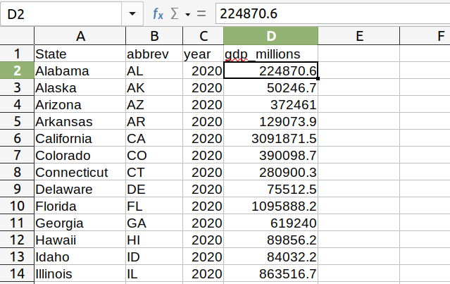
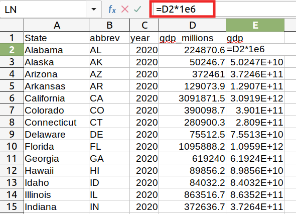
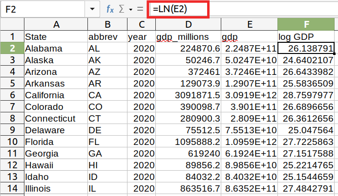
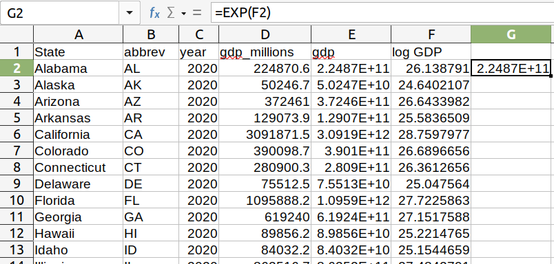

---
output:
  beamer_presentation:
    theme: "CambridgeUS"
    colortheme: "dolphin"
    fonttheme: "structurebold"
fontsize: 14pt
classoption: "aspectratio=169"
header-includes:
- \usepackage{caption}
- \captionsetup[figure]{labelformat=empty}
- \captionsetup[table]{labelformat=empty}
- \setbeamertemplate{page number in head/foot}[]{}
---

```{r, echo = FALSE, warning = FALSE, message = FALSE}
## Render the pdf
##rmarkdown::render(input = "./11_1-Transforming_Variables.Rmd", output_file = "./11_1-Transforming_Variables.pdf")

##fontsizes for tables: ‘"tiny"’, ‘"scriptsize"’, ‘"footnotesize"’, ‘"small"’, ‘"normalsize"’, ‘"large"’, ‘"Large"’, ‘"LARGE"’, ‘"huge"’, ‘"Huge"’

library(tidyverse)
library(readxl)
library(stargazer)
##library(kableExtra)
library(modelr)

knitr::opts_chunk$set(echo = FALSE,
                      eval = TRUE,
                      error = FALSE,
                      message = FALSE,
                      warning = FALSE,
                      comment = NA)

#############################################################
## Stargazer code

## Regular Table
##stargazer(summary = FALSE, type = "latex", header = FALSE, rownames = FALSE, float = FALSE)

## Regression Results
##stargazer(res1, type = "latex", digits = 2, omit.stat = "rsq", header = FALSE, font.size = "footnotesize", star.cutoffs = .05, notes = "*p < 0.05", notes.append = FALSE, dep.var.caption = "", float = FALSE)

##covariate.labels = c("Mother's Education")
##dep.var.labels = "Earnings (2021)"

#############################################################
## Figures

## ```{r, fig.align = 'center', fig.asp=0.618, out.width = '100%', fig.width = 7}

##knitr::include_graphics()

#############################################################
## Side-by-side columns

## ::: columns
## :::: column
## Content in left column
## ::::
## :::: column
## Content in right column
## ::::
## :::

## Build bullets one-by-one
##\begin{enumerate}[<+->]

```


# Today's Agenda: Dataset 1

\begin{large}

Extending the OLS Regression

\begin{enumerate}
\item Week 9: Dichotomous and categorical predictors
\item Today: Transforming the variables
\item Thursday: Transforming the model
\end{enumerate}

\end{large}

\vspace{.25in}

\begin{center}
Justin Leinaweaver (Spring 2022)
\end{center}

```{r, include = FALSE}
d <- read_excel("../../Data/Dataset-1/Dataset1-2020_Only.xlsx", na = "NA") %>%
  mutate(
    gdp_category = factor(gdp_category, levels = c("Under $100 billion", "Under $1 trillion", "Above $1 trillion")),
    pop_under5 = if_else(pop_category == "Under 5 million", 1, 0),
    pop_under10 = if_else(pop_category == "Under 10 million", 1, 0),
    pop_above10 = if_else(pop_category == "Above 10 million", 1, 0),
    pop_category = factor(pop_category, levels = c("Under 5 million", "Under 10 million", "Above 10 million")),
    manufacturing_category = factor(manufacturing_category, levels = c("Under 100k", "Under 300k", "Above 300k")),
    income_tax2 = if_else(income_tax == 1, "Income Tax", "No Income Tax"),
    log_gdp = log(gdp_millions*1e6),
    pop_millions = population_thousands / 1000,
    gdp_billions = gdp_millions/1000,
    log_pop = log(population_thousands * 1e3)
  )
```


# Let's Practice with Categorical Predictors
\center
\LARGE

Regress GDP (millions) on the three population level categories in pop_category


# Let's Practice with Categorical Predictors
\Large

\begin{center}
Regress GDP (millions) on the three population level categories in pop\_category
\end{center}

\vspace{.2in}

Create Dummy Vars:

1. Under 10 million

2. Above 10 million


# 
::: columns
:::: column
\vspace{.75in}
\large
\begin{center}
Group Means
\vspace{.1in}
```{r, results = "asis"}
# Group means
d %>%
  group_by(pop_category) %>%
  summarize(
    "GDP (millions)" = prettyNum(round(mean(gdp_millions), 0), big.mark = ",", scientific = FALSE)
  ) %>%
    rename(Population = pop_category) %>%
  mutate(
    Population = c("Under 5 million", "Under 10 million", "Above 10 million")
  ) |>
  stargazer(summary = FALSE, rownames = FALSE, header = FALSE, float = FALSE, font.size = "footnotesize", title = "Group Means")
```
\end{center}
::::
:::: column
\begin{center}
```{r, results = "asis"}
# Start by examining a bad model fit: GDP ~ bachelors
res1 <- lm(data = d, gdp_millions ~ pop_under10 + pop_above10)

stargazer(res1, digits = 2, dep.var.caption = "", star.cutoffs = .05, notes.append = FALSE, notes = "*p<0.05", omit.stat = "rsq", dep.var.labels = "GDP (millions)", covariate.labels = c("Pop (5-10million)", "Pop (Above 10million)"), header = FALSE, float = FALSE, font.size = "footnotesize")
```
\end{center}
::::
:::


# 
::: columns
:::: column
```{r, fig.asp=1.4, out.width='80%', fig.width=5}
## Group means
group_means1 <- d |>
  group_by(pop_category) |>
  summarize(
    mean = mean(gdp_millions)
  )

d |>
  ggplot(aes(x = gdp_millions)) +
  geom_histogram(bins = 25, color = "white") +
  geom_vline(data = group_means1, aes(xintercept = mean), color = "red", size = 1.4) +
  facet_wrap(~ pop_category, ncol = 1, scales = "free_y") +
  theme_bw() +
  labs(x = "GDP (millions USD)", y = "")
```
::::
:::: column
\begin{center}
```{r, results = "asis"}
stargazer(res1, digits = 2, dep.var.caption = "", star.cutoffs = .05, notes.append = FALSE, notes = "*p<0.05", omit.stat = "rsq", dep.var.labels = "GDP (millions)", covariate.labels = c("Pop (5-10million)", "Pop (Above 10million)"), header = FALSE, float = FALSE, font.size = "footnotesize")
```
\end{center}
::::
:::


# Improving Model Fit: Transforming Variables
\Large

\begin{center}
Do states with more educated workforces have larger economies?
\end{center}

\vspace{.25in}

Model 1: Regress GDP (**millions**) on bachelors

Model 2: Regress GDP (**billions**) on bachelors


# 
\begin{center}
```{r, results = "asis"}
res1 <- lm(data = d, gdp_millions ~ bachelors)
res2 <- lm(data = d, gdp_billions ~ bachelors)

stargazer(res1, res2, digits = 2, dep.var.caption = "", star.cutoffs = .05, notes.append = FALSE, notes = "*p<0.05", omit.stat = "rsq", dep.var.labels = c("GDP (millions)", "GDP (billions)"), covariate.labels = c("Bachelors (\\%)", "Intercept"), header = FALSE, float = FALSE, font.size = "small")
```
\end{center}


# 
```{r, results = "asis"}
# Illustrate decimal transformations
d2 <- d %>%
  mutate(
    gdp_10billion = gdp_billions/10,
    gdp_100billion = gdp_billions/100
  )

res1 <- lm(data = d, gdp_millions ~ bachelors)
res2 <- lm(data = d, gdp_billions ~ bachelors)
res3 <- lm(data = d2, gdp_10billion ~ bachelors)
res4 <- lm(data = d2, gdp_100billion ~ bachelors)

stargazer(res1, res2, res3, res4, digits = 2, dep.var.caption = "", star.cutoffs = .05, notes.append = FALSE, notes = "*p<0.05", omit.stat = "rsq", dep.var.labels = c("GDP (millions)", "(billions)", "(10 billion)", "(100 billion)"), covariate.labels = c("Bachelors (\\%)", "Intercept"), header = FALSE, float = FALSE, font.size = "footnotesize")
```


# Transformation 1: Shift the Decimal Point
```{r, fig.align = 'center', fig.asp=0.618, out.height = '80%', fig.width = 5.5}
# Visualize the residual plot (600x300)
d10 <- d %>%
  add_residuals(res2) %>% 
  add_predictions(res2)

d10 %>%
  ggplot(aes(x = pred, y = resid)) +
  geom_point() +
  theme_bw() +
  labs(x = "Predicted GDP (Billions USD)", y = "Residuals") +
  coord_cartesian(ylim = c(-1000, 3000)) +
  geom_hline(yintercept = 0, color = "red")
```


# Transformation 1: Shift the Decimal Point
```{r, fig.align = 'center', fig.asp=0.618, out.height = '80%', fig.width = 5.5}
# Visualize the residual plot (600x300)
d_labels <- d10 |>
  filter(resid > 1000)

d10 %>%
  ggplot(aes(x = pred, y = resid)) +
  geom_point() +
  ggrepel::geom_text_repel(data = d_labels, aes(label = State)) +
  theme_bw() +
  labs(x = "Predicted GDP (Billions USD)", y = "Residuals") +
  coord_cartesian(ylim = c(-1000, 3000)) +
  geom_hline(yintercept = 0, color = "red")
```


# Transformation 1: Shift the Decimal Point
::: columns
:::: column
```{r, fig.align = 'center', fig.asp=0.85, out.height = '80%', fig.width = 5.5}
# Visualize the residual plot (600x300)
d10 %>%
  ggplot(aes(x = pred, y = resid)) +
  geom_point() +
  ggrepel::geom_text_repel(data = d_labels, aes(label = State)) +
  theme_bw() +
  labs(x = "Predicted GDP (Billions USD)", y = "Residuals") +
  coord_cartesian(ylim = c(-1000, 3000)) +
  geom_hline(yintercept = 0, color = "red")
```
::::
:::: column

\vspace{1in}

\begin{Large}
\begin{center}

`r sum(d10$resid < 0)` / 50 (`r (sum(d10$resid < 0)/50)*100` \%) are below the zero line.

\vspace{.2in}

Aim is 50\%-50\%

\end{center}
\end{Large}
::::
:::


# Transformation 2: Natural Logarithms

```{r, fig.align = 'center', fig.asp=0.618, out.width = '75%', fig.width = 6}
## Visualize the natural log scale
tibble(
  x = 1:20, #1e3,
  log_x = log(x)
) %>%
  ggplot(aes(x = x, y = log_x)) +
  geom_line() +
  theme_bw() +
  labs(x = "X", y = "Natural Log of X")
```


# Transformation 2: Natural Logarithms

```{r, fig.align = 'center', fig.asp=0.618, out.width = '75%', fig.width = 6}
## Visualize the natural log scale
tibble(
  x = 1:20, #1e3,
  log_x = log(x)
) %>%
  ggplot(aes(x = x, y = log_x)) +
  geom_line() +
  annotate("segment", x = 1, xend = 5, y = 1.609, yend = 1.609, linetype = "dashed") +
  annotate("segment", x = 5, xend = 5, y = 0, yend = 1.609, linetype = "dashed") +
  annotate("point", x = 5, y = 1.609, color = "red", size = 6) +
  theme_bw() +
  labs(x = "X", y = "Natural Log of X",
       title = "Excel Function: LN()")
```


# Transformation 2: Natural Logarithms

```{r, fig.align = 'center', fig.asp=0.618, out.width = '75%', fig.width = 6}
## Visualize the natural log scale
tibble(
  x = 1:20, #1e3,
  log_x = log(x)
) %>%
  ggplot(aes(x = x, y = log_x)) +
  geom_line() +
  annotate("segment", x = 1, xend = 5, y = 1.609, yend = 1.609, linetype = "dashed") +
  annotate("segment", x = 5, xend = 5, y = 0, yend = 1.609, linetype = "dashed") +
  annotate("point", x = 5, y = 1.6, color = "red", size = 6) +
  annotate("segment", x = 1, xend = 10, y = 2.3, yend = 2.3, linetype = "dashed") +
  annotate("segment", x = 10, xend = 10, y = 0, yend = 2.3, linetype = "dashed") +
  annotate("point", x = 10, y = 2.3, color = "red", size = 6) +
  theme_bw() +
  labs(x = "X", y = "Natural Log of X")
```


# Transformation 2: Natural Logarithms

```{r, fig.align = 'center', fig.asp=0.5, out.width = '85%', fig.width = 6}
## Visualize the natural log scale
tibble(
  x = 1:1e4,
  log_x = log(x)
) %>%
  ggplot(aes(x = x, y = log_x)) +
  geom_line() +
  annotate("segment", x = 1, xend = 5000, y = 8.517, yend = 8.517, linetype = "dashed") +
  annotate("segment", x = 5000, xend = 5000, y = 0, yend = 8.517, linetype = "dashed") +
  annotate("point", x = 5000, y = 8.517, color = "red", size = 4) +
  annotate("segment", x = 1, xend = 7500, y = 8.9226, yend = 8.9226, linetype = "dashed") +
  annotate("segment", x = 7500, xend = 7500, y = 0, yend = 8.9226, linetype = "dashed") +
  annotate("point", x = 7500, y = 8.9226, color = "red", size = 4) +
  theme_bw() +
  labs(x = "X", y = "Natural Log of X")
```


# Transformation 2: Natural Logarithms

\begin{Large}

The natural log scale = multiplying by e

\begin{itemize}

\item $e$ is Euler's Number (2.718282...)

\item Typically written as $log_e$ X or ln X

\end{itemize}

\vspace{.25in}

Transform back to linear scale using $e^{X}$

\end{Large}


# Transformation 2: Natural Logarithms
\begin{center}
```{r, out.width='80%'}

```
\end{center}


# Transformation 2: Natural Logarithms
\begin{center}
```{r, out.width='80%'}

```
\end{center}


# Transformation 2: Natural Logarithms
\begin{center}
```{r, out.width='80%'}

```
\end{center}


# Transformation 2: Natural Logarithms
\begin{center}
```{r, out.width='90%'}

```
\end{center}


# Let's Practice with Log Transformations
\Large

\begin{center}
Do states with more educated workforces have larger economies?
\end{center}

\vspace{.25in}

Model 3: Regress GDP (**log**) on bachelors


# 
\begin{center}
```{r, results = "asis"}
##### Bachelors #####
res1 <- d %>% lm(data = ., gdp_billions ~ bachelors)
res2 <- d %>% lm(data = ., log_gdp ~ bachelors)

## Save coefficients
x1 <- round(coef(res1), 2)
x2 <- round(coef(res2), 2)

stargazer(res1, res2, digits = 2, dep.var.caption = "", star.cutoffs = .056, notes.append = FALSE, notes = "*p<0.056", omit.stat = "rsq", dep.var.labels = c("GDP (billions)", "GDP (log)"), covariate.labels = c("Bachelors (\\%)", "Intercept"), header = FALSE, float = FALSE, font.size = "small")
```
\end{center}


# 
::: columns
:::: column

\vspace{.4in}

```{r, fig.align = 'center', fig.asp=0.8, out.height = '65%', fig.width = 5}
# Visualize the line fit plot (600x300)
d %>%
  ggplot(aes(x = bachelors, y = gdp_billions)) +
  geom_point() +
  geom_smooth(method = "lm", se = FALSE) +
  theme_bw() +
  labs(x = "Bachelors Degree (%)", y = "GDP (billions)")
```
::::
:::: column

\vspace{.4in}

```{r, fig.align = 'center', fig.asp=0.8, out.height = '65%', fig.width = 5}
# Visualize the line fit plot (600x300)
d %>%
  ggplot(aes(x = bachelors, y = log_gdp)) +
  geom_point() +
  geom_smooth(method = "lm", se = FALSE) +
  theme_bw() +
  labs(x = "Bachelors Degree (%)", y = "log (GDP)")
```
::::
:::


# 
::: columns
:::: column
```{r, fig.align = 'center', fig.asp=0.8, out.height = '70%', fig.width = 5}
# Visualize the residual plot (600x300)
resid11 <- d %>%
  add_residuals(res1) %>%
    add_predictions(res1)

resid11 %>%
  ggplot(aes(x = pred, y = resid)) +
  geom_point() +
  theme_bw() +
  labs(x = "Predicted GDP (billions USD)", y = "Residuals") +
  geom_hline(yintercept = 0, color = "red")
```

\begin{center}

\begin{large}

Above the line = `r sum(resid11$resid > 0)` (`r round(sum(resid11$resid > 0)/50*100,0)`\%)

Below the line = `r sum(resid11$resid < 0)` (`r round(sum(resid11$resid < 0)/50*100,0)`\%)

\end{large}

\end{center}

::::
:::: column

```{r, fig.align = 'center', fig.asp=0.8, out.height = '70%', fig.width = 5}
# Visualize the residual plot (600x300)
resid12 <- d %>%
  add_residuals(res2) %>%
    add_predictions(res2)

resid12 %>%
  ggplot(aes(x = pred, y = resid)) +
  geom_point() +
  theme_bw() +
  labs(x = "Predicted GDP (log)", y = "Residuals") +
  geom_hline(yintercept = 0, color = "red")
```

\begin{center}
\begin{large}

Above the line = `r sum(resid12$resid > 0)` (`r round(sum(resid12$resid > 0)/50*100,0)`\%)

Below the line = `r sum(resid12$resid < 0)` (`r round(sum(resid12$resid < 0)/50*100,0)`\%)

\end{large}
\end{center}
::::
:::


# Transformation 2: Natural Logarithms

```{r, fig.align = 'center', fig.asp=0.5, out.width = '90%', fig.width = 7}
## Plot GDP vs Log GDP
d %>%
  pivot_longer(cols = c(gdp_billions, log_gdp), names_to = "Version", values_to = "Values") %>%
  mutate(
    Version = if_else(Version == "gdp_billions", "GDP (Billions USD)", "log of GDP (USD)")
  ) %>%
  ggplot(aes(x = Values)) +
  geom_histogram(bins = 15, fill = "darkgrey", color = "white") +
  theme_bw() +
  labs(x = "", y = "") +
  facet_wrap(~ Version, scales = "free", ncol = 2)
```


# Transformation 2: Natural Logarithms

```{r, fig.align = 'center', fig.asp=0.5, out.width = '90%', fig.width = 7}
## Plot GDP vs Log GDP (add mean line)
new1 <- tibble(
  Version = c("GDP (Billions USD)", "log of GDP (USD)"),
  Values = c(mean(d$gdp_billions), mean(d$log_gdp))
)

d %>%
  pivot_longer(cols = c(gdp_billions, log_gdp), names_to = "Version", values_to = "Values") %>%
  mutate(
    Version = if_else(Version == "gdp_billions", "GDP (Billions USD)", "log of GDP (USD)"),
    Mean = mean(Values)
  ) %>% 
  ggplot(aes(x = Values)) +
  geom_histogram(bins = 15, fill = "darkgrey", color = "white") +
  geom_vline(data = new1, aes(xintercept = Values), color = "red", size = 3) +
  theme_bw() +
  labs(x = "", y = "") +
  facet_wrap(~ Version, scales = "free", ncol = 2)
```


# Transformation 2: Natural Logarithms

```{r, fig.align = 'center', fig.asp=0.5, out.width = '90%', fig.width = 7}
## Plot GDP vs Log GDP, add highlights to show how log stretches out differences at the low end
d %>%
  mutate(
    color_in = if_else(gdp_billions < 110, "1", "0")
  ) %>%
  pivot_longer(cols = c(gdp_billions, log_gdp), names_to = "Version", values_to = "Values") %>%
  mutate(
    Version = if_else(Version == "gdp_billions", "GDP (Billions USD)", "log of GDP (USD)")
  ) %>%
  ggplot(aes(x = Values, fill = color_in)) +
  geom_histogram(bins = 15, color = "white") +
  theme_bw() +
  labs(x = "", y = "") +
  facet_wrap(~ Version, scales = "free", ncol = 2) +
  guides(fill = FALSE) +
  scale_fill_manual(values = c("darkgrey", "orange"))
```


# Transformation 2: Natural Logarithms

```{r, fig.align = 'center', fig.asp=0.5, out.width = '90%', fig.width = 7}
## Plot GDP vs Log GDP, add highlights to show how log condenses differences at the high end
d %>%
  mutate(
    color_in = if_else(gdp_billions > 1500, "1", "0")
  ) %>%
  pivot_longer(cols = c(gdp_billions, log_gdp), names_to = "Version", values_to = "Values") %>%
  mutate(
    Version = if_else(Version == "gdp_billions", "GDP (Billions USD)", "log of GDP (USD)")
  ) %>%
  ggplot(aes(x = Values, fill = color_in)) +
  geom_histogram(bins = 15, color = "white") +
  theme_bw() +
  labs(x = "", y = "") +
  facet_wrap(~ Version, scales = "free", ncol = 2) +
  guides(fill = FALSE) +
  scale_fill_manual(values = c("darkgrey", "red"))
```


# Transformation 2: Natural Logarithms

\begin{LARGE}

GDP for State X = \$5,000 or 8.5 (ln)

\begin{itemize}

\item $log_e$ 5,000 $\approx$ 8.5

\item $e^{8.5} \approx$ 5,000 

\end{itemize}

\end{LARGE}


# 
```{r, fig.align = 'center', fig.asp=0.618, out.width = '65%', fig.width = 5}
p1 <- d %>%
  ggplot(aes(x = log_gdp)) +
  geom_histogram(bins = 15, fill = "darkgrey", color = "white") +
  theme_minimal() +
  labs(x = "", y = "", title = "Log (GDP)")

p1 +
    geom_vline(xintercept = c(24, 29), color = "red", size = 1.3)
```

\begin{large}
\begin{itemize}

\item $e^{24}$ is approximately \$26 billion

\item $e^{29}$ is approximately \$3.9 trillion

\end{itemize}
\end{large}


# 
::: columns
:::: column
```{r, fig.align = 'center', fig.asp=0.618, out.width = '90%', fig.width = 5}
p1 +
    geom_vline(xintercept = c(24, 25), color = "red", size = 1.3)
```

\begin{center}
\begin{itemize}

\item $e^{24}$ $\approx$ \$26 billion

\item $e^{25}$ $\approx$ \$72 billion

\end{itemize}
\end{center}

::::
:::: column

\vspace{.5in}

\begin{center}
\begin{large}
One unit on the LN scale: 

\begin{itemize}
\item value x $e$
\end{itemize}

\vspace{.5in}

General rule of thumb:

\begin{itemize}
\item value x 3
\end{itemize}

\end{large}
\end{center}
::::
:::


#
::: columns
:::: column

\vspace{.5in}

\begin{center}
\begin{LARGE}
\textbf{Making Point Estimates}
\end{LARGE}
\end{center}
::::
:::: column

```{r, results = "asis"}
stargazer(res2, digits = 2, dep.var.caption = "", star.cutoffs = .06, notes.append = FALSE, notes = "*p<0.06", omit.stat = "rsq", dep.var.labels = c("(log GDP)"), covariate.labels = c("Bachelors (\\%)"), header = FALSE, float = FALSE, font.size = "footnotesize")
```
::::
:::

\vspace{.15in}

\begin{center}
\textbf{ln (Outcome) = Intercept + Coefficient * (Predictor)}
\end{center}


#
::: columns
:::: column

\vspace{.5in}

\begin{center}
\begin{LARGE}
\textbf{Making Point Estimates}
\end{LARGE}
\end{center}
::::
:::: column

```{r, results = "asis"}
stargazer(res2, digits = 2, dep.var.caption = "", star.cutoffs = .06, notes.append = FALSE, notes = "*p<0.06", omit.stat = "rsq", dep.var.labels = c("(log GDP)"), covariate.labels = c("Bachelors (\\%)"), header = FALSE, float = FALSE, font.size = "footnotesize")
```
::::
:::

\vspace{.15in}

\begin{center}
\textbf{ln (GDP) = `r x2[1]` + `r x2[2]` * (Bachelors)}
\end{center}


#
::: columns
:::: column

\vspace{.5in}

\begin{center}
\begin{LARGE}
\textbf{Making Point Estimates}
\end{LARGE}
\end{center}
::::
:::: column

```{r, results = "asis"}
stargazer(res2, digits = 2, dep.var.caption = "", star.cutoffs = .06, notes.append = FALSE, notes = "*p<0.06", omit.stat = "rsq", dep.var.labels = c("(log GDP)"), covariate.labels = c("Bachelors (\\%)"), header = FALSE, float = FALSE, font.size = "footnotesize")
```
::::
:::

\vspace{.15in}

\begin{center}
\textbf{ln (GDP) = `r x2[1]` + `r x2[2]` * `r round(mean(d$bachelors),2)` = `r round(x2[1]+x2[2]*mean(d$bachelors), 2)`}
\end{center}


#
::: columns
:::: column

\vspace{.5in}

\begin{center}
\begin{LARGE}
\textbf{Making Point Estimates}
\end{LARGE}
\end{center}
::::
:::: column

```{r, results = "asis"}
stargazer(res2, digits = 2, dep.var.caption = "", star.cutoffs = .06, notes.append = FALSE, notes = "*p<0.06", omit.stat = "rsq", dep.var.labels = c("(log GDP)"), covariate.labels = c("Bachelors (\\%)"), header = FALSE, float = FALSE, font.size = "footnotesize")

pred1 <- as.numeric(round(x2[1]+x2[2]*mean(d$bachelors), 2))
```
::::
:::

\vspace{.15in}

\begin{center}
\textbf{GDP = `r pred1` (ln) = $e^{`r pred1`}$ = `r round(exp(pred1)/1e9,1)` Billion USD}
\end{center}


# Practice with Dataset 2
\Large

**Do wealthier countries live longer?**

Model 1: Regress life expectancy on GDP (billions)

Model 2: Regress life expectancy on log(GDP)


#
::: columns
:::: column

\vspace{.2in}

```{r, results = "asis"}
d <- read_excel("../../Data/Dataset-2/Dataset2-2019_only.xlsx") %>%
    mutate(
        log_gdp = log(gdp_current),
        gdp_billions = gdp_current/1e9
    )

res5 <- lm(data = d, life_expectancy ~ gdp_billions)
res6 <- lm(data = d, life_expectancy ~ log_gdp)

stargazer(res5, res6, digits = 2, dep.var.caption = "", star.cutoffs = .05, notes.append = FALSE, notes = "*p<0.05", omit.stat = "rsq", dep.var.labels = "Life Expectancy", covariate.labels = c("GDP", "log(GDP)"), header = FALSE, float = FALSE, font.size = "scriptsize")
```
::::
:::: column
```{r, fig.align = 'center', fig.asp=0.618, out.height = '45%', fig.width = 5}
d %>%
    ggplot(aes(x = gdp_billions, y = life_expectancy)) +
    geom_point() +
    geom_smooth(method = "lm", se = FALSE) +
    theme_bw() +
    labs(x = "GDP (billions)", y = "Life Expectancy")

d %>%
    ggplot(aes(x = log_gdp, y = life_expectancy)) +
    geom_point() +
    geom_smooth(method = "lm", se = FALSE) +
    theme_bw() +
    labs(x = "log (GDP)", y = "Life Expectancy")
```
::::
:::


# Old


# Making Point Estimates

\begin{center}
\begin{Large}

ln(Outcome) = Intercept + Coefficient * (Predictor)

\vspace{.5in}

Outcome = $e^{Intercept + Coefficient * (Predictor)}$

\end{Large}
\end{center}
