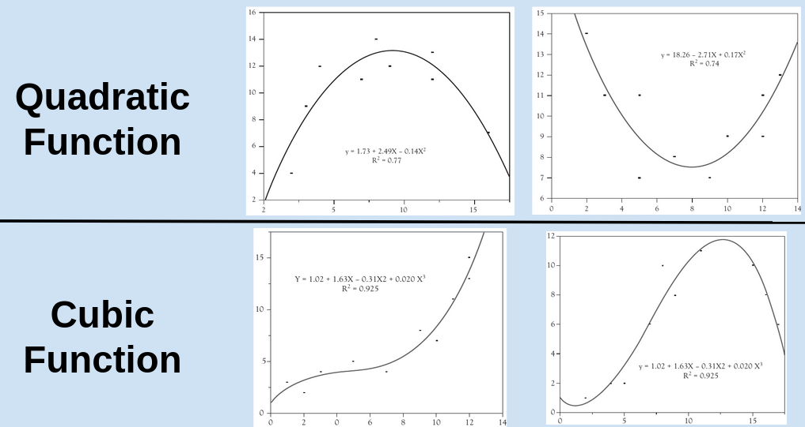

---
output:
  beamer_presentation:
    theme: "CambridgeUS"
    colortheme: "dolphin"
    fonttheme: "structurebold"
fontsize: 14pt
classoption: "aspectratio=169"
header-includes:
- \usepackage{caption}
- \captionsetup[figure]{labelformat=empty}
- \captionsetup[table]{labelformat=empty}
- \setbeamertemplate{page number in head/foot}[]{}
---

```{r, echo = FALSE, warning = FALSE, message = FALSE}
## Render the pdf
##rmarkdown::render(input = "./11_2-Transforming_the_Model.Rmd", output_file = "./11_2-Transforming_the_Model.pdf")

##fontsizes for tables: ‘"tiny"’, ‘"scriptsize"’, ‘"footnotesize"’, ‘"small"’, ‘"normalsize"’, ‘"large"’, ‘"Large"’, ‘"LARGE"’, ‘"huge"’, ‘"Huge"’

library(tidyverse)
library(readxl)
library(stargazer)
##library(kableExtra)
library(modelr)

knitr::opts_chunk$set(echo = FALSE,
                      eval = TRUE,
                      error = FALSE,
                      message = FALSE,
                      warning = FALSE,
                      comment = NA)

#################
## Could you replicate the models from Tuesday but add non-linear extensions?

## Dataset 1

## GDP on Bachelors
# res1a <- lm(data = d, gdp_billions ~ bachelors)
# res1b <- lm(data = d, gdp_billions ~ bachelors + I(bachelors^2))
# res1c <- lm(data = d, gdp_billions ~ bachelors + I(bachelors^2) + I(bachelors^3))
# stargazer(res1a, res1b, res1c, type = "text")
# 
# res2a <- lm(data = d, log_gdp ~ bachelors)
# res2b <- lm(data = d, log_gdp ~ bachelors + I(bachelors^2))
# res2c <- lm(data = d, log_gdp ~ bachelors + I(bachelors^2) + I(bachelors^3))
# stargazer(res2a, res2b, res2c, type = "text")
# 
# ## Dataset 2
# 
# ## Life expectancy on GDP
# d2 <- read_excel("../../Data/Dataset-2/Dataset2-2019_only.xlsx") %>%
#     mutate(
#         log_gdp = log(gdp_current),
#         gdp_billions = gdp_current/1e9
#     )
# 
# res5a <- lm(data = d2, life_expectancy ~ gdp_billions)
# res5b <- lm(data = d2, life_expectancy ~ gdp_billions + I(gdp_billions^2))
# res5c <- lm(data = d2, life_expectancy ~ gdp_billions + I(gdp_billions^2) + I(gdp_billions^3))
# stargazer(res5a, res5b, res5c, type = "text")
# 
# res6a <- lm(data = d2, life_expectancy ~ log_gdp)
# res6b <- lm(data = d2, life_expectancy ~ log_gdp + I(log_gdp^2))
# res6c <- lm(data = d2, life_expectancy ~ log_gdp + I(log_gdp^2) + I(log_gdp^3))
# stargazer(res6a, res6b, res6c, type = "text")
# 
# ## Visualize the log models
# ggplot(data = d2, aes(x = log_gdp, y = life_expectancy)) + 
#   geom_point() +
#   geom_smooth(method = "lm", se = FALSE, size = 1) +
#   theme_bw() +
#   labs(x = "GDP (log)", y = "Life Expectancy (years)", title = "Linear Model")
# 
# # Visualize quadratic
# quad1 <- data.frame(
#   life_expectancy = predict(res6b, newdata = data.frame(log_gdp = seq(16,31,.25))),
#   log_gdp = seq(16,31,.25)
#   )
# 
# ggplot(data = d2, aes(x = log_gdp, y = life_expectancy)) + 
#   geom_point() +
#   geom_smooth(method = "lm", se = FALSE, size = 1) +
#   theme_bw() +
#   geom_line(data = quad1, color = "red", size = 1.3) +
#   theme_bw() +
#   labs(x = "GDP (log)", y = "Life Expectancy (years)", title = "Quadratic Model")
# 
# # Visualize cubic
# cubic1 <- data.frame(
#   life_expectancy = predict(res6c, newdata = data.frame(log_gdp = seq(16,31,.25))),
#   log_gdp = seq(16,31,.25)
#   )
# 
# ggplot(data = d2, aes(x = log_gdp, y = life_expectancy)) + 
#   geom_point() +
#   geom_smooth(method = "lm", se = FALSE, size = 1) +
#   theme_bw() +
#   geom_line(data = cubic1, color = "red", size = 1.3) +
#   theme_bw() +
#   labs(x = "GDP (log)", y = "Life Expectancy (years)", title = "Cubic Model")

```


# Today's Agenda

\begin{large}

Extending the OLS Regression

\begin{enumerate}

\item Week 9: Dichotomous and categorical predictors
\item Tuesday: Transforming the variables
\item Today: Transforming the model

\end{enumerate}

\end{large}

\vspace{.25in}

\begin{center}
Justin Leinaweaver (Spring 2022)
\end{center}

```{r, include = FALSE}
## Input data
d <- read_excel("../../Data/Dataset-1/Dataset1-2020_Only.xlsx", na = "NA") %>%
  mutate(
    gdp_category = factor(gdp_category, levels = c("Under $100 billion", "Under $1 trillion", "Above $1 trillion")),
    pop_category = factor(pop_category, levels = c("Under 5 million", "Under 10 million", "Above 10 million")),
    manufacturing_category = factor(manufacturing_category, levels = c("Under 100k", "Under 300k", "Above 300k")),
    income_tax2 = if_else(income_tax == 1, "Income Tax", "No Income Tax"),
    log_gdp = log(gdp_millions*1e6),
    pop_millions = population_thousands / 1000,
    gdp_billions = gdp_millions/1000,
    log_pop = log(population_thousands * 1e3)
  )
```


# Transformation 2: Natural Logarithms
```{r, fig.align = 'center', fig.asp=0.5, out.width = '90%', fig.width = 7}
## Plot GDP vs Log GDP
d %>%
  pivot_longer(cols = c(gdp_billions, log_gdp), names_to = "Version", values_to = "Values") %>%
  mutate(
    Version = if_else(Version == "gdp_billions", "GDP (Billions USD)", "log of GDP (USD)")
  ) %>%
  ggplot(aes(x = Values)) +
  geom_histogram(bins = 15, fill = "darkgrey", color = "white") +
  theme_bw() +
  labs(x = "", y = "") +
  facet_wrap(~ Version, scales = "free", ncol = 2)
```


# Transformation 2: Natural Logarithms

```{r, fig.align = 'center', fig.asp=0.5, out.width = '90%', fig.width = 7}
## Plot GDP vs Log GDP (add mean line)
new1 <- tibble(
  Version = c("GDP (Billions USD)", "log of GDP (USD)"),
  Values = c(mean(d$gdp_billions), mean(d$log_gdp))
)

d %>%
  pivot_longer(cols = c(gdp_billions, log_gdp), names_to = "Version", values_to = "Values") %>%
  mutate(
    Version = if_else(Version == "gdp_billions", "GDP (Billions USD)", "log of GDP (USD)"),
    Mean = mean(Values)
  ) %>% 
  ggplot(aes(x = Values)) +
  geom_histogram(bins = 15, fill = "darkgrey", color = "white") +
  geom_vline(data = new1, aes(xintercept = Values), color = "red", size = 3) +
  theme_bw() +
  labs(x = "", y = "") +
  facet_wrap(~ Version, scales = "free", ncol = 2)
```


# 
```{r, fig.align = 'center', fig.asp=0.618, out.width = '100%', fig.width = 7}

```


# Transforming the Model

\begin{Large}
\textbf{Fit three separate OLS models to the data.}

\begin{enumerate}
\item A standard, simple OLS model

\item An OLS with a quadratic function

\item An OLS with a cubic function
\end{enumerate}

\end{Large}


# Do states with more manufacturing have larger economies?

\begin{Large}
\textbf{Regress GDP (billions) on Manufacturing as:}

\begin{enumerate}
\item A standard, simple OLS model

\item An OLS with a quadratic function

\item An OLS with a cubic function
\end{enumerate}
\end{Large}


# Do states with more manufacturing have larger economies?

\begin{large}

\textbf{Regress GDP (billions) on Manufacturing as:}

\begin{enumerate}
\item Manufacturing

\item Manufacturing + Manufacturing$^2$

\item Manufacturing + Manufacturing$^2$ + Manufacturing$^3$
\end{enumerate}
\end{large}


#

\begin{center}
```{r, results = "asis"}
res1a <- lm(data = d, gdp_billions ~ manufacturing_thousands)
res1b <- lm(data = d, gdp_billions ~ manufacturing_thousands + I(manufacturing_thousands^2))
res1c <- lm(data = d, gdp_billions ~ manufacturing_thousands + I(manufacturing_thousands^2) + I(manufacturing_thousands^3))

stargazer(res1a, res1b, res1c, digits = 2, dep.var.caption = "", star.cutoffs = .05, notes.append = FALSE, notes = "*p<0.05", omit.stat = "rsq", dep.var.labels = "GDP (billions)", covariate.labels = c("Manufacturing", "Squared", "Cubed"), header = FALSE, float = FALSE, font.size = "scriptsize")
```
\end{center}


# Make a Marginal Effects Plot
\center
```{r, results='asis'}
tibble(
  Manufacturing = seq(0, 1500, 300),
  Manufacturing2 = Manufacturing^2,
  Predicted = ""
) |>
  stargazer(summary = FALSE, type = "latex", header = FALSE, font.size = "normalsize", rownames = FALSE, float = FALSE)
```


# Make a Marginal Effects Plot
\center
```{r, results='asis'}
tibble(
  Manufacturing = seq(0, 1500, 300),
  Manufacturing2 = Manufacturing^2,
  Predicted = ""
) |>
  stargazer(summary = FALSE, type = "latex", header = FALSE, font.size = "normalsize", rownames = FALSE, float = FALSE)
```

GDP = 87 + 0.77(Manufacturing) + .001(Manufacturing^2)


#
```{r, fig.align = 'center', fig.asp=0.618, out.height = '90%', fig.width = 5}
# Visualize linear
ggplot(data = d, aes(x = manufacturing_thousands, y = gdp_billions)) + 
  geom_point() +
  geom_smooth(method = "lm", se = FALSE, size = 1) +
  theme_bw() +
    labs(x = "Manufacturing Employment (Thousands)", y = "GDP (Billions USD)", title = "Linear Model") +
    coord_cartesian(xlim = c(0, 1500))
```


#
```{r, fig.align = 'center', fig.asp=0.618, out.width = '90%', fig.width = 5}
# Visualize quadratic
quad1 <- data.frame(gdp_billions = predict(res1b, newdata = data.frame(manufacturing_thousands = seq(0,1500,1))), manufacturing_thousands = seq(0,1500,1))

ggplot(data = d, aes(x = manufacturing_thousands, y = gdp_billions)) + 
  geom_point() +
  geom_smooth(method = "lm", se = FALSE, size = .2) +
  geom_line(data = quad1, color = "red", size = 1.3) +
  theme_bw() +
  labs(x = "Manufacturing Employment (Thousands)", y = "GDP (Billions USD)", title = "Quadratic Model") +
    coord_cartesian(xlim = c(0, 1500))
```


# Does homeownership explain the size of the economy?

\begin{large}
\textbf{Regress GDP (billions) on Homeownership as:}

\begin{enumerate}
\item A standard, simple OLS model

\item An OLS with a quadratic function

\item An OLS with a cubic function
\end{enumerate}
\end{large}

#
\begin{center}
```{r, results = "asis"}
res3a <- lm(data = d, gdp_billions ~ homeowner_rate)
res3b <- lm(data = d, gdp_billions ~ homeowner_rate + I(homeowner_rate^2))
res3c <- lm(data = d, gdp_billions ~ homeowner_rate + I(homeowner_rate^2) + I(homeowner_rate^3))

stargazer(res3a, res3b, res3c, digits = 2, dep.var.caption = "", star.cutoffs = .05, notes.append = FALSE, notes = "*p<0.05", omit.stat = "rsq", dep.var.labels = "GDP (billions)", covariate.labels = c("Homeownership", "Squared", "Cubed"), header = FALSE, float = FALSE, font.size = "scriptsize")
```
\end{center}


# Make a Marginal Effects Plot
\center
```{r, results='asis'}
tibble(
  Homeownership = seq(50, 75, 5),
  Homeownership2 = "",
  Homeownership3 = "",
  Predicted = ""
) |>
  stargazer(summary = FALSE, type = "latex", header = FALSE, font.size = "normalsize", rownames = FALSE, float = FALSE)
```


# Make a Marginal Effects Plot
\center
```{r, results='asis'}
tibble(
  Homeownership = seq(50, 75, 5),
  Homeownership2 = Homeownership^2,
  Homeownership3 = Homeownership^3,
  Predicted = ""
) |>
  stargazer(summary = FALSE, type = "latex", header = FALSE, font.size = "normalsize", rownames = FALSE, float = FALSE)
```


#
```{r, fig.align = 'center', fig.asp=0.618, out.height = '90%', fig.width = 5}
# Visualize linear
ggplot(data = d, aes(x = homeowner_rate, y = gdp_billions)) + 
  geom_point() +
  geom_smooth(method = "lm", se = FALSE, size = 1) +
  theme_bw() +
    labs(x = "Homeownership", y = "GDP (Billions USD)", title = "Linear Model")
```

#
```{r, fig.align = 'center', fig.asp=0.618, out.width = '90%', fig.width = 5}
# Visualize quadratic
quad1 <- data.frame(gdp_billions = predict(res3b, newdata = data.frame(homeowner_rate = seq(50,80,1))), homeowner_rate = seq(50,80,1))

ggplot(data = d, aes(x = homeowner_rate, y = gdp_billions)) + 
  geom_point() +
  geom_smooth(method = "lm", se = FALSE, size = .2) +
  geom_line(data = quad1, color = "red", size = 1.3) +
  theme_bw() +
  labs(x = "Homeownership", y = "GDP (Billions USD)", title = "Quadratic Model")
```

#
```{r, fig.align = 'center', fig.asp=0.618, out.width = '90%', fig.width = 5}
# Visualize cubic
cubic1 <- data.frame(gdp_billions = predict(res3c, newdata = data.frame(homeowner_rate = seq(50,80,1))), homeowner_rate = seq(50,80,1))

ggplot(data = d, aes(x = homeowner_rate, y = gdp_billions)) + 
  geom_point() +
  geom_smooth(method = "lm", se = FALSE, size = .2) +
  geom_line(data = quad1, color = "red", size = .5) +
  geom_line(data = cubic1, color = "green", size = 1) +
  theme_bw() +
  labs(x = "Homeownership", y = "GDP (Billions USD)", title = "Cubic Model")
```


# Put it All Together! Does unemployment explain the size of the economy?

\begin{Large}
\textbf{Regress GDP (log) on Unemployment as:}

\begin{enumerate}
\item A standard, simple OLS model

\item An OLS with a quadratic function

\item An OLS with a cubic function
\end{enumerate}
\end{Large}


#
\begin{center}
```{r, results = "asis"}
## Check a log transformation
res2a <- lm(data = d, log_gdp ~ unemployment)
res2b <- lm(data = d, log_gdp ~ unemployment + I(unemployment^2))
res2c <- lm(data = d, log_gdp ~ unemployment + I(unemployment^2) + I(unemployment^3))

stargazer(res2a, res2b, res2c, digits = 2, dep.var.caption = "", star.cutoffs = .05, notes.append = FALSE, notes = "*p<0.05", omit.stat = "rsq", dep.var.labels = "GDP (log)", covariate.labels = c("Unemployment", "Squared", "Cubed"), header = FALSE, float = FALSE, font.size = "scriptsize")
```
\end{center}

#
```{r, fig.align = 'center', fig.asp=0.618, out.height = '90%', fig.width = 5}
# Visualize linear
ggplot(data = d, aes(x = unemployment, y = log_gdp)) + 
  geom_point() +
  geom_smooth(method = "lm", se = FALSE, size = 1) +
  theme_bw() +
    labs(x = "Unemployment Rate", y = "GDP (log)", title = "Linear Model")
```

#
```{r, fig.align = 'center', fig.asp=0.618, out.width = '90%', fig.width = 5}
# Visualize quadratic
quad1 <- data.frame(log_gdp = predict(res2b, newdata = data.frame(unemployment = seq(4,14,1))), unemployment = seq(4,14,1))

ggplot(data = d, aes(x = unemployment, y = log_gdp)) + 
  geom_point() +
  geom_smooth(method = "lm", se = FALSE, size = .2) +
  geom_line(data = quad1, color = "red", size = 1.3) +
  theme_bw() +
  labs(x = "Unemployment Rate", y = "GDP (log)", title = "Quadratic Model")
```

#
```{r, fig.align = 'center', fig.asp=0.618, out.width = '90%', fig.width = 5}
# Visualize cubic
cubic1 <- data.frame(log_gdp = predict(res2c, newdata = data.frame(unemployment = seq(4,14,1))), unemployment = seq(4,14,1))

ggplot(data = d, aes(x = unemployment, y = log_gdp)) + 
  geom_point() +
  geom_smooth(method = "lm", se = FALSE, size = .2) +
  geom_line(data = quad1, color = "red", size = .5) +
  geom_line(data = cubic1, color = "green", size = 1) +
  theme_bw() +
  labs(x = "Unemployment Rate", y = "GDP (log)", title = "Cubic Model")
```


# 
```{r, fig.align = 'center', fig.asp=0.618, out.width = '100%', fig.width = 7}

```
