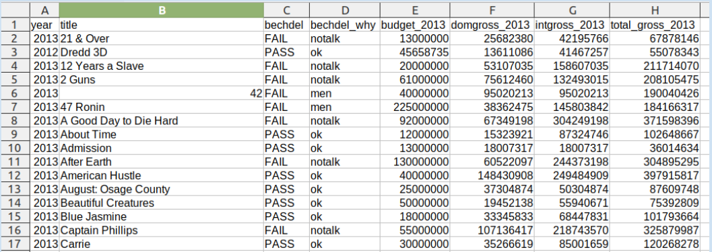
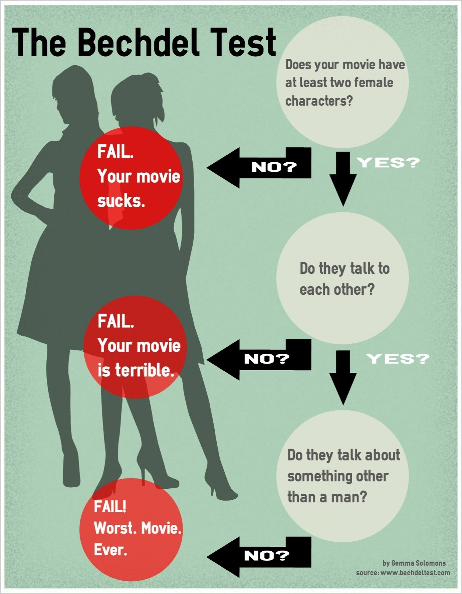

---
output:
  beamer_presentation:
    theme: "CambridgeUS"
    colortheme: "dolphin"
    fonttheme: "structurebold"
fontsize: 14pt
classoption: "aspectratio=169"
header-includes:
- \usepackage{caption}
- \captionsetup[figure]{labelformat=empty}
- \captionsetup[table]{labelformat=empty}
- \setbeamertemplate{page number in head/foot}[]{}
---

```{r, echo = FALSE, warning = FALSE, message = FALSE}
## Render the pdf
##rmarkdown::render(input = "./12_1-Practice_Extending_OLS.Rmd", output_file = "./12_1-Practice_Extending_OLS.pdf")

##fontsizes for tables: ‘"tiny"’, ‘"scriptsize"’, ‘"footnotesize"’, ‘"small"’, ‘"normalsize"’, ‘"large"’, ‘"Large"’, ‘"LARGE"’, ‘"huge"’, ‘"Huge"’

library(tidyverse)
library(readxl)
library(stargazer)
##library(kableExtra)
library(modelr)

knitr::opts_chunk$set(echo = FALSE,
                      eval = TRUE,
                      error = FALSE,
                      message = FALSE,
                      warning = FALSE,
                      comment = NA)

#############################################################
## Stargazer code

## Regular Table
##stargazer(summary = FALSE, type = "latex", header = FALSE, rownames = FALSE, float = FALSE)

## Regression Results
##stargazer(res1, type = "latex", digits = 2, omit.stat = "rsq", header = FALSE, font.size = "footnotesize", star.cutoffs = .05, notes = "*p < 0.05", notes.append = FALSE, dep.var.caption = "", float = FALSE)

##covariate.labels = c("Mother's Education")
##dep.var.labels = "Earnings (2021)"

#############################################################
## Figures

## ```{r, fig.align = 'center', fig.asp=0.618, out.width = '100%', fig.width = 7}

##knitr::include_graphics()

#############################################################
## Side-by-side columns

## ::: columns
## :::: column
## Content in left column
## ::::
## :::: column
## Content in right column
## ::::
## :::

## Build bullets one-by-one
##\begin{enumerate}[<+->]

```


# Today's Agenda
\begin{large}

Practice extending the OLS Regression

\begin{enumerate}

\item Dummy predictors
\item Categorical predictors
\item Transforming the variables
\item Transforming the model

\end{enumerate}

\end{large}

\vspace{.25in}

\begin{center}
Justin Leinaweaver (Spring 2022)
\end{center}

```{r, include=FALSE}
## Input data
d <- read_excel("../../Data/Bechdel-538/FiveThirtyEight-Bechdel_Test_Data.xlsx", na = "NA")

## Mutate
d2 <- d %>%
  mutate(
    domgross_2013_millions = domgross_2013/1e6,
    intgross_2013_millions = intgross_2013/1e6,
    total_gross_2013_millions = total_gross_2013/1e6,
    budget_2013_millions = budget_2013/1e6,
    bechdel_why = factor(bechdel_why, levels = c("ok", "nowomen", "notalk", "men")),
    budget_2013_millions2 = budget_2013_millions^2,
    bechdel_pass = if_else(bechdel == "PASS", 1, 0),
    nowomen = if_else(bechdel_why == "nowomen", 1, 0),
    notalk = if_else(bechdel_why == "notalk", 1, 0),
    men = if_else(bechdel_why == "men", 1, 0)
  )
```


# 
\begin{center}
\textbf{Hickey, W. (2014, Apr 1). The Dollar-And-Cents Case Against Hollywood’s Exclusion of Women. FiveThirtyEight.}
\end{center}

```{r, fig.align = 'center', fig.asp=0.618, out.width = '100%', fig.width = 7}

```


# 
\begin{columns}
\begin{column}{.6\textwidth}
\vspace{.5in}
\begin{Large}
\begin{center}
\textbf{The Bechdel Test: Sexism at the Movies}
\end{center}
\end{Large}

\end{column}

\begin{column}{.4\textwidth}
```{r, fig.align = 'center', out.height = '90%'}

```
\end{column}
\end{columns}


# 
::: columns
:::: column
\begin{Large}
\begin{center}
\textbf{The Bechdel Test: Sexism at the Movies}

\vspace{.75in}

What proportion of movies in this dataset pass the Bechdel test?

\end{center}
\end{Large}

```{r, eval=FALSE}
d2 |>
  arrange(desc(total_gross_2013)) |>
  #slice(1:10) |>
  count(bechdel, name = "count") |>
  mutate(
    prop = count/sum(count)
  )
```

::::
:::: column
```{r, fig.align = 'center', out.height = '90%'}

```
::::
:::


# 
::: columns
:::: column
\begin{Large}
\begin{center}
\textbf{The Bechdel Test: Sexism at the Movies}

\vspace{.75in}

What proportion of the top 10 movies pass the Bechdel test?

\end{center}
\end{Large}

```{r, eval=FALSE}
d2 |>
  arrange(desc(total_gross_2013)) |>
  slice(1:10) |>
  count(bechdel, name = "count") |>
  mutate(
    prop = count/sum(count)
  )
```

::::
:::: column
```{r, fig.align = 'center', out.height = '90%'}

```
::::
:::


# 
::: columns
:::: column
\begin{Large}
\begin{center}
\textbf{The Bechdel Test: Sexism at the Movies}

\vspace{.75in}

Any better in the top 20? 50? Or 100?

\end{center}
\end{Large}

```{r, eval=FALSE}
d2 |>
  arrange(desc(total_gross_2013)) |>
  slice(1:20) |>
  count(bechdel, name = "count") |>
  mutate(
    prop = count/sum(count)
  )

d2 |>
  arrange(desc(total_gross_2013)) |>
  slice(1:50) |>
  count(bechdel, name = "count") |>
  mutate(
    prop = count/sum(count)
  )

d2 |>
  arrange(desc(total_gross_2013)) |>
  slice(1:100) |>
  count(bechdel, name = "count") |>
  mutate(
    prop = count/sum(count)
  )
```

::::
:::: column
```{r, fig.align = 'center', out.height = '90%'}

```
::::
:::


# 
\begin{Large}
\begin{center}
\textbf{Do sexist movies (Bechdel = Fail) make more money at the box office?}
\end{center}

\vspace{.5in}

\begin{itemize}
\item Regress total\_gross\_2013 on bechdel
\end{itemize}

\end{Large}


# 
\begin{Large}
\begin{center}
\textbf{Do sexist movies (Bechdel = Fail) make more money at the box office?}
\end{center}

\vspace{.5in}

\begin{enumerate}
\item Create a new dummy variable: bechdel\_pass

\item Rescale box office into millions of USD

\item Regress total\_gross\_2013 on bechdel\_pass
\end{enumerate}

\end{Large}


# 
\begin{center}
```{r, results = "asis"}
##########
## Exercise 1
res1 <- d2 %>% lm(data = ., total_gross_2013_millions ~ bechdel_pass)

stargazer(res1, digits = 2, omit.stat = "rsq", star.cutoffs = .05, notes = "*p<0.05", notes.append = FALSE, dep.var.caption = "", dep.var.labels = c("Box Office (millions)"), header = FALSE, float = FALSE, font.size = "small")
```
\end{center}


# 
\begin{large}
\begin{center}
\textbf{Is the international market more sexist then the domestic market?}
\end{center}

\vspace{.5in}

Fit and evaluate the following two models:

\begin{itemize}
\item Model 1: Regress domgross\_2013 on bechdel\_pass
\item Model 2: Regress intgross\_2013 on bechdel\_pass
\end{itemize}

\end{large}


# 
\begin{center}
```{r, results = "asis"}
##########
## Exercise 2
res2 <- d2 %>% lm(data = ., domgross_2013_millions ~ bechdel_pass)
res3 <- d2 %>% lm(data = ., intgross_2013_millions ~ bechdel_pass)

stargazer(res1, res2, res3, digits = 2, omit.stat = "rsq", star.cutoffs = .05, notes = "*p<0.05", notes.append = FALSE, dep.var.caption = "", dep.var.labels = c("Box Office (millions)", "Domestic", "International"), header = FALSE, float = FALSE, font.size = "footnotesize")
```
\end{center}


# 
\begin{large}

\begin{center}
\textbf{What kinds of sexism make the most money at the box office?}
\end{center}

\vspace{.25in}

\textbf{bechdel\_why}

\begin{enumerate}
\item nowomen = Fewer than two women
\item notalk = Women don't talk to each other
\item men = Women only talk about men
\item ok = Passes the test
\end{enumerate}

\end{large}


# 
\begin{large}

\begin{center}
\textbf{What kinds of sexism make the most money at the box office?}
\end{center}

\vspace{.25in}

\begin{enumerate}
\item Convert bechdel\_why to three dummies: nowomen, notalk and men (Baseline = "ok")

\item Regress total\_gross\_2013 on bechdel\_why dummies
\end{enumerate}

\end{large}


# 
\begin{center}
```{r, results = "asis"}
##########
## Exercise 3
res4 <- d2 %>% lm(data = ., total_gross_2013_millions ~ nowomen + notalk + men)

stargazer(res4, digits = 2, omit.stat = "rsq", star.cutoffs = .05, notes = "*p<0.05", notes.append = FALSE, dep.var.caption = "", dep.var.labels = c("Box Office (millions)"), header = FALSE, float = FALSE, font.size = "footnotesize")
```
\end{center}


# 
\begin{large}

\begin{center}
\textbf{Is box office about sexism or budget size?}
\end{center}
\end{large}

```{r, fig.align = 'center', fig.asp=0.618, out.height = '55%', fig.width = 5}
d2 %>%
    ggplot(aes(x = budget_2013_millions, y = total_gross_2013_millions)) +
    geom_point() +
    #geom_smooth(method = "lm", se = FALSE) +
    theme_bw() +
    labs(x = "Budget (2013 millions)", y = "Total Box Office (2013 millions)")
```
\begin{enumerate}
\item Rescale budget into millions of USD
\item Regress total\_gross\_2013 on bechdel\_pass and budget\_2013
\end{enumerate}


# 
\begin{center}
```{r, results = "asis"}
##########
## Exercise 3
res5 <- d2 %>% lm(data = ., total_gross_2013_millions ~ bechdel_pass + budget_2013_millions)

stargazer(res1, res5, digits = 2, omit.stat = "rsq", star.cutoffs = .05, notes = "*p<0.05", notes.append = FALSE, dep.var.caption = "", dep.var.labels = c("Box Office (millions)"), header = FALSE, float = FALSE, font.size = "footnotesize")
```
\end{center}


#
```{r, fig.align = 'center', fig.asp=0.618, out.height = '95%', fig.width = 5}
library(modelr)

tibble(
  budget_2013_millions = c(seq(0, 450, 10), seq(0, 450, 10)),
  bechdel_pass = c(rep(1, 46), rep(0, 46)),
  Bechdel = c(rep("Pass", 46), rep("Fail", 46))
) |>
  add_predictions(res5) |>
  ggplot(aes(x = budget_2013_millions, y = pred, color = Bechdel)) +
  #geom_point() +
  geom_line() +
  theme_bw() +
  labs(x = "Budget (2013 millions)", y = "Total Box Office (2013 millions)", color = "") +
  scale_color_manual(values = c("red", "blue")) +
  theme(legend.position = c(.8, .2))
```


# 
\begin{large}

\begin{center}
\textbf{Is box office about sexism or budget size?}
\end{center}
\end{large}

```{r, fig.align = 'center', fig.asp=0.618, out.height = '60%', fig.width = 5}
d2 %>%
    ggplot(aes(x = budget_2013_millions, y = total_gross_2013_millions)) +
    geom_point() +
    geom_smooth(method = "lm", se = FALSE) +
    theme_bw() +
    labs(x = "Budget (2013 millions)", y = "Total Box Office (2013 millions)")
```
\begin{itemize}
\item Redo the last model but include a quadratic function of budget\_2013\_millions
\end{itemize}


# 
\begin{center}
```{r, results = "asis"}
##########
res6 <- d2 %>% lm(data = ., total_gross_2013_millions ~ bechdel_pass + budget_2013_millions + budget_2013_millions2)

stargazer(res5, res6, digits = 2, omit.stat = "rsq", star.cutoffs = .05, notes = "*p<0.05", notes.append = FALSE, dep.var.caption = "", dep.var.labels = c("Box Office (millions)"), header = FALSE, float = FALSE, font.size = "scriptsize")
```
\end{center}


# 
```{r, fig.align = 'center', fig.asp=0.618, out.height = '95%', fig.width = 6.5}
# Visualize
new1 <- tibble(
  budget_2013_millions = seq(0, 462, 1),
  budget_2013_millions2 = budget_2013_millions^2,
  bechdel_pass = 1
) %>%
  add_predictions(res5, var = "Linear") %>%
  add_predictions(res6, var = "Quadratic")

## d2 %>%
##   filter(total_gross_2013_millions > 3700) %>%
##   select(title, budget_2013_millions, total_gross_2013_millions)

new1 %>%
  pivot_longer(cols = Linear:Quadratic, names_to = "Model", values_to = "Values") %>%
  ggplot(aes(x = budget_2013_millions)) +
  geom_point(data = d2, aes(x = budget_2013_millions, y = total_gross_2013_millions), alpha = .5) +
  geom_line(aes(y = Values, color = Model), size = 1.2) +
  annotate("text", x = 461, y = 4200, label = "Avatar") +
  annotate("text", x = 290, y = 4400, label = "Titanic") +
  theme_minimal() +
  labs(x = "Budget (millions 2013 USD)", y = "Box Office (millions 2013 USD)")
```
