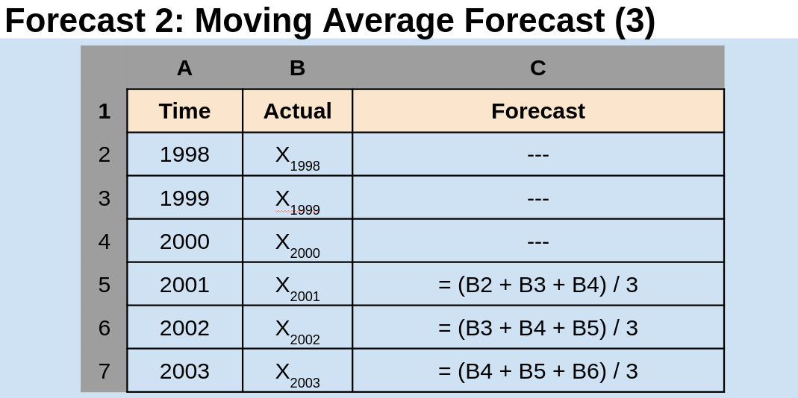

---
output:
  beamer_presentation:
    theme: "CambridgeUS"
    colortheme: "dolphin"
    fonttheme: "structurebold"
fontsize: 14pt
classoption: "aspectratio=169"
header-includes:
- \usepackage{caption}
- \captionsetup[figure]{labelformat=empty}
- \captionsetup[table]{labelformat=empty}
---

```{r, echo = FALSE, warning = FALSE, message = FALSE}
## Render the pdf
##rmarkdown::render(input = "./12_2-Forecasting_No_Trends.Rmd", output_file = "./12_2-Forecasting_No_Trends.pdf")

##fontsizes for tables: ‘"tiny"’, ‘"scriptsize"’, ‘"footnotesize"’, ‘"small"’, ‘"normalsize"’, ‘"large"’, ‘"Large"’, ‘"LARGE"’, ‘"huge"’, ‘"Huge"’

library(tidyverse)
library(readxl)
library(stargazer)
##library(kableExtra)
library(modelr)

knitr::opts_chunk$set(echo = FALSE,
                      eval = TRUE,
                      error = FALSE,
                      message = FALSE,
                      warning = FALSE,
                      comment = NA)

#############################################################
## Stargazer code

## Regular Table
##stargazer(summary = FALSE, type = "latex", header = FALSE, rownames = FALSE, float = FALSE)

## Regression Results
##stargazer(res1, type = "latex", digits = 2, omit.stat = "rsq", header = FALSE, font.size = "footnotesize", star.cutoffs = .05, notes = "*p < 0.05", notes.append = FALSE, dep.var.caption = "", float = FALSE)

##covariate.labels = c("Mother's Education")
##dep.var.labels = "Earnings (2021)"

#############################################################
## Figures

## ```{r, fig.align = 'center', fig.asp=0.618, out.height = '90%', fig.width = 5}

##knitr::include_graphics()

#############################################################
## Side-by-side columns

## ::: columns
## :::: column
## Content in left column
## ::::
## :::: column
## Content in right column
## ::::
## :::

## Build bullets one-by-one
##\begin{enumerate}[<+->]

```


# Today's Agenda

\begin{large}

1. Review the components of time series data

2. Evaluate four forecasting tools:

\begin{itemize}
\item Na{\"i}ve
\item Moving Average
\item Weighted Moving Average
\item Exponential Smoothing
\end{itemize}
\end{large}

\vspace{.5in}

\begin{center}
Justin Leinaweaver (Spring 2022)
\end{center}


# 
::: columns
:::: column
```{r, fig.align = 'center', out.height = '90%'}
knitr::include_graphics("./Images/12_2-Four_types_trend.png")
```
::::
:::: column

\vspace{2.7in}

\begin{small}
\hfill The Components of Time Series Data
\hfill (Render, Stair, Jr., Hanna and Hale 2018)
\end{small}
::::
:::


# 
```{r, fig.align = 'center', fig.asp=0.55, out.height = '95%', fig.width = 6}
library(lubridate)

# Input data
d <- read_excel("../../Data/Dataset-5-Advanced_Retail_Sales/Data5-Advanced_Retail_Sales_vSP22.xlsx") %>%
  mutate(
    date = ymd(date)
  )

d %>%
  ggplot(aes(x = date, y = advance_retail_sales)) +
  geom_line() +
  theme_minimal() +
  labs(x = "", y = "Billions USD", title = "Advance Retail Sales",
       caption = "Source: U.S. Census Bureau")
```


# 
```{r, fig.align = 'center', fig.asp=0.9, out.height = '100%', fig.width = 6}
library(forecast)
x1 <- ts(d$advance_retail_sales, start = 2015, frequency = 12)
plot(decompose(x1))
```


# 
::: columns
:::: column
```{r, fig.align = 'center', fig.asp=0.9, out.height = '80%', fig.width = 6}
plot(decompose(x1)$random, xlab = "", ylab = "", main = "Random Variation")
```
::::
:::: column

\vspace{1in}

\textbf{Random Variation Models}

\begin{enumerate}
\item Na{\"i}ve Forecast
\item Moving Average
\item Weighted Moving Average
\item Exponential Smoothing
\end{enumerate}

::::
:::


#
```{r, fig.align = 'center', fig.asp=0.55, out.height = '100%', fig.width = 6}
# Exploring GDP Rate of change in Missouri
d <- read_excel("../../Data/Dataset-1/Dataset1-All_Years.xlsx") %>% 
  filter(abbrev == "MO") %>%
  select(State, year, GDP_Rate = gdp_rate)

## ts1 <- ts(d$GDP_Rate, frequency = 1, start = 1997)
## plot(decompose(ts1))

# Visualize current data 750x400
d %>%
  ggplot(aes(x = year, y = GDP_Rate)) +
  geom_line() +
  theme_minimal() +
  labs(x = "", y = "", title = "Rate of Change in GDP (Missouri)") +
  scale_x_continuous(breaks = seq(1997, 2020, 3)) +
  scale_y_continuous(labels = scales::percent_format(accuracy = 1))
```


# Forecast 1: Naive Forecast

\begin{LARGE}

Set forecast to the last observation

\begin{itemize}

\item Forecast$_{time+1}$ = Actual$_{time}$

\end{itemize}

\end{LARGE}


# Forecast 1: Naive Forecast
```{r, fig.align = 'center', out.height = '80%'}

```


# 
```{r, fig.align = 'center', fig.asp=0.55, out.height = '100%', fig.width = 6}
## Calculate naive forecast and mse
d2 <- d %>%
  add_row(State = "Missouri", year = 2021, GDP_Rate = NA) %>% 
  mutate(
    Naive = lag(GDP_Rate, n = 1),
    error = (GDP_Rate - Naive),
    error2 = error^2
  )

## Save the MSE and predictions
results1 <- c("Naive Forecast", round(mean(d2$error2, na.rm = TRUE), 5), str_c(round(tail(d2$Naive, n=1), 2)*100, '%'))

## Visualize
d2 %>%
  pivot_longer(cols = c(GDP_Rate, Naive), names_to = "Variables", values_to = "Values") %>%
  ggplot(aes(x = year, y = Values, color = Variables)) +
  geom_line(size = 1.3) +
  theme_minimal() +
  labs(x = "", y = "", title = "Rate of Change in GDP (Missouri)", color = "") +
  scale_x_continuous(breaks = seq(1998, 2021, 2)) +
  scale_y_continuous(labels = scales::percent_format(accuracy = 1), limits = c(-.03,.06)) +
  scale_color_manual(values = c("black", "orange")) +
  theme(axis.text.x = element_text(angle = 55)) +
  annotate("text", x = 2000, y = -.01, label = str_c("Forecast: ", round(tail(d2$Naive, n=1), 3)*100, '%'), size = 4.5)
```


# Forecast Accuracy: Mean Squared Error (MSE)
\begin{enumerate}
\item Calculate the forecast error

\begin{itemize}
\item Forecast Error = Actual Value - Forecast Value
\end{itemize}

\item Square each forecast error

\item Calculate the mean of the squared errors
\end{enumerate}

\begin{LARGE}
\begin{center}
MSE = $\frac{\Sigma (Error)^2}{n}$
\end{center}
\end{LARGE}


# 
\begin{Large}
\begin{center}
MSE = $\frac{\Sigma (Error)^2}{n}$
\end{center}
\end{Large}

```{r, fig.align = 'center', out.height = '50%'}
knitr::include_graphics("./Images/12_2-mse-table.png")
```
\begin{Large}
\begin{center}
MSE = AVERAGE(D3:D4)
\end{center}
\end{Large}


# 
```{r, fig.align = 'center', fig.asp=0.55, out.height = '100%', fig.width = 6}
# Calculate naive forecast and mse
d2 %>%
  pivot_longer(cols = c(GDP_Rate, Naive), names_to = "Variables", values_to = "Values") %>%
  ggplot(aes(x = year, y = Values, color = Variables)) +
  geom_line(size = 1.3) +
  theme_minimal() +
  labs(x = "", y = "", title = "Rate of Change in GDP (Missouri)", color = "") +
  scale_x_continuous(breaks = seq(1998, 2021, 2)) +
  scale_y_continuous(labels = scales::percent_format(accuracy = 1), limits = c(-.03,.06)) +
  scale_color_manual(values = c("black", "orange")) +
  theme(axis.text.x = element_text(angle = 55)) +
  annotate("text", x = 2000, y = -.01, label = str_c("Forecast: ", round(tail(d2$Naive, n=1), 3)*100, '%'), size = 4.5) +
    annotate("text", x = 2000, y = -.02, label = str_c("MSE: ", round(mean(d2$error2, na.rm = TRUE), 5)), size = 4.5)
```


#
```{r, fig.align = 'center', out.height = '100%'}

```


#
```{r, fig.align = 'center', out.height = '100%'}

```


# 
```{r, fig.align = 'center', fig.asp=0.55, out.height = '100%', fig.width = 6}
# Calculate MA3 forecast and mse
d2 <- d %>%
  add_row(State = "Missouri", year = 2021, GDP_Rate = NA) %>% 
  mutate(
    MA3 = (lag(GDP_Rate, n = 1) + lag(GDP_Rate, n = 2) + lag(GDP_Rate, n = 3)) / 3,
    error = (GDP_Rate - MA3),
    error2 = error^2
  )

## Save the MSE and predictions
results2 <- c("MA-3", round(mean(d2$error2, na.rm = TRUE), 5), str_c(round(tail(d2$MA3, n=1), 2)*100, '%'))

#formatC(mean(d2$error2, na.rm = T), format = "e")

# 850x400
d2 %>%
  pivot_longer(cols = c(GDP_Rate, MA3), names_to = "Variables", values_to = "Values") %>%
  ggplot(aes(x = year, y = Values, color = Variables)) +
  geom_line(size = 1.3) +
  theme_minimal() +
  labs(x = "", y = "", title = "Rate of Change in GDP (Missouri)", color = "") +
  scale_x_continuous(breaks = seq(1997, 2021, 2)) +
  scale_y_continuous(labels = scales::percent_format(accuracy = 1), limits = c(-.025,.07)) +
  scale_color_manual(values = c("black", "red")) +
  theme(axis.text.x = element_text(angle = 55)) +
  annotate("text", x = 2000, y = -.01, label = str_c("Forecast: ", round(tail(d2$MA3, n=1), 3)*100, '%'), size = 4.5) +
  annotate("text", x = 2000, y = -.02, label = str_c("MSE: ", round(mean(d2$error2, na.rm = TRUE), 5)), size = 4.5)
```

# Forecast 3: Weighted Moving Average Forecast

\begin{center}
\begin{Large}
$F_{t+1} = \frac{\Sigma (\text{Weight in period i})(\text{Actual value in period i})}{\Sigma (\text{Weights})}$
\end{Large}
\end{center}


# Forecast 3: Weighted Moving Average Forecast

\begin{center}
\begin{Large}

$F_{t+1} = \frac{\Sigma (\text{Weight in period i})(\text{Actual value in period i})}{\Sigma (\text{Weights})}$

\vspace{.4in}

Forecast$_t$ = $\frac{(\text{Actual}_{t-1} \text{ x 3 + Actual}_{t-2} \text{ x 2 + Actual}_{t-3}\text{ x 1})}{6}$

\end{Large}
\end{center}


#
```{r, fig.align = 'center', out.height = '100%'}

```


#
```{r, fig.align = 'center', fig.asp=0.55, out.height = '100%', fig.width = 6}
# Calculate Weighted MA3 forecast and mse
d2 <- d %>%
  add_row(State = "Missouri", year = 2021, GDP_Rate = NA) %>% 
  mutate(
    Weighted_MA3 = (lag(GDP_Rate, n = 1) * 3 + lag(GDP_Rate, n = 2) * 2 + lag(GDP_Rate, n = 3)) / 6,
    error = (GDP_Rate - Weighted_MA3),
    error2 = error^2
  )

## Save the MSE and predictions
results3 <- c("Weighted MA-3", round(mean(d2$error2, na.rm = TRUE), 5), str_c(round(tail(d2$Weighted_MA3, n=1), 2)*100, '%'))

## Visualize
d2 %>%
  pivot_longer(cols = c(GDP_Rate, Weighted_MA3), names_to = "Variables", values_to = "Values") %>%
  ggplot(aes(x = year, y = Values, color = Variables)) +
  geom_line(size = 1.3) +
  theme_minimal() +
  labs(x = "", y = "", title = "Rate of Change in GDP (Missouri)", color = "") +
  scale_x_continuous(breaks = seq(1997, 2021, 2)) +
  scale_y_continuous(labels = scales::percent_format(accuracy = 1), limits = c(-.025,.07)) +
  scale_color_manual(values = c("black", "darkgreen")) +
  theme(axis.text.x = element_text(angle = 55)) +
  annotate("text", x = 2000, y = -.01, label = str_c("Forecast: ", round(tail(d2$Weighted_MA3, n=1), 3)*100, '%'), size = 4.5) +
  annotate("text", x = 2000, y = -.02, label = str_c("MSE: ", round(mean(d2$error2, na.rm = TRUE), 5)), size = 4.5)
```


#
```{r, fig.align = 'center', out.height = '100%'}

```

#
```{r, fig.align = 'center', out.height = '100%'}

```


#
```{r, fig.align = 'center', out.height = '100%'}

```


#
```{r, fig.align = 'center', fig.asp=0.55, out.height = '100%', fig.width = 6}
# Calculate exponential smoothing (.2) forecast and mse
d2 <- d %>%
  add_row(State = "Missouri", year = 2021, GDP_Rate = NA)

d2$Exp_smoothing20 <- c(NA, .0399, rep(NA, 23))

for (i in 3:25) {
  
  d2$Exp_smoothing20[i] <- d2$Exp_smoothing20[i-1] + .2*(d2$GDP_Rate[i-1] - d2$Exp_smoothing20[i-1])
  
}

d3 <- d2 %>%
  mutate(
    error = (GDP_Rate - Exp_smoothing20),
    error2 = error^2
  )

## Save the MSE and predictions
results4 <- c("Exp Smoothing (.2)", round(mean(d3$error2, na.rm = TRUE), 5), str_c(round(tail(d2$Exp_smoothing20, n=1), 2)*100, '%'))

## Visualize
d3 %>%
  pivot_longer(cols = c(GDP_Rate, Exp_smoothing20), names_to = "Variables", values_to = "Values") %>%
  ggplot(aes(x = year, y = Values, color = Variables)) +
  geom_line(size = 1.3) +
  theme_minimal() +
  labs(x = "", y = "", title = "Rate of Change in GDP (Missouri)", color = "") +
  scale_x_continuous(breaks = seq(1997, 2019, 2)) +
  scale_y_continuous(labels = scales::percent_format(accuracy = 1), limits = c(-.025,.07)) +
  scale_color_manual(values = c("purple", "black")) +
  theme(axis.text.x = element_text(angle = 55)) +
  annotate("text", x = 2000, y = -.01, label = str_c("Forecast: ", round(tail(d2$Exp_smoothing20, n=1), 3)*100, '%'), size = 4.5) +
  annotate("text", x = 2000, y = -.02, label = str_c("MSE: ", round(mean(d3$error2, na.rm = TRUE), 5)), size = 4.5)
```


#
```{r, fig.align = 'center', fig.asp=0.55, out.height = '100%', fig.width = 6}
# All predictions
# Calculate forecasts
d10 <- d %>%
  add_row(State = "Missouri", year = 2021, GDP_Rate = NA) %>% 
  mutate(
    Naive = lag(GDP_Rate, n = 1),
    MA3 = (lag(GDP_Rate, n = 1) + lag(GDP_Rate, n = 2) + lag(GDP_Rate, n = 3)) / 3,
    Weighted_MA3 = (lag(GDP_Rate, n = 1) * 3 + lag(GDP_Rate, n = 2) * 2 + lag(GDP_Rate, n = 3)) / 6
  )

d10$Exp_smoothing20 <- c(NA, .0399, rep(NA, 23))

for (i in 3:25) {
  d10$Exp_smoothing20[i] <- d10$Exp_smoothing20[i-1] + .2*(d10$GDP_Rate[i-1] - d10$Exp_smoothing20[i-1])
}

d10 %>%
  pivot_longer(cols = Naive:Exp_smoothing20, names_to = "Variables", values_to = "Values") %>%
  ggplot(aes(x = year)) +
  geom_line(aes(y = GDP_Rate)) +
  geom_line(aes(y = Values, color = Variables), size = 1.3) +
  theme_minimal() +
  facet_wrap(~ Variables) +
  scale_y_continuous(labels = scales::percent_format(), limits = c(-.025,.07)) +
  labs(x = "", y = "GDP (Rate)") +
  guides(color = FALSE) +
  scale_x_continuous(breaks = seq(1997, 2021, 3)) +
  theme(axis.text.x = element_text(angle = 55))
```


#
\begin{center}

```{r, results = "asis"}
rbind(results1, results2, results3, results4) %>%
    as_tibble() %>%
    rename("Forecast Tool" = V1, "MSE" = V2, "Prediction" = V3) %>%
    stargazer(summary = FALSE, header = FALSE, float = FALSE, rownames = FALSE, font.size = "LARGE")
```
\end{center}


#
\begin{center}

```{r, results = "asis"}
d10 %>%
    slice(1:7) %>%
    rename(WMA3 = Weighted_MA3, ExpSmth = Exp_smoothing20) %>%
    mutate_if(is.numeric, round, 2) %>%
    stargazer(summary = FALSE, header = FALSE, float = FALSE, rownames = FALSE, font.size = "normalsize")
```

\textbf{To compare forecasts ONLY calculate the MSE on the rows with no missing data!}

e.g. starting at row 2001.
\end{center}


#
\begin{center}
```{r, results = "asis"}
# Re-calculate MSE on rows in common across forecast
error_calc <- function(forecast) {
  
  d10 %>%
    filter(complete.cases(.)) %>%
    mutate(
      error = (GDP_Rate - {{forecast}}),
      error2 = error^2
    ) %>%
    summarize(
      mse = mean(error2, na.rm = T)
    )
}

rbind(results1, results2, results3, results4) %>%
    as_tibble() %>%
    rename("Forecast Tool" = V1, "MSE" = V2, "Prediction" = V3) %>%
    mutate(
        MSE = c(as.numeric(error_calc(forecast = Naive)),
                as.numeric(error_calc(forecast = MA3)),
                as.numeric(error_calc(forecast = Weighted_MA3)),
                as.numeric(error_calc(forecast = Exp_smoothing20))
                )
    ) %>%
    mutate_if(is.numeric, round, 5) %>%
    stargazer(summary = FALSE, header = FALSE, float = FALSE, rownames = FALSE, font.size = "LARGE")
```
\end{center}


# Assignment for Tuesday
::: columns
:::: column
```{r, fig.align = 'center', fig.asp=0.85, out.height = '75%', fig.width = 5}
d <- read_excel("../../Data/Dataset-1/Dataset1-All_Years.xlsx") %>% 
  filter(abbrev == "MO") %>%
  select(State, year, homeowner_rate)

d %>%
    ggplot(aes(x = year, y = homeowner_rate)) +
    geom_line() +
    theme_bw() +
    labs(x = "", y = "Homeownership Rate")
```
::::
:::: column
What is the best forecast model of homeownership rates in MO?

\vspace{.2in}

\begin{itemize}
\item Naïve
\item MA (3)
\item Weighted MA (3), or
\item Exponential Smoothing (0.2)
\end{itemize}

\vspace{.2in}

Predict 2021 and calculate the MSE!
::::
:::


