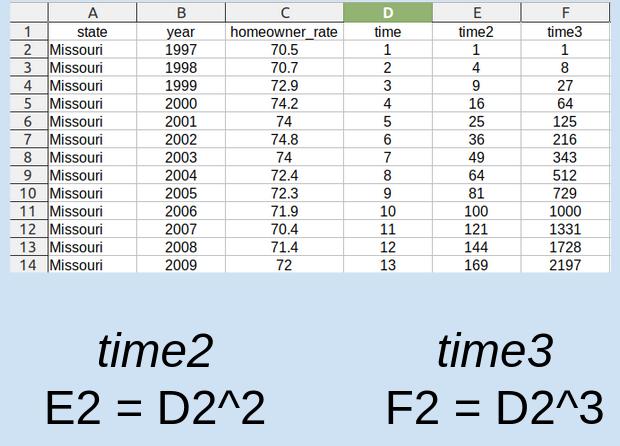

---
output:
  beamer_presentation:
    theme: "CambridgeUS"
    colortheme: "dolphin"
    fonttheme: "structurebold"
fontsize: 14pt
classoption: "aspectratio=169"
header-includes:
- \usepackage{caption}
- \captionsetup[figure]{labelformat=empty}
- \captionsetup[table]{labelformat=empty}
- \setbeamertemplate{page number in head/foot}[]{}
editor_options: 
  chunk_output_type: console
---

```{r, echo = FALSE, warning = FALSE, message = FALSE}
## Render the pdf
##rmarkdown::render(input = "./13_1-Forecasting_Linear_Trends.Rmd", output_file = "./13_1-Forecasting_Linear_Trends.pdf")

##fontsizes for tables: ‘"tiny"’, ‘"scriptsize"’, ‘"footnotesize"’, ‘"small"’, ‘"normalsize"’, ‘"large"’, ‘"Large"’, ‘"LARGE"’, ‘"huge"’, ‘"Huge"’

library(tidyverse)
library(readxl)
library(stargazer)
##library(kableExtra)
library(modelr)

knitr::opts_chunk$set(echo = FALSE,
                      eval = TRUE,
                      error = FALSE,
                      message = FALSE,
                      warning = FALSE,
                      comment = NA)

```


# Today's Agenda

\begin{Large}

Comparing random variation models to linear trend models of time series data

\end{Large}

\vspace{.5in}

\begin{center}
Justin Leinaweaver (Spring 2022)
\end{center}


```{r, fig.align='center', out.width='90%', fig.width=8, fig.height=5, eval=FALSE}
# Input data
grades <- tibble(
  report1 = c(78, 73, 60, 60, 83, 100, 83, 65, 80, 90, 85, 80, 93, 93, 70, 85, 82, 100, 100, 70, 83, 65, 83, 50, 90),
  report1_revised = c(90, 80, 60, 68, 83, 100, 92, 78, 90, 100, 95,
95, 100, 96, 87, 100, 93, 100, 100, 82, 92, 75, 93, 50, 100),
  report2 = c(70, 68, 65, 68, 68, 100, 82, 90, 93, 100, 100, 100, 95, 93, 88, 100, 95, 100, 100, 78, 78, 78, 97, 70, 100),
  report3 = c(80, 75, 50, 50, 70, 82, 70, 75, 95, 95, 80, 93, 100, 100, 78, 93, 88, 100, 100, 75, 100, 85, 92, 70, 100),
  participation = c(3, 2, 3, 2, 6, 5, 2, 6, 1, 0, 0, 0, 1, 2, 3, 1, 5, 0, 1, 1, 1, 3, 1, 4, 4),
  absences = c(3, 0, 0, 0, 3, 5, 2, 6, 0, 0, 0, 0, 1, 1, 2, 1, 3, 0, 0, 1, 1, 2, 1, 4, 1)
)|>
  mutate(
    part_cat = case_when(
      participation == 0 ~ "All Participation",
      participation < 3 ~ "Missing a Few",
      TRUE ~ "Missing Many"
    ),
    absences_grps = case_when(
      absences == 0 ~ "Perfect Attendance",
      absences == 1 ~ "1 Absence",
      absences > 1 ~ "More than 1 Absence",
    ),
    absences_grps2 = case_when(
      absences <= 1 ~ "Less than 1 Absence",
      absences > 1 ~ "More than 1 Absence",
    )
  )

# summary(grades$report1)
# summary(grades$report1_revised)
# summary(grades$report2)
# summary(grades$report3)
# summary(grades$participation)

grades |>
  pivot_longer(cols = report1:report3, names_to = "Report", values_to = "Scores") |>
  ggplot(aes(x = Report, y = Scores)) +
  geom_boxplot(fill = "steelblue2") +
  scale_x_discrete(limits = c("report1", "report1_revised", "report2", "report3"), labels = c("Report 1", "Report 1\nRevisions", "Report 2", "Report 3")) +
  labs(x = "", y = "Grades") + 
  theme_bw()

# grades |>
#   pivot_longer(cols = report1:report3, names_to = "Report", values_to = "Scores") |>
#   ggplot(aes(x = Report, y = Scores)) +
#   geom_boxplot(fill = "steelblue2") +
#   scale_x_discrete(limits = c("report1", "report1_revised", "report2", "report3"), labels = c("Report 1", "Report 1\nRevisions", "Report 2", "Report 3")) +
#   labs(x = "", y = "Grades") + 
#   theme_bw() +
#   facet_wrap(~ absences_grps)

## Boxes with participation numeric
# grades |>
#   pivot_longer(cols = report1:report3, names_to = "Report", values_to = "Scores") |>
#   ggplot(aes(x = factor(participation), y = Scores)) +
#   geom_boxplot(fill = "steelblue2")
```


```{r, fig.align='center', out.width='90%', fig.width=8, fig.height=5, eval=FALSE}

## Boxes with participation categorical
grades |>
  pivot_longer(cols = report1:report3, names_to = "Report", values_to = "Scores") |>
  #filter(Report != "report1_revised") |>
  ggplot(aes(x = part_cat, y = Scores)) +
  geom_boxplot(fill = "steelblue2") +
  labs(x = "", y = "Report Grades",
       title = "There is a strong correlation between participation in class and report grades",
       subtitle = "(e.g. come to class, be on time, don't leave early)") +
  theme_bw() +
  scale_x_discrete(limits = c("Missing Many", "Missing a Few", "All Participation"))


# ## Boxes absences categories
# grades |>
#   pivot_longer(cols = report1:report3, names_to = "Report", values_to = "Scores") |>
#   ggplot(aes(x = absences_grps, y = Scores)) +
#   geom_boxplot(fill = "steelblue2")
# 
# 
# ## Omit revised report 1
# grades |>
#   mutate(
#     Student = 1:25
#   ) |>
#   pivot_longer(cols = report1:report3, names_to = "Report", values_to = "Scores") |>
#   filter(Report != "report1_revised") |>
#   mutate(
#     Report_order = case_when(
#       Report == "report1" ~ 1,
#       Report == "report2" ~ 2,
#       Report == "report3" ~ 3
#     )
#   ) |>
#   group_by(Report_order, absences_grps2) |>
#   summarize(
#     Mean = mean(Scores),
#     StdDev = sd(Scores)
#   ) |>
#   ggplot(aes(x = Report_order, y = Mean, color = absences_grps2)) +
#   geom_point() +
#   geom_line() +
#   coord_cartesian(ylim = c(60, 100))
#   
#   
#   #guides(color = "none")


```


# 
```{r, fig.align = 'center', fig.asp=0.9, out.height = '110%', fig.width = 6}
library(lubridate)

# Input data
d <- read_excel("../../Data/Dataset-5-Advanced_Retail_Sales/Data5-Advanced_Retail_Sales_v2.xlsx") %>%
  mutate(
    date = ymd(date)
  )

library(forecast)
x1 <- ts(d$advance_retail_sales, start = 2015, frequency = 12)
plot(decompose(x1))
```


# Assignment for Today
::: columns
:::: column
```{r, fig.align = 'center', fig.asp=0.85, out.width = '95%', fig.width = 4}
d <- read_excel("../../Data/Dataset-1/Dataset1-All_Years.xlsx") %>% 
  filter(abbrev == "MO") %>%
  select(State, year, homeowner_rate)

d %>%
    ggplot(aes(x = year, y = homeowner_rate)) +
    geom_line() +
    theme_bw() +
    labs(x = "", y = "Homeownership Rate")
```
::::
:::: column
What is the best forecast model of homeownership rates in MO?

\vspace{.2in}

\begin{itemize}
\item Naïve
\item MA (3)
\item Weighted MA (3), or
\item Exponential Smoothing (0.2)
\end{itemize}

\vspace{.2in}

Predict 2021 and calculate the MSE!
::::
:::


#
\begin{center}
```{r, results = "asis"}
# Exploring GDP Rate of change in Missouri
d <- read_excel("../../Data/Dataset-1/Dataset1-All_Years.xlsx") %>% 
  filter(abbrev == "MO") %>%
  select(State, year, homeowner_rate)

# All predictions
# Calculate forecasts
d10 <- d %>%
  add_row(State = "Missouri", year = 2021, homeowner_rate = NA) %>% 
  mutate(
    Naive = lag(homeowner_rate, n = 1),
    MA3 = (lag(homeowner_rate, n = 1) + lag(homeowner_rate, n = 2) + lag(homeowner_rate, n = 3)) / 3,
    Weighted_MA3 = (lag(homeowner_rate, n = 1) * 3 + lag(homeowner_rate, n = 2) * 2 + lag(homeowner_rate, n = 3)) / 6
  )

d10$Exp_smoothing20 <- c(70.5, rep(NA, 24))

for (i in 2:25) {
  d10$Exp_smoothing20[i] <- d10$Exp_smoothing20[i-1] + .2*(d10$homeowner_rate[i-1] - d10$Exp_smoothing20[i-1])
}

# Re-calculate MSE on rows in common across forecast
error_calc <- function(forecast) {
  
  d10 %>%
    filter(complete.cases(.)) %>%
    mutate(
      error = (homeowner_rate - {{forecast}}),
      error2 = error^2
    ) %>%
    summarize(
      mse = mean(error2, na.rm = T)
    )
}

tab1 <- tibble(
    Forecast = c("Naive", "MA-3", "WMA-3", "Exp Smooth (.2)"),
    MSE = c(as.numeric(error_calc(forecast = Naive)),
            as.numeric(error_calc(forecast = MA3)),
            as.numeric(error_calc(forecast = Weighted_MA3)),
            as.numeric(error_calc(forecast = Exp_smoothing20))),
    Prediction = tail(d10, n = 1) %>% select(Naive:Exp_smoothing20) %>% as.numeric %>% round(1)
) %>%
    mutate_if(is.numeric, round, 2)

tab1 %>%
    stargazer(summary = FALSE, header = FALSE, float = FALSE, rownames = FALSE, font.size = "LARGE")
```
\end{center}


# {.plain}
```{r, fig.align = 'center', fig.asp=0.618, out.height = '100%', fig.width = 9}
d10 %>%
  pivot_longer(cols = Naive:Exp_smoothing20, names_to = "Variables", values_to = "Values") %>%
  ggplot(aes(x = year)) +
  geom_line(aes(y = homeowner_rate)) +
  geom_line(aes(y = Values, color = Variables), size = 1.3) +
  theme_bw() +
  facet_wrap(~ Variables) +
  labs(x = "", y = "Homeownership (Rate)") +
  guides(color = FALSE) +
  scale_x_continuous(breaks = seq(1997, 2021, 3)) +
  theme(axis.text.x = element_text(angle = 55))
```


#
\begin{columns}
\begin{column}{0.7\textwidth}
```{r, fig.align = 'center', out.width = '85%'}

```
\end{column}
\begin{column}{0.3\textwidth}
\begin{center}
The Components of Time Series Data

\vspace{.2in}

(Render, Stair, Jr., Hanna and Hale 2018)
\end{center}
\end{column}
\end{columns}


#
```{r, fig.align = 'center', fig.asp=0.618, out.width = '90%', fig.width = 6}
# Visualize
d %>%
  ggplot(aes(x = year, y = homeowner_rate)) +
  geom_line(size = 1.2) +
  theme_minimal() +
  labs(x = "", y = "Homeownership Rates (%)",
       title = "Homeownership in Missouri") +
  scale_x_continuous(breaks = seq(1997, 2021, 3))
```


#
```{r, fig.align = 'center', fig.asp=0.618, out.width = '90%', fig.width = 6}
# Visualize
d %>%
  ggplot(aes(x = year, y = homeowner_rate)) +
  geom_line(size = 1.2) +
  theme_minimal() +
  labs(x = "Time", y = "Homeownership Rates (%)",
       title = "OLS on Time Series Data: Regress on Time Period") +
  scale_x_continuous(breaks = seq(1997, 2021, 1), labels = seq(1, 25, 1))
```


# Create Time Period Variable
```{r, fig.align = 'center', fig.asp=0.618, out.width = '70%', fig.width = 5}

```


# Practice Using OLS on Time Series Data
\begin{Large}

\begin{enumerate}
\item Regress homeownership rate on the time period

\item Visualize the forecast as a line plot

\item Calculate the MSE
\end{enumerate}
\end{Large}


# 
```{r, fig.align = 'center', fig.asp=0.618, out.width = '77%', fig.width = 5}

```


# 
```{r, fig.align = 'center', fig.asp=0.618, out.width = '77%', fig.width = 5}

```

\begin{center}
\textbf{MSE = Average of the Squared Residuals}
\end{center}


# Practice Using OLS on Time Series Data
\begin{Large}

\begin{enumerate}
\item Regress homeownership rate on the time period

\item Visualize the forecast as a line plot

\item Calculate the MSE
\end{enumerate}
\end{Large}


#
::: columns
:::: column

\vspace{.3in}

\begin{center}
```{r, results = "asis"}
res1 <- d %>%
    mutate(
        time = 1:24
    ) %>%
    lm(data = ., homeowner_rate ~ time)

# Save coefs
x1 <- round(coef(res1), 2)

stargazer(res1, type = "latex", digits = 2, omit.stat = "rsq", header = FALSE, star.cutoffs = .05, notes = "*p < 0.05", notes.append = FALSE, dep.var.caption = "", float = FALSE, font.size = "footnotesize")
```
\end{center}
::::
:::: column
```{r, fig.align = 'center', fig.asp=0.618, out.width = '75%', fig.width = 5}
d %>%
    mutate(
        time = 1:24
    ) %>%
    add_predictions(res1) %>%
    ggplot(aes(x = time)) +
    geom_line(aes(y = homeowner_rate)) +
    geom_line(aes(y = pred), color = "blue", size = 1.2) +
    theme_bw() +
    labs(x = "Time Period", y = "Homeownership Rate")
```
\begin{center}
```{r, results = "asis"}
mse1 <- d %>%
    mutate(
        time = 1:24
    ) %>%
    add_residuals(res1) %>%
    summarize(
        MSE = mean(resid^2)
    )

pred1 <- d %>%
    mutate(
        time = 1:24
    ) %>%
    add_predictions(res1) %>%
    tail(n = 1) %>%
    select(pred)

tab1 %>%
    add_row(Forecast = "OLS",
            MSE = round(as.numeric(mse1), 2),
            Prediction = round(as.numeric(pred1), 2)
            ) %>%
    arrange(desc(MSE)) %>%
    stargazer(rownames = FALSE, summary = FALSE, digits = 2, header = FALSE, float = FALSE, font.size = "footnotesize")
```
\end{center}
::::
:::


# Make Predictions
::: columns
:::: column
\begin{center}
```{r, results = "asis"}
stargazer(res1, type = "latex", digits = 2, omit.stat = "rsq", header = FALSE, star.cutoffs = .05, notes = "*p < 0.05", notes.append = FALSE, dep.var.caption = "", float = FALSE, font.size = "scriptsize")
```
\end{center}
::::
:::: column
```{r, fig.align = 'center', fig.asp=0.618, out.height = '50%', fig.width = 5}
d %>%
    mutate(
        time = 1:24
    ) %>%
    add_predictions(res1) %>%
    ggplot(aes(x = time)) +
    geom_line(aes(y = homeowner_rate)) +
    geom_line(aes(y = pred), color = "blue", size = 1.2) +
    theme_bw() +
    labs(x = "Time Period", y = "Homeownership Rate")
```
::::
:::

\begin{center}
Prediction = `r x1[1]` + `r x1[2]` x Time

Use the model to predict homeownership for the next two years.
\end{center}


# Make Predictions
::: columns
:::: column
\begin{center}
```{r, results = "asis"}
stargazer(res1, type = "latex", digits = 2, omit.stat = "rsq", header = FALSE, star.cutoffs = .05, notes = "*p < 0.05", notes.append = FALSE, dep.var.caption = "", float = FALSE, font.size = "scriptsize")
```
\end{center}
::::
:::: column
```{r, fig.align = 'center', fig.asp=0.618, out.height = '50%', fig.width = 5}
d %>%
    mutate(
        time = 1:24
    ) %>%
    add_predictions(res1) %>%
    ggplot(aes(x = time)) +
    geom_line(aes(y = homeowner_rate)) +
    geom_line(aes(y = pred), color = "blue", size = 1.2) +
    theme_bw() +
    labs(x = "Time Period", y = "Homeownership Rate")
```
::::
:::

\begin{center}
Prediction = `r x1[1]` + `r x1[2]` x (Time = 25) = `r x1[1] + x1[2]*25`

Prediction = `r x1[1]` + `r x1[2]` x (Time = 26) = `r x1[1] + x1[2]*26`
\end{center}


# Using OLS on Time Series Data

\begin{Large}

Compare our results to two model transformations:

\begin{enumerate}

\item Regress homeownership rate on a quadratic function of time period

\item Regress homeownership rate on a cubic function of time period

\end{enumerate}

\end{Large}


# 
```{r, fig.align = 'center', out.width = '75%'}

```


#
\begin{center}
```{r, results = "asis"}
d2 <- d %>%
    mutate(
        time = 1:24
    )

res2 <- d2 %>% lm(data = ., homeowner_rate ~ time + I(time^2))

mse2 <- d %>%
    mutate(
        time = 1:24
    ) %>%
    add_residuals(res2) %>%
    summarize(
        MSE = mean(resid^2)
    )

pred2 <- d %>%
    mutate(
        time = 1:24
    ) %>%
    add_predictions(res2) %>%
    tail(n = 1) %>%
    select(pred)

res3 <- d2 %>% lm(data = ., homeowner_rate ~ time + I(time^2) + I(time^3))

mse3 <- d %>%
    mutate(
        time = 1:24
    ) %>%
    add_residuals(res3) %>%
    summarize(
        MSE = mean(resid^2)
    )

pred3 <- d %>%
    mutate(
        time = 1:24
    ) %>%
    add_predictions(res3) %>%
    tail(n = 1) %>%
    select(pred)


stargazer(res1, res2, res3, type = "latex", digits = 2, omit.stat = "rsq", header = FALSE, star.cutoffs = .05, notes = "*p < 0.05", notes.append = FALSE, dep.var.caption = "", dep.var.labels = "Homeownership", covariate.labels = c("Time", "Squared", "Cubed"), float = FALSE, font.size = "scriptsize")
```
\end{center}


#
\begin{center}
```{r, results = "asis"}
tab1 %>%
    add_row(Forecast = "OLS",
            MSE = round(as.numeric(mse1), 2),
            Prediction = round(as.numeric(pred1), 2)
            ) %>%
    add_row(Forecast = "OLS Quadratic",
            MSE = round(as.numeric(mse2), 2),
            Prediction = round(as.numeric(pred2), 2)
            ) %>%
    add_row(Forecast = "OLS Cubic",
            MSE = round(as.numeric(mse3), 2),
            Prediction = round(as.numeric(pred3), 2)
            ) %>%    
    arrange(desc(MSE)) %>%
    stargazer(rownames = FALSE, summary = FALSE, digits = 2, header = FALSE, float = FALSE, font.size = "large")
```
\end{center}


# Predict the Future!
\LARGE

1. Use the cubic model fit to predict the next three years (2021, 2022, 2023), and

2. Visualize the actual data and your model fit.


#
```{r, fig.align = 'center', fig.asp=0.618, out.height = '90%', fig.width = 5}
new1 <- tibble(
    time = 1:27,
    time2 = time^2,
    time3 = time^3
) %>%
    add_predictions(res3, var = "pred3")

d %>%
    mutate(
        time = 1:24
    ) %>%
    ggplot(aes(x = time)) +
    geom_line(aes(y = homeowner_rate)) +
    geom_line(data = new1, aes(y = pred3), color = "blue", size = 1.2) +
    theme_bw() +
    labs(x = "Time Period", y = "Homeownership Rate", title = "Three Year Forecast") +
    scale_x_continuous(breaks = seq(1, 26, 4), labels = seq(1997, 2024, 4))
```


#
```{r, fig.align = 'center', fig.asp=0.618, out.height = '90%', fig.width = 5}
new1 <- tibble(
    time = 1:34,
    time2 = time^2,
    time3 = time^3
) %>%
    add_predictions(res3, var = "pred3")

d %>%
    mutate(
        time = 1:24
    ) %>%
    ggplot(aes(x = time)) +
    geom_line(aes(y = homeowner_rate)) +
    geom_line(data = new1, aes(y = pred3), color = "blue", size = 1.2) +
    theme_bw() +
    labs(x = "Time Period", y = "Homeownership Rate", title = "Ten Year Forecast") +
    scale_x_continuous(breaks = seq(1, 34, 4), labels = seq(1997, 2032, 4))
```


# Forecast Unemployment Rates
::: columns
:::: column
```{r, fig.align = 'center', fig.asp=0.85, out.width = '95%', fig.width = 4}
d <- read_excel("../../Data/Dataset-1/Dataset1-All_Years.xlsx") %>% 
  filter(abbrev == "MO") %>%
  select(State, year, unemployment)

d %>%
    ggplot(aes(x = year, y = unemployment)) +
    geom_line() +
    theme_bw() +
    labs(x = "", y = "Unemployment (%)")
```
::::
:::: column
\vspace{.4in}

What is the best forecast model of unemployment rates in MO?

\vspace{.2in}

\begin{itemize}
\item Naïve
\item Weighted MA (3)
\item Linear model of time
\item Quadratic function of time 
\end{itemize}
::::
:::


# 
\begin{center}
```{r, results = "asis"}
#### Unemployment
d <- read_excel("../../Data/Dataset-1/Dataset1-All_Years.xlsx") %>% 
  filter(abbrev == "MO") %>%
  select(State, year, unemployment) %>%
  mutate(
    time = 1:24,
    time2 = time^2,
    time3 = time^3
  )

# All predictions
# Calculate forecasts
d10 <- d %>%
  add_row(State = "Missouri", year = 2021, unemployment = NA) %>% 
  mutate(
    Naive = lag(unemployment, n = 1),
    WMA3 = (lag(unemployment, n = 1) * 3 + lag(unemployment, n = 2) * 2 + lag(unemployment, n = 3)) / 6
  )

d10$Exp_smoothing75 <- c(4.4, rep(NA, 24))

for (i in 2:25) {
  d10$Exp_smoothing75[i] <- d10$Exp_smoothing75[i-1] + .75*(d10$unemployment[i-1] - d10$Exp_smoothing75[i-1])
}

# Calculate MSE
error_calc <- function(forecast) {
  
  d10 %>%
    mutate(
      error = (unemployment - {{forecast}}),
      error2 = error^2
    ) %>%
    summarize(
      mean(error2, na.rm = T)
    )
}

res1 <- d %>% lm(data = ., unemployment ~ time)
res2 <- d %>% lm(data = ., unemployment ~ time + time2)
res3 <- d %>% lm(data = ., unemployment ~ time + time2 + time3)

# MSE
mse1 <- d %>%
  add_residuals(res1) %>%
  summarize(
    mse = mean(resid^2)
  )

mse2 <- d %>%
  add_residuals(res2) %>%
  summarize(
    mse = mean(resid^2)
  )


tibble(
    Forecast = c("Naive", "Weighted MA3", "OLS", "OLS (Quadratic)"),
    MSE = c(as.numeric(error_calc(forecast = Naive)),
            as.numeric(error_calc(forecast = WMA3)),
            as.numeric(mse1),
            as.numeric(mse2))
) %>%
    arrange(desc(MSE)) %>%
    mutate(
        MSE = round(MSE, 2)
        ) %>%
    stargazer(rownames = FALSE, summary = FALSE, digits = 2, header = FALSE, float = FALSE, font.size = "LARGE")
```
\end{center}


#
```{r, fig.align = 'center', fig.asp=0.618, out.height = '95%', fig.width = 6}
d10 %>%
    add_predictions(res1, var = "pred1") %>%
    add_predictions(res2, var = "pred2") %>%
    pivot_longer(cols = c(pred1, pred2, WMA3, Naive), names_to = "Models", values_to = "Values") %>%
  ggplot(aes(x = year, y = unemployment)) +
  geom_line(size = 1.2, color = "darkgrey") +
  geom_line(aes(y = Values, color = Models), size = 1) +
  theme_bw() +
  labs(x = "Time", y = "Unemployment Rates (%)") +
  scale_x_continuous(breaks = seq(1997, 2021, 4)) +
  facet_wrap(~ Models, ncol = 2) +
  guides(color = FALSE)
```
