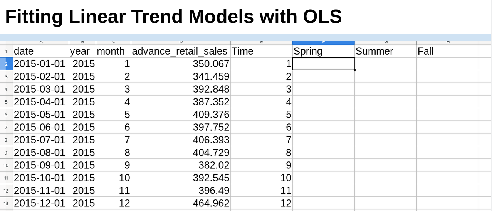
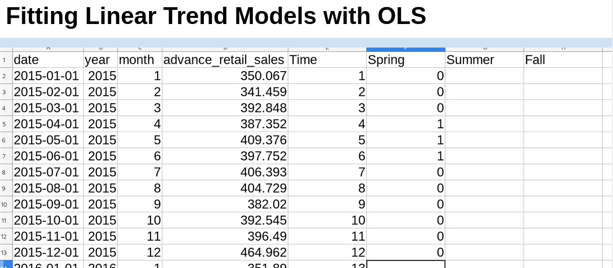
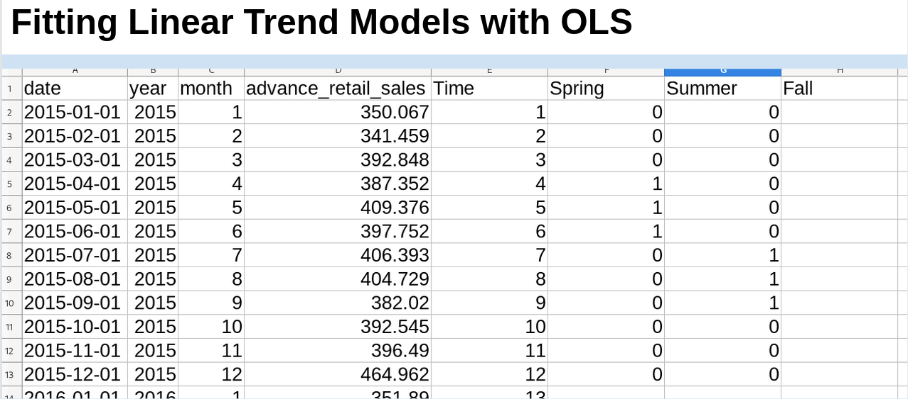
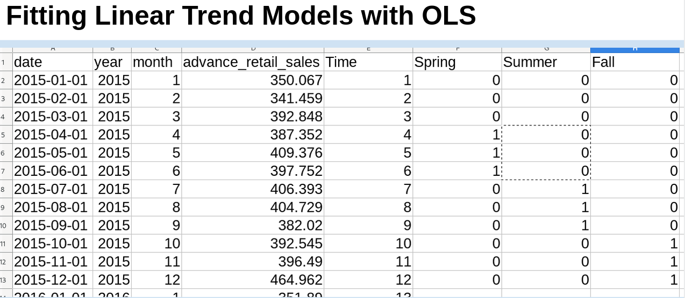
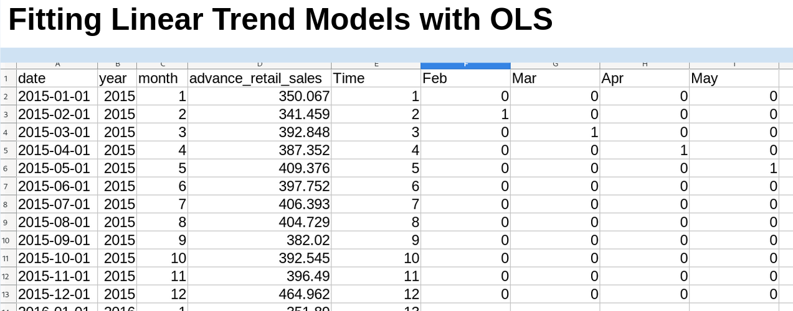

---
output:
  beamer_presentation:
    theme: "CambridgeUS"
    colortheme: "dolphin"
    fonttheme: "structurebold"
fontsize: 14pt
classoption: "aspectratio=169"
header-includes:
- \usepackage{caption}
- \captionsetup[figure]{labelformat=empty}
- \captionsetup[table]{labelformat=empty}
- \setbeamertemplate{page number in head/foot}[]{}
---

```{r, echo = FALSE, warning = FALSE, message = FALSE}
## Render the pdf
##rmarkdown::render(input = "./13_2-Seasonality.Rmd", output_file = "./13_2-Seasonality.pdf")

##fontsizes for tables: ‘"tiny"’, ‘"scriptsize"’, ‘"footnotesize"’, ‘"small"’, ‘"normalsize"’, ‘"large"’, ‘"Large"’, ‘"LARGE"’, ‘"huge"’, ‘"Huge"’

library(tidyverse)
library(readxl)
library(stargazer)
##library(kableExtra)
library(modelr)
library(lubridate)

knitr::opts_chunk$set(echo = FALSE,
                      eval = TRUE,
                      error = FALSE,
                      message = FALSE,
                      warning = FALSE,
                      comment = NA)

#############################################################
## Stargazer code

```


# Today's Agenda

\begin{Large}

Fitting and evaluating linear trend models with seasonality effects

\begin{itemize}
\item Dataset: Advanced Retail Sales
\end{itemize}

\end{Large}

\vspace{.5in}

\begin{center}
Justin Leinaweaver (Spring 2022)
\end{center}


#
\begin{center}
```{r, results = "asis"}
d <- read_excel("../../Data/Dataset-5-Advanced_Retail_Sales/Data5-Advanced_Retail_Sales_v2.xlsx", na  = "NA") %>%
    mutate(
        date = as.Date(date)
        )

d %>%
  slice(1:3) %>%
  stargazer(rownames = FALSE, summary = FALSE, header = FALSE, float = FALSE, font.size = "footnotesize")
```
\end{center}

```{r, fig.align = 'center', fig.asp=0.43, out.height = '75%', fig.width = 6}
library(lubridate)

# Plot both
d %>%
    pivot_longer(cols = advance_retail_sales:advance_retail_sales_adj, names_to = "Predictor", values_to = "Values") %>%
    mutate(
        Predictor = if_else(Predictor == "advance_retail_sales", "1. Advanced Retail Sales", "2. Adjusted by the Fed")
        ) %>%
    ggplot(aes(x = date, y = Values)) +
    geom_line() +
    theme_bw() +
    facet_wrap(~ Predictor) +
    labs(x = "", y = "Billions USD", caption = "Source: U.S. Census Bureau") +
    scale_x_date(date_breaks = "2 years")
```


#
\begin{large}
"Seasonality is a characteristic of a time series in which the data experiences regular and predictable changes that recur every calendar year" (Investopedia 2020).
\end{large}

```{r, fig.align = 'center', fig.asp=0.618, out.width = '60%', fig.width = 6}
# highlight seasons
d %>%
  ggplot(aes(x = date, y = advance_retail_sales)) +
  geom_line() +
  annotate("rect", xmin = ymd("2015-01-01"), xmax = ymd("2015-12-31"), ymin = 340, ymax = 525, alpha = .1, fill = "#CCCC00") +
  annotate("rect", xmin = ymd("2016-01-01"), xmax = ymd("2016-12-31"), ymin = 340, ymax = 525, alpha = .1, fill = "#006633") +
  annotate("rect", xmin = ymd("2017-01-01"), xmax = ymd("2017-12-31"), ymin = 340, ymax = 525, alpha = .1, fill = "#CCCC00") +
  annotate("rect", xmin = ymd("2018-01-01"), xmax = ymd("2018-12-31"), ymin = 340, ymax = 525, alpha = .1, fill = "#006633") +
  annotate("rect", xmin = ymd("2019-01-01"), xmax = ymd("2019-12-15"), ymin = 340, ymax = 525, alpha = .1, fill = "#CCCC00") +
  theme_bw() +
  labs(x = "", y = "Billions USD", title = "Advance Retail Sales")
```


#
\begin{large}
"Seasonality is a characteristic of a time series in which the data experiences regular and predictable changes that recur every calendar year" (Investopedia 2020).
\end{large}

```{r, fig.align = 'center', fig.asp=0.35, out.width = '100%', fig.width = 6}
# Split out the seasons with facets (500x500 to show sharp angles)
d %>%
  ggplot(aes(x = date, y = advance_retail_sales)) +
  geom_line() +
  theme_bw() +
  labs(x = "", y = "Billions USD") +
  facet_wrap(~ year, scale = "free_x", nrow = 1) +
  theme(axis.text.x = element_blank())
```


#
\begin{large}
"Seasonality is a characteristic of a time series in which the data experiences regular and predictable changes that recur every calendar year" (Investopedia 2020).
\end{large}

```{r, fig.align = 'center', fig.asp=0.618, out.width = '60%', fig.width = 6}
library(forecast)

# Overlap the seasonality
x1 <- ts(data = d$advance_retail_sales, frequency = 12, start = c(2015, 1))

ggseasonplot(x1, year.labels = TRUE) +
  theme_bw() +
  labs(x = "", y = "Billions USD", title = "Advance Retail Sales")
```


#
\begin{columns}
\begin{column}{.75\textwidth}

\vspace{.2in}

```{r, fig.align = 'center', fig.asp=0.618, out.width = '90%', fig.width = 5}
## Fit random variation models
d2 <- d %>%
    select(-advance_retail_sales_adj) %>%
    add_row(date = ymd("2020-01-01"), year = 2020, month = 1, advance_retail_sales = NA) %>% 
  mutate(
    Naive = lag(advance_retail_sales, n = 1),
    MA3 = (lag(advance_retail_sales, n = 1) + lag(advance_retail_sales, n = 2) + lag(advance_retail_sales, n = 3)) / 3,
    WMA3 = (lag(advance_retail_sales, n = 1) * 3 + lag(advance_retail_sales, n = 2) * 2 + lag(advance_retail_sales, n = 3)) / 6
  )

d2$Exp_smoothing20 <- c(350, rep(NA, 60))

for (i in 2:61) {
  d2$Exp_smoothing20[i] <- d2$Exp_smoothing20[i-1] + .2*(d2$advance_retail_sales[i-1] - d2$Exp_smoothing20[i-1])
}

# Visualize all 4
d2 %>%
    pivot_longer(cols = Naive:Exp_smoothing20, names_to = "Variables", values_to = "Values") %>%
    mutate(
        Variables = case_when(
                        Variables == "Naive" ~ "1. Naive",
                        Variables == "MA3" ~ "2. MA-3",
                        Variables == "WMA3" ~ "3. WMA-3",
                        Variables == "Exp_smoothing20" ~ "4. Exponential Smoothing (.20)")
    ) %>%
    ggplot(aes(x = date)) +
    geom_line(aes(y = advance_retail_sales)) +
    geom_line(aes(y = Values, color = Variables), size = 1.3) +
    theme_bw() +
    facet_wrap(~ Variables) +
    labs(x = "", y = "Advanced Retail Sales (Billions USD)") +
    guides(color = FALSE)
```
\end{column}

\begin{column}{.25\textwidth}
```{r, results = "asis"}
# MSE
# Calculate MSE
error_calc <- function(forecast) {
  
  d2 %>%
    mutate(
      error = (advance_retail_sales - {{forecast}}),
      error2 = error^2
    ) %>%
    summarize(
      mean(error2, na.rm = T)
    )
}

tab1 <- rbind(error_calc(forecast = Naive),
      error_calc(forecast = MA3),
      error_calc(forecast = WMA3),
      error_calc(forecast = Exp_smoothing20)) %>%
    mutate(
        Tools = c("Naive", "MA-3", "WMA-3", "ExpSmth (.2)")
    ) %>%
    select(Tools, MSE = `mean(error2, na.rm = T)`) %>%
    mutate(
        MSE = round(MSE, 0)
    )

tab1 %>%
    stargazer(summary = FALSE, rownames = FALSE, header = FALSE, float = FALSE, font.size = "footnotesize")
```
\end{column}
\end{columns}


# Model 1
\begin{Large}
\textbf{Regress advanced retail sales on time period}
\begin{enumerate}
\item Fit the model (Time period = 1:60)
\item Visualize the model (line plot)
\item Predict the next 12 months
\end{enumerate}
\end{Large}


# 
\begin{columns}
\begin{column}{0.4\textwidth}

\begin{center}
```{r, results = "asis"}
# Linear models
d3 <- d2 %>%
     mutate(
     time = 1:61,
     time2 = time^2,
     time3 = time^3,
     Spring = if_else(month %in% 4:6, 1, 0),
     Summer = if_else(month %in% 7:9, 1, 0),
     Fall = if_else(month %in% 10:12, 1, 0)
   )

res1 <- d3 %>% lm(data = ., advance_retail_sales ~ time)

## Save coefs
x2 <- round(coef(res1), 2)

stargazer(res1, digits = 2, dep.var.caption = "", star.cutoffs = .05, notes.append = FALSE, notes = "*p<0.05", omit.stat = "rsq", dep.var.labels = "Retail Sales", covariate.labels = c("Time"), float = FALSE, header = FALSE, font.size = "scriptsize")
```
\end{center}

\end{column}
\begin{column}{0.6\textwidth}

```{r, fig.align = 'center', fig.asp=0.75, out.width = '85%', fig.width = 5}
## Visualize
d3 %>%
  add_predictions(res1) %>%
  ggplot(aes(x = date, y = advance_retail_sales)) +
  geom_line(size = 1.2, color = "darkgrey") +
  geom_line(aes(y = pred), color = "blue", size = 1.2) +
  theme_bw() +
  labs(x = "Time", y = "Advanced Retail Sales (Billions USD)")
```

\end{column}
\end{columns}

\vspace{.2in}

\textbf{Sales = `r x2[1]` + `r x2[2]` x Time}
\begin{itemize}
\item Time = 61, 62, 63, 64, ...
\end{itemize}


# 
\begin{columns}
\begin{column}{0.4\textwidth}

\begin{center}
```{r, results = "asis"}
stargazer(res1, digits = 2, dep.var.caption = "", star.cutoffs = .05, notes.append = FALSE, notes = "*p<0.05", omit.stat = "rsq", dep.var.labels = "Retail Sales", covariate.labels = c("Time"), float = FALSE, header = FALSE, font.size = "scriptsize")
```
\end{center}

\end{column}
\begin{column}{0.6\textwidth}

```{r, fig.align = 'center', fig.asp=0.75, out.width = '85%', fig.width = 5}
## Make the predictions
new1 <- tibble(
    time = 61:72,
    date = seq.Date(from = ymd("2020-01-01"), by = "month", length.out = 12)
    ) %>%
    add_predictions(res1)

d3 %>%
  add_predictions(res1) %>%
  ggplot(aes(x = date, y = advance_retail_sales)) +
  geom_line(size = 1.2, color = "darkgrey") +
  geom_line(aes(y = pred), color = "blue", size = 1.2) +
  geom_line(data = new1, aes(y = pred), color = "green", size = 1.2) +
  theme_bw() +
  labs(x = "Time", y = "Advanced Retail Sales (Billions USD)")
```

\end{column}
\end{columns}

\vspace{.2in}

```{r}
round(new1$pred, 0)
```


# Fitting Linear Trend Models with OLS

\begin{columns}
\begin{column}{0.35\textwidth}
\begin{center}
```{r, results="asis"}
## MSEs
mse1 <- d3 %>%
  add_residuals(res1) %>%
  summarize(
    mse = mean(resid^2, na.rm = TRUE)
  )

tab1 %>%
    add_row(Tools = "OLS Time", MSE = round(as.numeric(mse1), 0)) %>%
    arrange(desc(MSE)) %>%
    stargazer(summary = FALSE, rownames = FALSE, header = FALSE, float = FALSE, font.size = "normalsize")
```
\end{center}
\end{column}
\begin{column}{0.65\textwidth}
```{r, fig.align = 'center', fig.asp=0.75, out.width = '85%', fig.width = 5}
d3 %>%
  add_predictions(res1) %>%
  ggplot(aes(x = date, y = advance_retail_sales)) +
  geom_line(size = 1.2, color = "darkgrey") +
  geom_line(aes(y = pred), color = "blue", size = 1.2) +
  theme_bw() +
  labs(x = "Time", y = "Advanced Retail Sales (Billions USD)")
```
\end{column}
\end{columns}


# 
\begin{large}
\textbf{Model 2: Regress advanced retail sales on time period and season dummies}
\begin{enumerate}
\item Fit the model
\begin{itemize}
\item Time period = 1:60
\item Spring = '1' if Apr, May, Jun
\item Summer = '1' if Jul, Aug, Sep
\item Fall = '1' if Oct, Nov, Dec
\end{itemize}
\item Visualize the model (line plot)
\item Predict the next 12 months
\end{enumerate}
\end{large}


#
```{r, fig.align = 'center', out.width = '95%'}

```


#
```{r, fig.align = 'center', out.width = '95%'}

```


#
```{r, fig.align = 'center', out.width = '95%'}

```


#
```{r, fig.align = 'center', out.width = '95%'}

```


# 
\begin{large}
\textbf{Model 2: Regress advanced retail sales on time period and season dummies}
\begin{enumerate}
\item Fit the model
\begin{itemize}
\item Time period = 1:60
\item Spring = '1' if Apr, May, Jun
\item Summer = '1' if Jul, Aug, Sep
\item Fall = '1' if Oct, Nov, Dec
\end{itemize}
\item Visualize the model (line plot)
\item Predict the next 12 months
\end{enumerate}
\end{large}


# 
\begin{columns}
\begin{column}{0.4\textwidth}

\begin{center}
```{r, results = "asis"}
# Add season dummies
res2 <- d3 %>% lm(data = ., advance_retail_sales ~ time + Spring + Summer + Fall)

stargazer(res2, digits = 2, dep.var.caption = "", star.cutoffs = .05, notes.append = FALSE, notes = "*p<0.05", omit.stat = "rsq", dep.var.labels = "Retail Sales", covariate.labels = c("Time"), float = FALSE, header = FALSE, font.size = "scriptsize")
```
\end{center}

\end{column}
\begin{column}{0.6\textwidth}

```{r, fig.align = 'center', fig.asp=0.75, out.width = '75%', fig.width = 5}
## Make the predictions
new2 <- tibble(
    time = 61:72,
    date = seq.Date(from = ymd("2020-01-01"), by = "month", length.out = 12),
    month = 1:12,
    Spring = if_else(month %in% 4:6, 1, 0),
    Summer = if_else(month %in% 7:9, 1, 0),
    Fall = if_else(month %in% 10:12, 1, 0)
    ) %>%
    add_predictions(res2)

d3 %>%
  add_predictions(res2) %>%
  ggplot(aes(x = date, y = advance_retail_sales)) +
  geom_line(size = 1.2, color = "darkgrey") +
  geom_line(aes(y = pred), color = "blue", size = 1.2) +
  geom_line(data = new2, aes(y = pred), color = "green", size = 1.2) +
  theme_bw() +
  labs(x = "Time", y = "Advanced Retail Sales (Billions USD)")
```

\vspace{.2in}

Predictions

```{r, results = "asis"}
tab2 <- tibble(
    Time = 61:72,
    Predictions = as.numeric(round(new2$pred, 0))
)

dput(tab2$Predictions)

##cbind(tab2[1:6, ], tab2[7:12, ]) %>%
##    stargazer(summary = FALSE, rownames = FALSE, header = FALSE, float = FALSE, font.size = "scriptsize")
```
\end{column}
\end{columns}


# Fitting Linear Trend Models with OLS

\begin{columns}
\begin{column}{0.35\textwidth}
\begin{center}
```{r, results="asis"}
## MSEs
mse2 <- d3 %>%
  add_residuals(res2) %>%
  summarize(
    mse = mean(resid^2, na.rm = TRUE)
  )

tab1 %>%
    add_row(Tools = "OLS Time", MSE = round(as.numeric(mse1), 0)) %>%
    add_row(Tools = "OLS Time and Season", MSE = round(as.numeric(mse2), 0)) %>%
    arrange(desc(MSE)) %>%
    stargazer(summary = FALSE, rownames = FALSE, header = FALSE, float = FALSE, font.size = "normalsize")
```
\end{center}
\end{column}

\begin{column}{0.65\textwidth}
\vspace{.2in}
```{r, fig.align = 'center', fig.asp=0.75, out.width = '75%', fig.width = 5}
d3 %>%
  add_predictions(res2) %>%
  ggplot(aes(x = date, y = advance_retail_sales)) +
  geom_line(size = 1.2, color = "darkgrey") +
  geom_line(aes(y = pred), color = "blue", size = 1.2) +
  theme_bw() +
  labs(x = "Time", y = "Advanced Retail Sales (Billions USD)")
```
\end{column}
\end{columns}


# 
\begin{large}
\textbf{Model 3: Regress advanced retail sales on time period and monthly dummies}
\begin{enumerate}
\item Fit the model
\begin{itemize}
\item Time period = 1:60
\item Month dummies (x 11)
\end{itemize}
\item Visualize the model (line plot)
\item Predict the next 12 months
\end{enumerate}
\end{large}


#
```{r, fig.align = 'center', out.width = '95%'}

```


#
\begin{columns}
\begin{column}{0.4\textwidth}

\begin{center}
```{r, results = "asis"}
# Add month dummies
res3 <- d3 %>% lm(data = ., advance_retail_sales ~ time + factor(month))

stargazer(res3, digits = 2, dep.var.caption = "", star.cutoffs = .05, notes.append = FALSE, notes = "*p<0.05", omit.stat = "rsq", dep.var.labels = "Retail Sales", covariate.labels = c("Time"), float = FALSE, header = FALSE, font.size = "scriptsize", omit = "month")
```
\end{center}

\end{column}
\begin{column}{0.6\textwidth}

```{r, fig.align = 'center', fig.asp=0.75, out.width = '75%', fig.width = 5}
## Make the predictions
new3 <- tibble(
    time = 61:72,
    date = seq.Date(from = ymd("2020-01-01"), by = "month", length.out = 12),
    month = 1:12,
    Spring = if_else(month %in% 4:6, 1, 0),
    Summer = if_else(month %in% 7:9, 1, 0),
    Fall = if_else(month %in% 10:12, 1, 0)
    ) %>%
    add_predictions(res3)

d3 %>%
  add_predictions(res3) %>%
  ggplot(aes(x = date, y = advance_retail_sales)) +
  geom_line(size = 1.2, color = "darkgrey") +
  geom_line(aes(y = pred), color = "blue", size = 1.2) +
  geom_line(data = new3, aes(y = pred), color = "green", size = 1.2) +
  theme_bw() +
  labs(x = "Time", y = "Advanced Retail Sales (Billions USD)")
```
\end{column}
\end{columns}

\vspace{.2in}
```{r, results = "asis"}
tab3 <- tibble(
    Time = 61:72,
    Predictions = as.numeric(round(new3$pred, 0))
)
```

Predictions = `r (tab3$Predictions)`

* Month coefficients omitted from the table.


# Fitting Linear Trend Models with OLS

\begin{columns}
\begin{column}{0.35\textwidth}
\begin{center}
```{r, results="asis"}
## MSEs
mse3 <- d3 %>%
  add_residuals(res3) %>%
  summarize(
    mse = mean(resid^2, na.rm = TRUE)
  )

tab1 %>%
    add_row(Tools = "OLS Time", MSE = round(as.numeric(mse1), 0)) %>%
    add_row(Tools = "OLS Time and Season", MSE = round(as.numeric(mse2), 0)) %>%
    add_row(Tools = "OLS Time and Month", MSE = round(as.numeric(mse3), 0)) %>%
    arrange(desc(MSE)) %>%
    stargazer(summary = FALSE, rownames = FALSE, header = FALSE, float = FALSE, font.size = "normalsize")
```
\end{center}
\end{column}

\begin{column}{0.65\textwidth}
\vspace{.2in}
```{r, fig.align = 'center', fig.asp=0.75, out.width = '75%', fig.width = 5}
d3 %>%
  add_predictions(res3) %>%
  ggplot(aes(x = date, y = advance_retail_sales)) +
  geom_line(size = 1.2, color = "darkgrey") +
  geom_line(aes(y = pred), color = "blue", size = 1.2) +
  theme_bw() +
  labs(x = "Time", y = "Advanced Retail Sales (Billions USD)")
```
\end{column}
\end{columns}


# Predict the next 12 months of new home sales

```{r, fig.align = 'center', fig.asp=0.618, out.height = '70%', fig.width = 5}
d <- read_excel("../../Data/Wk13-New_Homes_FRED/Week13-New_Homes_FRED.xlsx") %>%
  mutate(
    date = ymd(observation_date),
    observation_date = NULL,
    Houses_sold_thousands = `New One Family Houses Sold: United States, Thousands of Units, Monthly, Not Seasonally Adjusted`,
    `New One Family Houses Sold: United States, Thousands of Units, Monthly, Not Seasonally Adjusted` = NULL,
    time = 1:121,
    month = month(date),
    month_name = month(date, label = TRUE, abbr = TRUE),
    month_name = as.character(month_name),
    month_name = factor(month_name),
    month_name = relevel(month_name, "Jan"),
    year = year(date),
    Spring = if_else(month %in% 4:6, 1, 0),
    Summer = if_else(month %in% 7:9, 1, 0),
    Fall = if_else(month %in% 10:12, 1, 0),
    season = case_when(
      month %in% 1:3 ~ "Winter",
      month %in% 4:6 ~ "Spring",
      month %in% 7:9 ~ "Summer",
      month %in% 10:12 ~ "Fall"
    )
  )

d %>%
  ggplot(aes(x = date, y = Houses_sold_thousands)) +
  geom_line() +
  theme_minimal() +
  labs(x = "", y = "Thousands of Houses Sold")
```

\begin{center}
\textbf{Regress new home sales on time and season dummies}
\end{center}


#
\begin{columns}
\begin{column}{0.4\textwidth}

\begin{center}
```{r, results = "asis"}
# Add month dummies
res4 <- d %>% lm(data = ., Houses_sold_thousands ~ time + Spring + Summer + Fall)

stargazer(res4, digits = 2, dep.var.caption = "", star.cutoffs = .05, notes.append = FALSE, notes = "*p<0.05", omit.stat = "rsq", dep.var.labels = "New Home Sales", covariate.labels = c("Time"), float = FALSE, header = FALSE, font.size = "scriptsize")
```
\end{center}

\end{column}
\begin{column}{0.6\textwidth}

```{r, fig.align = 'center', fig.asp=0.75, out.width = '75%', fig.width = 5}
## Make the predictions
new3 <- tibble(
    time = 122:133,
    date = seq.Date(from = ymd("2021-03-01"), by = "month", length.out = 12),
    month = c(3:12, 1:2),
    Spring = if_else(month %in% 4:6, 1, 0),
    Summer = if_else(month %in% 7:9, 1, 0),
    Fall = if_else(month %in% 10:12, 1, 0)
    ) %>%
    add_predictions(res4)

d %>%
    add_predictions(res4) %>%
    ggplot(aes(x = date, y = Houses_sold_thousands)) +
    geom_line(size = 1.2, color = "darkgray") +
    geom_line(aes(y = pred), size = 1.2, color = "blue") +
    geom_line(data = new3, aes(y = pred), size = 1.2, color = "green") +
    theme_minimal() +
    labs(x = "", y = "Thousands of Units")
```
\end{column}
\end{columns}

\vspace{.2in}
```{r, results = "asis"}
tab4 <- tibble(
    Time = 122:133,
    Predictions = as.numeric(round(new3$pred, 0))
)
```

Predictions = `r (tab4$Predictions)`


#
\begin{columns}
\begin{column}{0.4\textwidth}

\begin{center}
```{r, results = "asis"}
# Add month dummies
res4 <- d %>% lm(data = ., Houses_sold_thousands ~ time + Spring + Summer + Fall)

stargazer(res4, digits = 2, dep.var.caption = "", star.cutoffs = .05, notes.append = FALSE, notes = "*p<0.05", omit.stat = "rsq", dep.var.labels = "New Home Sales", covariate.labels = c("Time"), float = FALSE, header = FALSE, font.size = "scriptsize")
```
\end{center}

\end{column}
\begin{column}{0.6\textwidth}

\begin{center}
```{r, results = "asis"}
tab4 <- tibble(
    Time = 122:133,
    Date = as.character(seq.Date(from = ymd("2021-03-01"), by = "month", length.out = 12)),
    Predictions = as.numeric(round(new3$pred, 0))
) %>%
    stargazer(summary = FALSE, rownames = FALSE, header = FALSE, float = FALSE, font.size = "small")
```
\end{center}

\end{column}
\end{columns}
